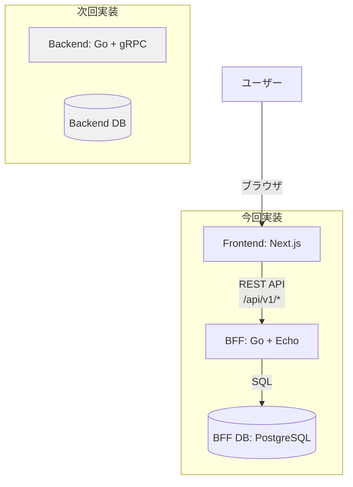
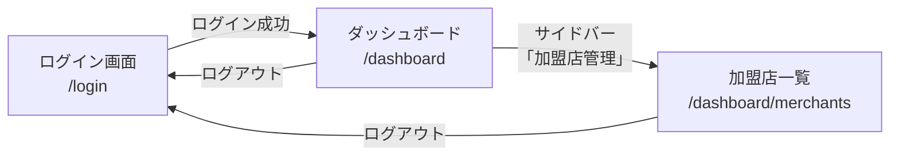
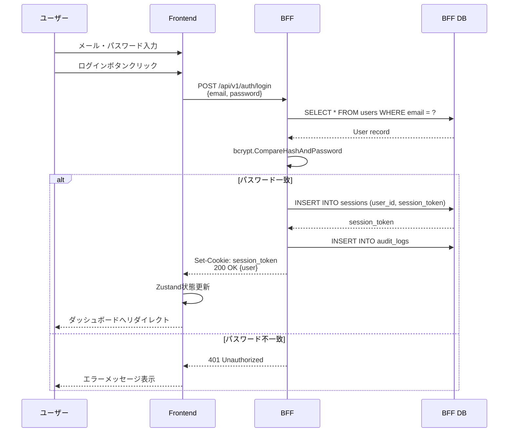
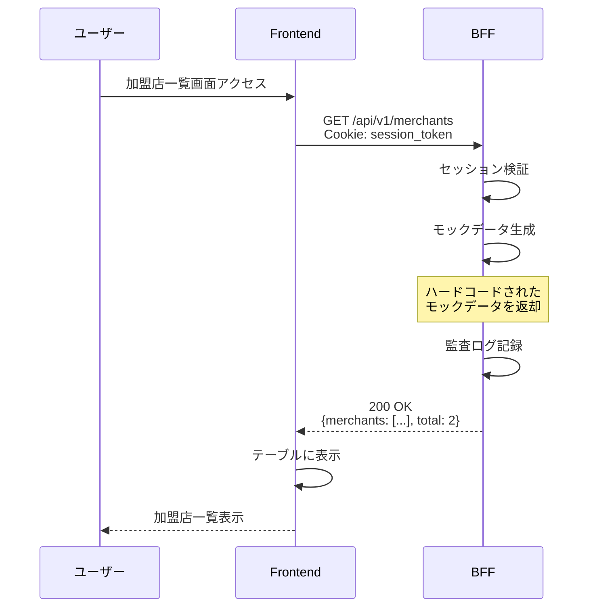

# Frontend→BFF Agent Teams検証 - 設計

## アーキテクチャ

### システム構成図



**重要:** 今回はBackendを実装しません。BFFは加盟店APIでモックデータを返却します。

---

## 画面遷移図



---

## データフロー

### ログインフロー



---

### 加盟店一覧取得フロー



---

## API設計

### エンドポイント一覧

| メソッド | エンドポイント | 説明 | 認証 | 実装 |
|---------|---------------|------|------|------|
| POST | `/api/v1/auth/login` | ログイン | 不要 | BFF |
| POST | `/api/v1/auth/logout` | ログアウト | 必要 | BFF |
| GET | `/api/v1/auth/me` | 現在のユーザー情報取得 | 必要 | BFF |
| GET | `/api/v1/merchants` | 加盟店一覧取得（モック） | 必要 | BFF（モック） |

---

### API詳細

#### 1. POST /api/v1/auth/login

**リクエスト:**
```json
{
  "email": "test@example.com",
  "password": "password123"
}
```

**レスポンス（成功）:**
```json
{
  "user": {
    "user_id": "550e8400-e29b-41d4-a716-446655440000",
    "email": "test@example.com",
    "name": "テストユーザー",
    "role_id": "contract-manager",
    "is_active": true
  }
}
```

**Set-Cookie:**
```
session_token=<token>; Path=/; HttpOnly; Secure; SameSite=Lax; Max-Age=86400
```

**レスポンス（失敗）:**
```json
{
  "error": "Invalid credentials"
}
```

---

#### 2. GET /api/v1/merchants

**リクエスト:**
```
GET /api/v1/merchants?page=1&limit=20
Cookie: session_token=<token>
```

**レスポンス（モックデータ）:**
```json
{
  "merchants": [
    {
      "merchant_id": "mock-merchant-00000000-0000-0000-0000-000000000001",
      "merchant_code": "M-00001",
      "name": "テスト加盟店1",
      "address": "東京都渋谷区渋谷1-1-1",
      "contact_person": "山田太郎",
      "phone": "03-1234-5678",
      "email": "yamada@example.com",
      "is_active": true,
      "created_at": "2025-01-01T00:00:00Z",
      "updated_at": "2025-01-01T00:00:00Z"
    },
    {
      "merchant_id": "mock-merchant-00000000-0000-0000-0000-000000000002",
      "merchant_code": "M-00002",
      "name": "テスト加盟店2",
      "address": "東京都新宿区新宿2-2-2",
      "contact_person": "佐藤花子",
      "phone": "03-2345-6789",
      "email": "sato@example.com",
      "is_active": true,
      "created_at": "2025-01-02T00:00:00Z",
      "updated_at": "2025-01-02T00:00:00Z"
    }
  ],
  "total": 2,
  "page": 1,
  "limit": 20
}
```

**注意:** `merchant_id` フィールドは実際のBackend実装時にはUUID v4形式になります。今回はモック用に識別しやすい形式を使用しています。

---

## BFFモック実装

### モックデータ定義

```go
// internal/handler/merchant_handler.go (BFF)

// モックデータ（注意: UUIDはモック用の固定値）
var mockMerchants = []map[string]interface{}{
    {
        "merchant_id":    "mock-merchant-00000000-0000-0000-0000-000000000001",
        "merchant_code":  "M-00001",
        "name":           "テスト加盟店1",
        "address":        "東京都渋谷区渋谷1-1-1",
        "contact_person": "山田太郎",
        "phone":          "03-1234-5678",
        "email":          "yamada@example.com",
        "is_active":      true,
        "created_at":     "2025-01-01T00:00:00Z",
        "updated_at":     "2025-01-01T00:00:00Z",
    },
    {
        "merchant_id":    "mock-merchant-00000000-0000-0000-0000-000000000002",
        "merchant_code":  "M-00002",
        "name":           "テスト加盟店2",
        "address":        "東京都新宿区新宿2-2-2",
        "contact_person": "佐藤花子",
        "phone":          "03-2345-6789",
        "email":          "sato@example.com",
        "is_active":      true,
        "created_at":     "2025-01-02T00:00:00Z",
        "updated_at":     "2025-01-02T00:00:00Z",
    },
}

func (h *MerchantHandler) ListMerchants(c echo.Context) error {
    // 認証済みユーザー取得
    userID := c.Get("user_id").(uuid.UUID)

    // 権限チェック（merchants:read）
    if !h.permissionService.HasPermission(userID, "merchants:read") {
        return c.JSON(http.StatusForbidden, map[string]string{
            "error": "Permission denied",
        })
    }

    // TODO: 次回タスクでBackend gRPC呼び出しに置き換え
    // resp, err := h.backendClient.ListMerchants(ctx, &pb.ListMerchantsRequest{...})

    // モックデータ返却
    response := map[string]interface{}{
        "merchants": mockMerchants,
        "pagination": map[string]interface{}{
            "current_page":   1,
            "total_pages":    1,
            "total_items":    2,
            "items_per_page": 20,
        },
    }

    // 監査ログ記録
    h.auditService.Log(userID, "LIST_MERCHANTS", "merchants", "", c.Request())

    return c.JSON(http.StatusOK, response)
}
```

---

## データベース設計

### BFF Database（bff_db）

今回実装するテーブル:

#### 1. users（ユーザー）

```sql
CREATE TABLE users (
    user_id UUID PRIMARY KEY DEFAULT gen_random_uuid(),
    email VARCHAR(255) UNIQUE NOT NULL,
    password_hash VARCHAR(255) NOT NULL,
    name VARCHAR(100) NOT NULL,
    role_id VARCHAR(50) NOT NULL REFERENCES roles(role_id),
    is_active BOOLEAN DEFAULT TRUE,
    created_at TIMESTAMPTZ DEFAULT NOW(),
    updated_at TIMESTAMPTZ DEFAULT NOW()
);
```

**初期データ:**
```sql
-- テストユーザー
-- メールアドレス: test@example.com
-- パスワード: password123 (bcrypt コスト12でハッシュ化)
INSERT INTO users (email, password_hash, name, role_id) VALUES
('test@example.com', '$2a$12$LQv3c1yqBWVHxkd0LHAkCOYz6TtxMQJqhN8/LewY5GyYnQJe4w.7G', 'テストユーザー', 'contract-manager');
```

**注意:** パスワードハッシュは実際のbcrypt結果に置き換える必要があります。上記は例示です。

---

#### 2. roles（ロール）

```sql
CREATE TABLE roles (
    role_id VARCHAR(50) PRIMARY KEY,
    role_name VARCHAR(100) NOT NULL,
    description TEXT,
    created_at TIMESTAMPTZ DEFAULT NOW(),
    updated_at TIMESTAMPTZ DEFAULT NOW()
);
```

**初期データ:**
```sql
INSERT INTO roles (role_id, role_name, description) VALUES
('system-admin', 'システム管理者', '全機能アクセス可能'),
('contract-manager', '契約管理者', '契約の登録・編集・承認可能'),
('sales', '営業担当者', '契約閲覧・新規登録・申請可能'),
('viewer', '閲覧者', '契約の閲覧のみ');
```

---

#### 3. permissions（権限）

```sql
CREATE TABLE permissions (
    permission_id VARCHAR(50) PRIMARY KEY,
    resource VARCHAR(50) NOT NULL,
    action VARCHAR(50) NOT NULL,
    description TEXT,
    created_at TIMESTAMPTZ DEFAULT NOW()
);
```

**初期データ（今回使用する権限のみ）:**
```sql
INSERT INTO permissions (permission_id, resource, action, description) VALUES
('merchants:read', 'merchants', 'read', '加盟店閲覧');
```

---

#### 4. role_permissions（ロール-権限紐付け）

```sql
CREATE TABLE role_permissions (
    role_id VARCHAR(50) REFERENCES roles(role_id) ON DELETE CASCADE,
    permission_id VARCHAR(50) REFERENCES permissions(permission_id) ON DELETE CASCADE,
    PRIMARY KEY (role_id, permission_id)
);
```

**初期データ:**
```sql
INSERT INTO role_permissions (role_id, permission_id) VALUES
('contract-manager', 'merchants:read');
```

---

#### 5. sessions（セッション）

```sql
CREATE TABLE sessions (
    session_id UUID PRIMARY KEY DEFAULT gen_random_uuid(),
    user_id UUID NOT NULL REFERENCES users(user_id) ON DELETE CASCADE,
    session_token VARCHAR(255) UNIQUE NOT NULL,
    expires_at TIMESTAMPTZ NOT NULL,
    last_accessed_at TIMESTAMPTZ DEFAULT NOW(),
    ip_address INET,
    user_agent TEXT,
    created_at TIMESTAMPTZ DEFAULT NOW()
);
```

---

#### 6. audit_logs（監査ログ）

```sql
CREATE TABLE audit_logs (
    audit_log_id UUID PRIMARY KEY DEFAULT gen_random_uuid(),
    user_id UUID REFERENCES users(user_id) ON DELETE SET NULL,
    action VARCHAR(100) NOT NULL,
    resource_type VARCHAR(50) NOT NULL,
    resource_id VARCHAR(255),
    request_path TEXT,
    request_method VARCHAR(10),
    ip_address INET,
    user_agent TEXT,
    created_at TIMESTAMPTZ DEFAULT NOW()
);
```

---

## Frontend設計

### ディレクトリ構造（App Router）

```
services/frontend/
├── src/
│   └── app/
│       ├── login/
│       │   └── page.tsx                # ログイン画面 (/login)
│       └── dashboard/
│           ├── layout.tsx              # ダッシュボードレイアウト
│           ├── page.tsx                # ダッシュボードトップ (/dashboard)
│           └── merchants/
│               └── page.tsx            # 加盟店一覧画面 (/dashboard/merchants)
```

**ルーティング:**
- `/login` - ログイン画面（認証不要）
- `/dashboard` - ダッシュボードトップ（認証必要）
- `/dashboard/merchants` - 加盟店一覧画面（認証必要）

**認証チェック:**
- `app/dashboard/layout.tsx` でセッション検証を実施
- 未認証の場合は `/login` へリダイレクト

---

### 画面構成

#### 1. ログイン画面（`/login`）

**コンポーネント構成:**
```
LoginPage
├── LoginForm (shadcn/ui Form + Zod)
│   ├── Input (email)
│   ├── Input (password)
│   └── Button (ログイン)
└── ErrorMessage
```

**状態管理:**
- React Hook Form（フォーム状態）
- Zod（バリデーション）
- API Client（ログインAPI呼び出し）
- Zustand（認証状態更新）

---

#### 2. ダッシュボード画面（`/dashboard`）

**コンポーネント構成:**
```
DashboardLayout
├── Sidebar
│   ├── Logo
│   └── Navigation
│       ├── ダッシュボード
│       └── 加盟店管理
├── Header
│   └── LogoutButton
└── Main Content
    └── ダッシュボード概要
```

---

#### 3. 加盟店一覧画面（`/dashboard/merchants`）

**コンポーネント構成:**
```
MerchantsPage
├── DashboardLayout
└── MerchantList
    ├── SearchForm (UI表示のみ)
    ├── Table (shadcn/ui)
    │   ├── TableHeader
    │   └── TableBody
    │       └── TableRow × n
    └── Pagination (UI表示のみ)
```

**データ取得:**
```typescript
// hooks/use-merchants.ts
export function useMerchants() {
  return useQuery({
    queryKey: ['merchants'],
    queryFn: async () => {
      const response = await apiClient.get('/api/v1/merchants');
      return response.data;
    },
  });
}
```

---

## セキュリティ設計

### 認証フロー

1. **ログイン時:**
   - パスワードをbcryptで検証（BFF DB）
   - セッショントークン生成（32バイトランダム文字列）
   - HttpOnly Cookieにセッショントークンを設定

2. **API呼び出し時:**
   - Cookieからセッショントークンを取得
   - sessionsテーブルで検証（expires_at > NOW()）
   - user_idをコンテキストに設定

3. **ログアウト時:**
   - sessionsテーブルからレコード削除
   - Cookieを削除

---

### CSRF対策

今回は**Double Submit Cookie**方式を採用しますが、実装は次回タスクに延期します。

---

## 次回タスクへの移行設計

### BFFのモック実装をBackend gRPC呼び出しに置き換え

**変更箇所:**
```go
// internal/handler/merchant_handler.go

// 変更前（今回実装）
func (h *MerchantHandler) ListMerchants(c echo.Context) error {
    // モックデータ返却
    response := map[string]interface{}{
        "merchants": mockMerchants,
        "total":     2,
        "page":      1,
        "limit":     20,
    }
    return c.JSON(http.StatusOK, response)
}

// 変更後（次回タスク）
func (h *MerchantHandler) ListMerchants(c echo.Context) error {
    // Backend gRPC呼び出し
    ctx, cancel := context.WithTimeout(context.Background(), 5*time.Second)
    defer cancel()

    resp, err := h.backendClient.ListMerchants(ctx, &pb.ListMerchantsRequest{
        Page:  1,
        Limit: 20,
    })
    if err != nil {
        return c.JSON(http.StatusInternalServerError, ...)
    }
    return c.JSON(http.StatusOK, resp)
}
```

**影響範囲:**
- `internal/handler/merchant_handler.go` の1メソッドのみ
- Frontend側は変更不要（APIレスポンス形式は同じ）

---

**作成日:** 2026-04-07
**作成者:** Claude Code
