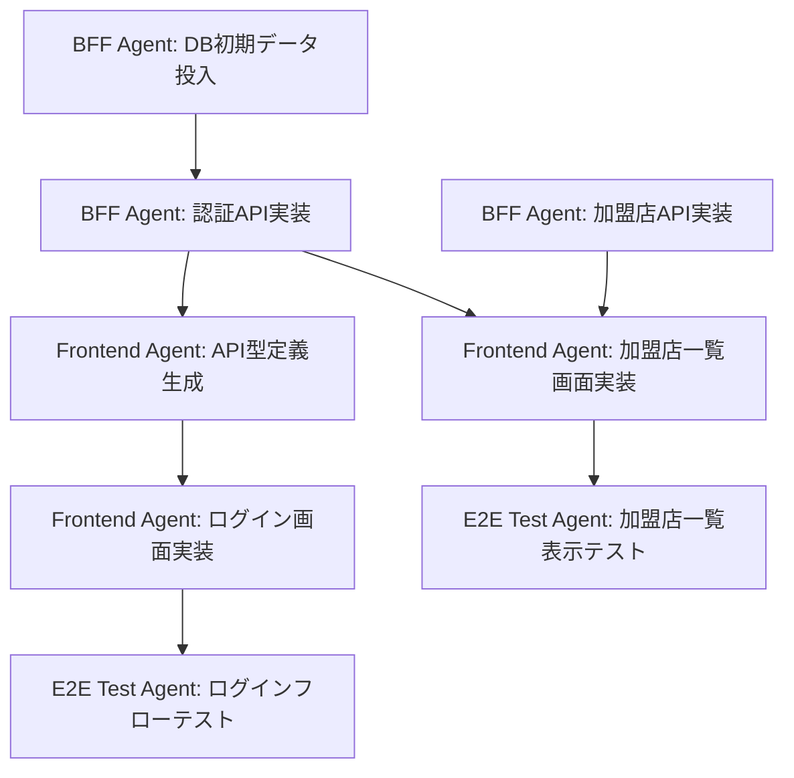

# Frontend→BFF Agent Teams検証 - タスクリスト

## Agent別タスク分担

### Frontend Agent

**担当範囲:** `services/frontend/`

#### 環境セットアップ
- [ ] Next.js 14プロジェクト初期化
- [ ] 依存関係インストール（React, TypeScript, Tailwind CSS, shadcn/ui, Zod, React Hook Form, Zustand, TanStack Query）
- [ ] shadcn/uiコンポーネントセットアップ
- [ ] Tailwind CSS設定

#### API型定義生成
- [ ] `contracts/openapi/bff-api.yaml` からTypeScript型定義生成（openapi-typescript）
- [ ] API Clientセットアップ（Axios）

#### 認証機能実装
- [ ] ログイン画面実装（`/login`）
  - [ ] LoginFormコンポーネント作成（React Hook Form + Zod）
  - [ ] バリデーションスキーマ定義（email, password）
  - [ ] ログインAPI呼び出し
  - [ ] エラーハンドリング
  - [ ] ログイン成功時のリダイレクト処理
- [ ] 認証状態管理（Zustand）
  - [ ] useAuthStore作成
  - [ ] login/logout/getCurrentUser actions実装
- [ ] 認証ガードミドルウェア実装
  - [ ] 未認証時のログイン画面リダイレクト

#### ダッシュボード実装
- [ ] DashboardLayoutコンポーネント作成
  - [ ] Sidebarコンポーネント作成
  - [ ] Headerコンポーネント作成（ログアウトボタン含む）
  - [ ] Navigationコンポーネント作成
- [ ] ダッシュボード画面実装（`/dashboard`）
  - [ ] ダッシュボード概要表示

#### 加盟店一覧画面実装
- [ ] 加盟店一覧画面実装（`/dashboard/merchants`）
  - [ ] MerchantListコンポーネント作成
  - [ ] useMerchantsフック作成（TanStack Query）
  - [ ] Tableコンポーネント実装（shadcn/ui）
  - [ ] SearchFormコンポーネント作成（UI表示のみ）
  - [ ] Paginationコンポーネント作成（UI表示のみ）

#### テスト
- [ ] ログインフォームのユニットテスト（Vitest）
- [ ] useAuthStoreのユニットテスト

---

### BFF Agent

**担当範囲:** `services/bff/`

#### 環境セットアップ
- [ ] Goプロジェクト初期化（go.mod）
- [ ] 依存関係インストール（Echo, sqlc, bcrypt, zap, godotenv, validator）
- [ ] Docker Compose設定（bff-db, bff-flyway）
- [ ] .env.example作成

#### データベース
- [ ] Flywayマイグレーション作成
  - [ ] V1__create_users.sql
  - [ ] V2__create_roles.sql
  - [ ] V3__create_permissions.sql
  - [ ] V4__create_role_permissions.sql
  - [ ] V5__create_sessions.sql
  - [ ] V6__create_audit_logs.sql
  - [ ] V7__seed_roles.sql
  - [ ] V8__seed_permissions.sql
  - [ ] V9__seed_role_permissions.sql
  - [ ] V10__seed_users.sql（テストユーザー: test@example.com）
- [ ] Flywayマイグレーション実行
- [ ] sqlcクエリ定義作成（db/queries/）
  - [ ] user.sql
  - [ ] session.sql
  - [ ] role.sql
  - [ ] permission.sql
  - [ ] audit_log.sql
- [ ] sqlc generate実行

#### 認証API実装
- [ ] ドメインモデル作成（internal/model/）
  - [ ] user.go
  - [ ] session.go
  - [ ] role.go
  - [ ] permission.go
- [ ] リポジトリ層実装（internal/repository/）
  - [ ] user_repository.go
  - [ ] session_repository.go
  - [ ] role_repository.go
  - [ ] permission_repository.go
- [ ] サービス層実装（internal/service/）
  - [ ] auth_service.go（ログイン・ログアウト・セッション検証）
  - [ ] permission_service.go（権限チェック）
- [ ] ハンドラー層実装（internal/handler/）
  - [ ] auth_handler.go
    - [ ] POST /api/v1/auth/login
    - [ ] POST /api/v1/auth/logout
    - [ ] GET /api/v1/auth/me

#### 加盟店API実装（モック）
- [ ] ハンドラー層実装（internal/handler/）
  - [ ] merchant_handler.go
    - [ ] GET /api/v1/merchants（モックデータ返却）
    - [ ] モックデータ定義（2件）

#### ミドルウェア実装
- [ ] 認証ミドルウェア（internal/middleware/auth.go）
  - [ ] セッショントークン検証
  - [ ] user_idをコンテキストに設定
- [ ] 権限チェックミドルウェア（internal/middleware/permission.go）
  - [ ] 権限チェック（merchants:read）
- [ ] 監査ログミドルウェア（internal/middleware/audit.go）
  - [ ] すべてのAPI呼び出しを記録
- [ ] CORSミドルウェア（internal/middleware/cors.go）
- [ ] ロギングミドルウェア（internal/middleware/logger.go）

#### サーバー起動
- [ ] cmd/server/main.go実装
  - [ ] 設定読み込み
  - [ ] DB接続
  - [ ] ロガー初期化
  - [ ] ミドルウェア登録
  - [ ] ルーティング設定
  - [ ] サーバー起動

#### テスト
- [ ] auth_service_test.go（ユニットテスト）
- [ ] auth_handler_test.go（統合テスト、testcontainers + Flyway）

---

### E2E Test Agent

**担当範囲:** `e2e/`

#### 環境セットアップ
- [ ] Playwrightインストール
- [ ] playwright.config.ts設定
- [ ] Docker Compose設定（frontend, bff, bff-db）
- [ ] テストヘルパー関数作成（e2e/utils/test-helpers.ts）
  - [ ] login()
  - [ ] logout()
  - [ ] waitForElement()

#### ログインフローテスト
- [ ] e2e/tests/auth/login-flow.spec.ts実装
  - [ ] 正常系: ログイン成功
  - [ ] 異常系: ログイン失敗（パスワード誤り）
  - [ ] 異常系: 未認証でダッシュボードアクセス時のリダイレクト

#### 加盟店一覧表示テスト
- [ ] e2e/tests/merchants/merchant-list.spec.ts実装
  - [ ] ログイン後に加盟店一覧が表示されること
  - [ ] モックデータ（2件）が正しく表示されること
  - [ ] テーブルの各カラムが正しく表示されること

#### テストシナリオ更新
- [ ] e2e/test-scenarios.md更新
  - [ ] ログインフローシナリオ追加
  - [ ] 加盟店一覧表示シナリオ追加

---

## Agent間の依存関係

### 依存関係図

### クリティカルパス

1. **BFF Agent: DB初期データ投入** ← 最初に実行
2. **BFF Agent: 認証API実装** ← 2番目に実行
3. **Frontend Agent: API型定義生成** ← 並行可能
4. **BFF Agent: 加盟店API実装（モック）** ← 並行可能
5. **Frontend Agent: 画面実装** ← 並行可能
6. **E2E Test Agent: テスト実装** ← 最後に実行

---

## タスク進捗管理

### 完了条件

各タスクは以下の条件を満たした場合に完了とみなします：

#### Frontend Agent
- [ ] すべてのコンポーネントが実装済み
- [ ] ユニットテストがすべて成功
- [ ] ESLint/TypeScriptエラーなし
- [ ] ブラウザで動作確認済み

#### BFF Agent
- [ ] すべてのAPIが実装済み
- [ ] Flywayマイグレーション実行済み
- [ ] ユニットテスト・統合テストがすべて成功
- [ ] `go vet` / `go fmt` エラーなし
- [ ] サーバー起動確認済み

#### E2E Test Agent
- [ ] すべてのE2Eテストが成功
- [ ] test-scenarios.md更新済み
- [ ] Docker Composeで全サービス起動確認済み

---

## 実装順序（推奨）

### フェーズ1: 環境セットアップ（並行実行可能）

**BFF Agent:**
1. Goプロジェクト初期化
2. Docker Compose設定
3. Flywayマイグレーション作成・実行
4. sqlc generate実行

**Frontend Agent:**
1. Next.jsプロジェクト初期化
2. shadcn/ui セットアップ
3. 依存関係インストール

---

### フェーズ2: 認証機能実装

**BFF Agent:**
1. 認証API実装（login, logout, me）
2. セッションミドルウェア実装
3. 監査ログミドルウェア実装

**Frontend Agent:**（BFF認証API完了後）
1. API型定義生成
2. ログイン画面実装
3. 認証状態管理（Zustand）

---

### フェーズ3: 加盟店一覧機能実装（並行実行可能）

**BFF Agent:**
1. 加盟店API実装（モックデータ返却）
2. 権限チェックミドルウェア実装

**Frontend Agent:**
1. DashboardLayout実装
2. 加盟店一覧画面実装

---

### フェーズ4: E2Eテスト実装（Frontend/BFF完了後）

**E2E Test Agent:**
1. Docker Compose設定
2. ログインフローテスト実装
3. 加盟店一覧表示テスト実装

---

## 完了チェックリスト

### 全Agent共通
- [ ] すべてのタスクが完了
- [ ] テストがすべて成功
- [ ] ドキュメント（CLAUDE.md, glossary.md）に準拠
- [ ] コミットメッセージ規約に準拠
- [ ] コードレビュー完了

### 統合確認
- [ ] Docker Composeですべてのサービスが起動
- [ ] E2Eテストがすべて成功
- [ ] ブラウザで手動動作確認
- [ ] 監査ログが正しく記録されている

---

**作成日:** 2026-04-07
**作成者:** Claude Code
