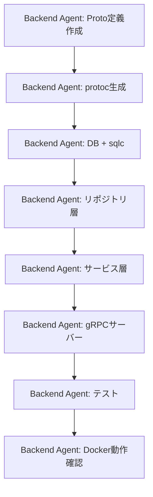

# Backend Service実装 (Phase 1) - タスクリスト

## Agent別タスク分担

### Backend Agent

**担当範囲:** `services/backend/`

#### 環境セットアップ
- [ ] Goプロジェクト初期化（go.mod）
- [ ] 依存関係インストール（grpc, protobuf, sqlc, zap, godotenv, validator, uuid）
- [ ] Docker Compose設定（`docker-compose.yml`）
  - [ ] backend-db（PostgreSQL、ポート5433）
  - [ ] backend-flyway（Flyway migration）
  - [ ] backend（Go gRPCサーバー、ポート50051）
- [ ] Dockerfile作成（マルチステージビルド）
- [ ] .env.example作成
- [ ] .dockerignore作成
- [ ] .gitignore作成

#### Protocol Buffers
- [ ] `contracts/proto/merchant.proto` 作成（親リポジトリ）
- [ ] protoc生成コード配置（`internal/pb/`）
- [ ] 生成コマンドをMakefile or スクリプトに定義

#### データベース
- [ ] Flywayマイグレーションファイル作成（`db/migrations/`）
  - [ ] V1__create_merchants.sql
  - [ ] V2__create_contract_changes.sql
  - [ ] V3__seed_merchants.sql（テストデータ2件）
- [ ] sqlcクエリ定義作成（`db/queries/`）
  - [ ] merchant.sql（ListMerchants, GetMerchant, CreateMerchant, GetMaxMerchantCode）
  - [ ] contract_change.sql（CreateContractChange）
- [ ] sqlc.yaml設定
- [ ] sqlc generate実行

#### ドメインモデル
- [ ] internal/model/merchant.go

#### リポジトリ層
- [ ] internal/repository/merchant_repository.go（インターフェース + 実装）
- [ ] internal/repository/audit_repository.go（インターフェース + 実装）

#### サービス層
- [ ] internal/service/merchant_service.go（インターフェース + 実装）
  - [ ] ListMerchants（ページネーション + 検索）
  - [ ] GetMerchant
  - [ ] CreateMerchant（コード自動採番 + 監査記録）

#### gRPCサーバー
- [ ] internal/grpc/merchant_server.go
  - [ ] ListMerchants RPC実装
  - [ ] GetMerchant RPC実装
  - [ ] CreateMerchant RPC実装

#### サーバー起動
- [ ] cmd/server/main.go
  - [ ] DB接続
  - [ ] ロガー初期化
  - [ ] gRPCサーバー起動
  - [ ] gRPC Health Checking Protocol実装
  - [ ] グレースフルシャットダウン

#### テスト
- [ ] internal/service/merchant_service_test.go（ユニットテスト）
- [ ] internal/grpc/merchant_server_test.go（gRPCテスト）

#### 動作確認
- [ ] Docker Compose起動確認
- [ ] grpcurl等でgRPCエンドポイント動作確認
- [ ] コミット・プッシュ

---

## Agent間の依存関係

### 依存関係図

### 備考
- Phase 1はBackend Agent単体の作業
- Proto定義は `contracts/proto/` に配置（親リポジトリ管理）
- Phase 2でBFF Agentが `contracts/proto/` を参照してgRPCクライアント実装

---

## 実装順序（推奨）

### フェーズ1: 基盤セットアップ
1. Goプロジェクト初期化
2. Protocol Buffers定義 + 生成
3. Docker Compose設定
4. Flywayマイグレーション作成

### フェーズ2: データアクセス層
1. sqlcクエリ定義 + 生成
2. ドメインモデル
3. リポジトリ層（インターフェース + 実装）

### フェーズ3: ビジネスロジック + gRPC
1. サービス層
2. gRPCサーバー実装
3. cmd/server/main.go

### フェーズ4: テスト + 動作確認
1. ユニットテスト
2. Docker Compose起動確認
3. gRPCエンドポイント動作確認

---

## 完了条件

### Backend Agent
- [ ] すべてのgRPC RPCが実装済み
- [ ] Docker Composeで backend + backend-db + backend-flyway が起動
- [ ] ユニットテストがすべて成功
- [ ] `go vet` / `go fmt` エラーなし
- [ ] grpcurlでListMerchants, GetMerchant, CreateMerchantが動作確認済み
- [ ] contract_changesテーブルに監査レコードが記録されている

---

**作成日:** 2026-04-09
**作成者:** Claude Code
