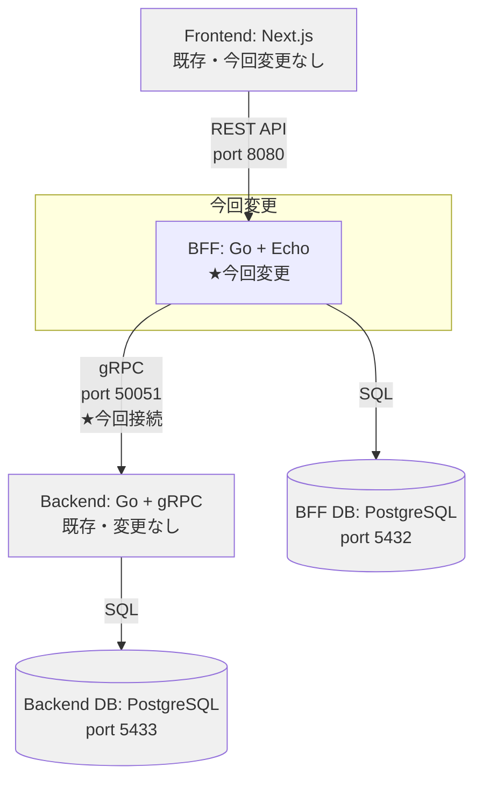
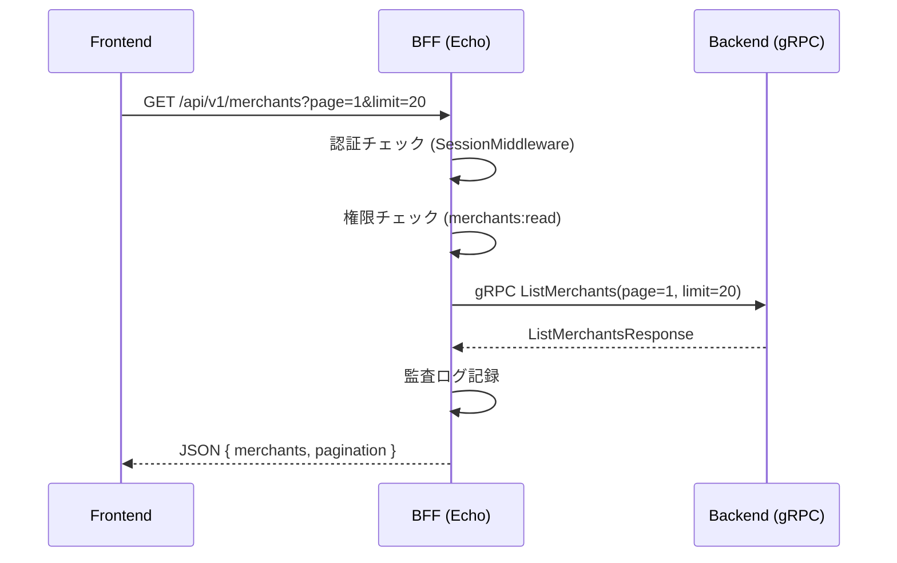

# BFF gRPC統合 (Phase 2) - 設計

## アーキテクチャ

### システム構成図



### 通信フロー



---

## 変更対象ファイル

### 新規作成

| ファイル | 説明 |
|---------|------|
| `internal/grpc/client.go` | gRPCクライアント初期化・接続管理 |
| `internal/pb/merchant.pb.go` | protoc生成コード |
| `internal/pb/merchant_grpc.pb.go` | protoc生成gRPCコード |

### 変更

| ファイル | 変更内容 |
|---------|---------|
| `internal/handler/merchant_handler.go` | モック削除→gRPC呼び出し、GetMerchant/CreateMerchant追加 |
| `cmd/server/main.go` | gRPCクライアント初期化、MerchantHandler依存関係変更、ルート追加 |
| `docker-compose.yml` | 外部ネットワーク追加、BACKEND_GRPC_ADDR環境変数 |
| `go.mod` | gRPC/protobuf依存関係追加 |
| `Makefile` | proto生成ターゲット追加 |
| `.env.example` | BACKEND_GRPC_ADDR追加 |

### 親リポジトリ（変更）

| ファイル | 変更内容 |
|---------|---------|
| `contracts/openapi/bff-api.yaml` | GetMerchant, CreateMerchant エンドポイント追加 |

### テスト（変更/新規）

| ファイル | 変更内容 |
|---------|---------|
| `internal/handler/merchant_handler_test.go` | 新規作成、gRPCモック使用 |

---

## gRPCクライアント設計

### client.go

```go
// internal/grpc/client.go
package grpc

import (
    "github.com/ikechin/agent-teams-bff/internal/pb"
    "google.golang.org/grpc"
    "google.golang.org/grpc/credentials/insecure"
)

// BackendClient holds gRPC client connections to the Backend service.
type BackendClient struct {
    conn     *grpc.ClientConn
    Merchant pb.MerchantServiceClient
}

// NewBackendClient creates a new gRPC client connection to the Backend service.
func NewBackendClient(addr string) (*BackendClient, error) {
    conn, err := grpc.NewClient(addr,
        grpc.WithTransportCredentials(insecure.NewCredentials()),
    )
    if err != nil {
        return nil, err
    }

    return &BackendClient{
        conn:     conn,
        Merchant: pb.NewMerchantServiceClient(conn),
    }, nil
}

// Close closes the gRPC client connection.
func (c *BackendClient) Close() error {
    return c.conn.Close()
}
```

**設計ポイント:**
- `grpc.NewClient` を使用（`grpc.Dial` は非推奨）
- 内部ネットワーク通信のため `insecure.NewCredentials()` を使用
- `BackendClient` 構造体に各サービスクライアントを集約（将来ContractService等を追加可能）
- `Close()` でグレースフルシャットダウン対応

---

## MerchantHandler 改修設計

### 構造体変更

```go
// 変更前
type MerchantHandler struct {
    permissionService *service.PermissionService
    logger            *zap.Logger
}

// 変更後
type MerchantHandler struct {
    backendClient     pb.MerchantServiceClient
    permissionService service.PermissionServiceInterface
    logger            *zap.Logger
}
```

### ListMerchants 改修

```go
func (h *MerchantHandler) ListMerchants(c echo.Context) error {
    // 認証・認可チェック（既存のまま）
    // ...

    // gRPC呼び出し（モックデータを置換）
    resp, err := h.backendClient.ListMerchants(c.Request().Context(), &pb.ListMerchantsRequest{
        Page:   int32(page),
        Limit:  int32(limit),
        Search: search,
    })
    if err != nil {
        // gRPCエラー → HTTPエラーへ変換
        return h.handleGRPCError(c, err, "Failed to list merchants")
    }

    // レスポンス変換（既存のJSON形式を維持）
    merchants := make([]map[string]interface{}, 0, len(resp.Merchants))
    for _, m := range resp.Merchants {
        merchants = append(merchants, merchantToMap(m))
    }

    return c.JSON(http.StatusOK, map[string]interface{}{
        "merchants": merchants,
        "pagination": map[string]interface{}{...},
    })
}
```

### GetMerchant 新規

```go
func (h *MerchantHandler) GetMerchant(c echo.Context) error {
    // 認証・認可チェック (merchants:read)
    // ...

    merchantID := c.Param("id")

    resp, err := h.backendClient.GetMerchant(c.Request().Context(), &pb.GetMerchantRequest{
        MerchantId: merchantID,
    })
    if err != nil {
        return h.handleGRPCError(c, err, "Failed to get merchant")
    }

    return c.JSON(http.StatusOK, map[string]interface{}{
        "merchant": merchantToMap(resp.Merchant),
    })
}
```

### CreateMerchant 新規

```go
func (h *MerchantHandler) CreateMerchant(c echo.Context) error {
    // 認証・認可チェック (merchants:create)
    // ...

    var req CreateMerchantRequest
    if err := c.Bind(&req); err != nil {
        return c.JSON(http.StatusBadRequest, ErrorResponse{Error: "Invalid request body"})
    }
    if err := c.Validate(req); err != nil {
        return c.JSON(http.StatusBadRequest, ErrorResponse{Error: err.Error()})
    }

    resp, err := h.backendClient.CreateMerchant(c.Request().Context(), &pb.CreateMerchantRequest{
        Name:          req.Name,
        Address:       req.Address,
        ContactPerson: req.ContactPerson,
        Phone:         req.Phone,
        Email:         req.Email,
        CreatedBy:     userID.String(), // BFF認証済みユーザーID
    })
    if err != nil {
        return h.handleGRPCError(c, err, "Failed to create merchant")
    }

    return c.JSON(http.StatusCreated, map[string]interface{}{
        "merchant": merchantToMap(resp.Merchant),
    })
}
```

### CreateMerchantRequest（バリデーション付き）

```go
type CreateMerchantRequest struct {
    Name          string `json:"name" validate:"required,max=200"`
    Address       string `json:"address" validate:"required"`
    ContactPerson string `json:"contact_person" validate:"required,max=100"`
    Phone         string `json:"phone" validate:"required,max=20"`
    Email         string `json:"email" validate:"omitempty,email,max=255"`
}
```

---

## gRPCエラー → HTTPエラー変換

```go
func (h *MerchantHandler) handleGRPCError(c echo.Context, err error, defaultMsg string) error {
    st, ok := status.FromError(err)
    if !ok {
        h.logger.Error(defaultMsg, zap.Error(err))
        return c.JSON(http.StatusInternalServerError, ErrorResponse{Error: defaultMsg})
    }

    switch st.Code() {
    case codes.NotFound:
        return c.JSON(http.StatusNotFound, ErrorResponse{Error: st.Message()})
    case codes.InvalidArgument:
        return c.JSON(http.StatusBadRequest, ErrorResponse{Error: st.Message()})
    case codes.AlreadyExists:
        return c.JSON(http.StatusConflict, ErrorResponse{Error: st.Message()})
    case codes.Unavailable:
        return c.JSON(http.StatusServiceUnavailable, ErrorResponse{Error: "Backend service unavailable"})
    default:
        h.logger.Error(defaultMsg, zap.Error(err), zap.String("grpc_code", st.Code().String()))
        return c.JSON(http.StatusInternalServerError, ErrorResponse{Error: defaultMsg})
    }
}
```

### マッピング表

| gRPCステータス | HTTPステータス | 説明 |
|---------------|---------------|------|
| OK | 200 / 201 | 成功 |
| NOT_FOUND | 404 | リソース未存在 |
| INVALID_ARGUMENT | 400 | バリデーションエラー |
| ALREADY_EXISTS | 409 | 重複 |
| UNAVAILABLE | 503 | Backend接続不可 |
| INTERNAL | 500 | 内部エラー |

---

## Protocol Buffers生成

### protoc生成コマンド（services/bff/ 内で実行）

```bash
protoc \
  --proto_path=../../contracts/proto \
  --go_out=./internal/pb --go_opt=paths=source_relative \
  --go-grpc_out=./internal/pb --go-grpc_opt=paths=source_relative \
  ../../contracts/proto/merchant.proto
```

### go_package

`contracts/proto/merchant.proto` の `go_package` は `github.com/ikechin/agent-teams-backend/internal/pb` になっている。
BFFではこのパッケージパスのまま生成コードを使用する。

**注意:** BFF用にgo_packageを変更する必要がある場合は、BFF専用の生成スクリプトで `--go_opt=Mmerchant.proto=github.com/ikechin/agent-teams-bff/internal/pb` を指定する。

```bash
protoc \
  --proto_path=../../contracts/proto \
  --go_out=./internal/pb --go_opt=paths=source_relative \
  --go_opt=Mmerchant.proto=github.com/ikechin/agent-teams-bff/internal/pb \
  --go-grpc_out=./internal/pb --go-grpc_opt=paths=source_relative \
  --go-grpc_opt=Mmerchant.proto=github.com/ikechin/agent-teams-bff/internal/pb \
  ../../contracts/proto/merchant.proto
```

---

## Docker Compose設定変更

### 外部ネットワーク追加

```yaml
# services/bff/docker-compose.yml に追加

services:
  bff:
    # 既存設定に追加
    environment:
      BACKEND_GRPC_ADDR: "backend:50051"
    networks:
      - default
      - backend-network

networks:
  backend-network:
    external: true
    name: backend_default
```

### 起動手順（統合動作確認）

```bash
# 1. Backend起動（先に起動してネットワーク作成）
cd services/backend
docker compose up -d

# 2. BFF起動（Backend外部ネットワークに接続）
cd services/bff
docker compose up -d

# 3. 動作確認
curl http://localhost:8080/api/v1/merchants  # 認証必要
```

---

## cmd/server/main.go 変更点

```go
// 追加: gRPCクライアント初期化
backendAddr := getEnv("BACKEND_GRPC_ADDR", "localhost:50051")
backendClient, err := grpcClient.NewBackendClient(backendAddr)
if err != nil {
    logger.Fatal("Failed to connect to backend", zap.Error(err))
}
defer backendClient.Close()

// 変更: MerchantHandler初期化にgRPCクライアントを渡す
merchantHandler := handler.NewMerchantHandler(backendClient.Merchant, permService, logger)

// 追加: GetMerchant, CreateMerchant ルート
merchants.GET("/:id", merchantHandler.GetMerchant)
merchants.POST("", merchantHandler.CreateMerchant)
```

---

## OpenAPI仕様追加分

### GET /api/v1/merchants/:id

```yaml
/api/v1/merchants/{id}:
  get:
    tags: [Merchants]
    summary: Get merchant by ID
    operationId: getMerchant
    security:
      - sessionAuth: []
    parameters:
      - name: id
        in: path
        required: true
        schema:
          type: string
          format: uuid
    responses:
      '200':
        description: Merchant details
        content:
          application/json:
            schema:
              type: object
              properties:
                merchant:
                  $ref: '#/components/schemas/Merchant'
      '404':
        description: Merchant not found
      '401':
        description: Not authenticated
      '403':
        description: Insufficient permissions
```

### POST /api/v1/merchants

```yaml
/api/v1/merchants:
  post:
    tags: [Merchants]
    summary: Create a new merchant
    operationId: createMerchant
    security:
      - sessionAuth: []
    requestBody:
      required: true
      content:
        application/json:
          schema:
            type: object
            required: [name, address, contact_person, phone]
            properties:
              name:
                type: string
                maxLength: 200
              address:
                type: string
              contact_person:
                type: string
                maxLength: 100
              phone:
                type: string
                maxLength: 20
              email:
                type: string
                format: email
    responses:
      '201':
        description: Merchant created
        content:
          application/json:
            schema:
              type: object
              properties:
                merchant:
                  $ref: '#/components/schemas/Merchant'
      '400':
        description: Validation error
      '401':
        description: Not authenticated
      '403':
        description: Insufficient permissions
      '409':
        description: Merchant already exists
```

### Merchantスキーマ更新

既存の `Merchant` スキーマに `email` と `is_active` フィールドを追加：

```yaml
Merchant:
  type: object
  properties:
    # 既存フィールド...
    email:
      type: string
      format: email
      example: "yamada@example.com"
    is_active:
      type: boolean
      example: true
```

---

## テスト設計

### merchant_handler_test.go

gRPCクライアントをモック化してテストする。

```go
// mockMerchantServiceClient は pb.MerchantServiceClient のモック
type mockMerchantServiceClient struct {
    listResp   *pb.ListMerchantsResponse
    getResp    *pb.MerchantResponse
    createResp *pb.MerchantResponse
    listErr    error
    getErr     error
    createErr  error
}

func (m *mockMerchantServiceClient) ListMerchants(ctx context.Context, req *pb.ListMerchantsRequest, opts ...grpc.CallOption) (*pb.ListMerchantsResponse, error) {
    return m.listResp, m.listErr
}
// ... GetMerchant, CreateMerchant も同様
```

**テストケース:**
- ListMerchants: 正常系、gRPCエラー（INTERNAL）、認証エラー、権限エラー
- GetMerchant: 正常系、NOT_FOUND、INVALID_ARGUMENT
- CreateMerchant: 正常系（201）、バリデーションエラー（400）、権限エラー（403）
- gRPCエラー変換: 各gRPCステータス → HTTPステータスのマッピング

---

## 権限設定

### 新規追加が必要な権限

| 権限 | 説明 | 対象ロール |
|------|------|-----------|
| `merchants:create` | 加盟店登録 | contract-manager, system-admin |

**注意:** `merchants:read` は既に存在（Phase 1で実装済み）。
`merchants:create` がBFF DBの `permissions` / `role_permissions` テーブルに存在するか確認し、
存在しない場合は Flyway マイグレーションで追加する。

---

**作成日:** 2026-04-09
**作成者:** Claude Code
