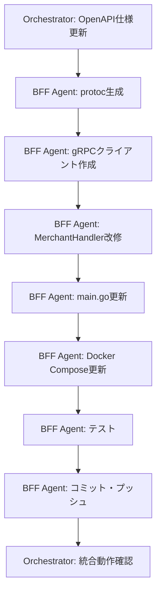

# BFF gRPC統合 (Phase 2) - タスクリスト

## 実装方針

**通常のClaude Code（単一Agent）で実装する。**
BFF Agent単体の作業であり、Agent Teamsを使用するとコストが増大するため。
以下のタスクリストは実装ガイドとして使用する。

## タスク分担

### BFF Agent（単一Agent実行）

**担当範囲:** `services/bff/`

#### Protocol Buffers
- [ ] protoc-gen-go / protoc-gen-go-grpc インストール確認
- [ ] protoc生成コード配置（`internal/pb/`）- BFF用go_packageオーバーライド
- [ ] 生成コマンドをMakefileに定義

#### gRPCクライアント
- [ ] `internal/grpc/client.go` 作成
  - [ ] `BackendClient` 構造体（conn + MerchantServiceClient）
  - [ ] `NewBackendClient(addr string)` コンストラクタ
  - [ ] `Close()` メソッド（グレースフルシャットダウン用）
- [ ] go.mod に gRPC/protobuf 依存関係追加

#### MerchantHandler 改修
- [ ] `mockMerchants` 変数と `filterMerchants` 関数を削除
- [ ] 構造体に `pb.MerchantServiceClient` フィールド追加
- [ ] `permissionService` の型を `*service.PermissionService` → `service.PermissionServiceInterface` に変更（テスタビリティ向上）
- [ ] `NewMerchantHandler` の引数変更（gRPCクライアント追加、PermissionServiceInterface型）
- [ ] `merchantToMap` ヘルパー関数作成（pb.Merchant → map変換）
- [ ] `handleGRPCError` ヘルパー関数作成（gRPCステータス → HTTPステータス変換）
- [ ] `ListMerchants` をgRPC呼び出しに置換
- [ ] `GetMerchant` 新規実装（`GET /api/v1/merchants/:id`）
  - [ ] 認証・認可チェック（merchants:read）
  - [ ] gRPC `GetMerchant` 呼び出し
  - [ ] NOT_FOUND → 404 変換
- [ ] `CreateMerchant` 新規実装（`POST /api/v1/merchants`）
  - [ ] 認証・認可チェック（merchants:create）
  - [ ] リクエストバリデーション（name, address, contact_person, phone 必須）
  - [ ] BFF user_id を created_by として渡す
  - [ ] 成功時 201 Created

#### サーバー起動（cmd/server/main.go）
- [ ] gRPCクライアント初期化（BACKEND_GRPC_ADDR環境変数）
- [ ] MerchantHandler初期化の依存関係更新
- [ ] ルート追加: `GET /merchants/:id`, `POST /merchants`
- [ ] グレースフルシャットダウン時にgRPCクライアントClose

#### Docker Compose・環境設定
- [ ] docker-compose.yml の `version: '3.8'` キーを削除（非推奨）
- [ ] docker-compose.yml に外部ネットワーク追加（backend_default）
- [ ] BACKEND_GRPC_ADDR 環境変数追加
- [ ] .env.example に BACKEND_GRPC_ADDR 追加

#### 権限マイグレーション
- [x] `merchants:create` 権限がBFF DBに存在するか確認 → **確認済み: 追加不要**
  - V8__seed_permissions.sql で定義済み
  - V9__seed_role_permissions.sql で system-admin, contract-manager に付与済み

#### テスト
- [ ] `internal/handler/merchant_handler_test.go` 作成
  - [ ] gRPCクライアントモック作成
  - [ ] ListMerchants: 正常系、gRPCエラー
  - [ ] GetMerchant: 正常系、NOT_FOUND、INVALID_ARGUMENT
  - [ ] CreateMerchant: 正常系(201)、バリデーションエラー(400)
  - [ ] handleGRPCError: ステータスコード変換テスト
- [ ] 既存テスト（auth_handler_test, auth_service_test）が引き続きパスすることを確認

#### 静的解析
- [ ] `go fmt ./...`
- [ ] `go vet ./...`

#### コミット・プッシュ
- [ ] featureブランチでコミット
- [ ] リモートにプッシュ

---

### Orchestrator（親リポジトリ）

**担当範囲:** 親リポジトリ（`contracts/openapi/`）

#### OpenAPI仕様更新
- [ ] `contracts/openapi/bff-api.yaml` 更新
  - [ ] `GET /api/v1/merchants/{id}` エンドポイント追加
  - [ ] `POST /api/v1/merchants` エンドポイント追加
  - [ ] Merchantスキーマに `email`, `is_active` フィールド追加
  - [ ] モックデータの記述を削除

#### 動作確認
- [ ] Backend Docker Compose起動確認
- [ ] BFF Docker Compose起動確認（外部ネットワーク接続）
- [ ] curl等で統合動作確認
  - [ ] `GET /api/v1/merchants` - 実データ返却
  - [ ] `GET /api/v1/merchants/:id` - 詳細取得
  - [ ] `POST /api/v1/merchants` - 新規登録
- [ ] 親リポジトリにコミット・プッシュ

---

## Agent間の依存関係

### 依存関係図

### 備考
- OpenAPI仕様更新とprotoc生成は並行実行可能
- MerchantHandler改修はprotoc生成コードに依存
- 統合動作確認はBFF Agent完了後にOrchestratorが実施

---

## 実装順序（推奨）

### フェーズ1: 基盤セットアップ
1. OpenAPI仕様更新（Orchestrator）
2. protoc生成 + go.mod依存関係追加
3. gRPCクライアント作成

### フェーズ2: ハンドラー実装
1. MerchantHandler改修（モック削除 → gRPC）
2. GetMerchant, CreateMerchant 新規実装
3. main.go更新（ルート追加、依存関係注入）

### フェーズ3: 環境・テスト
1. Docker Compose更新
2. 権限マイグレーション（必要な場合）
3. ユニットテスト作成・実行

### フェーズ4: 統合確認
1. Backend + BFF Docker Compose起動
2. curl等で統合動作確認
3. コミット・プッシュ

---

## 完了条件

### BFF Agent
- [ ] モックデータが完全に削除されている
- [ ] gRPC経由でBackendから実データを取得できる
- [ ] ListMerchants, GetMerchant, CreateMerchant が正常動作
- [ ] gRPCエラー → HTTPエラーの変換が正しい
- [ ] ユニットテストがすべて成功
- [ ] `go vet` / `go fmt` エラーなし

### Orchestrator
- [ ] OpenAPI仕様が更新されている
- [ ] Backend + BFF 統合動作確認完了
- [ ] 親リポジトリにコミット・プッシュ済み

---

**作成日:** 2026-04-09
**作成者:** Claude Code
