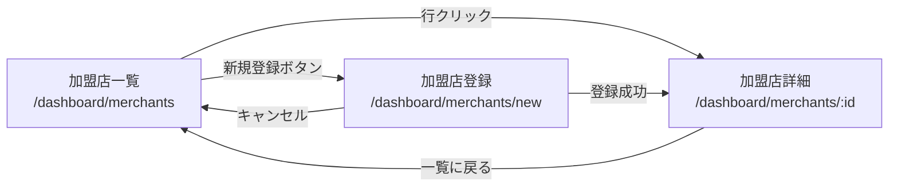
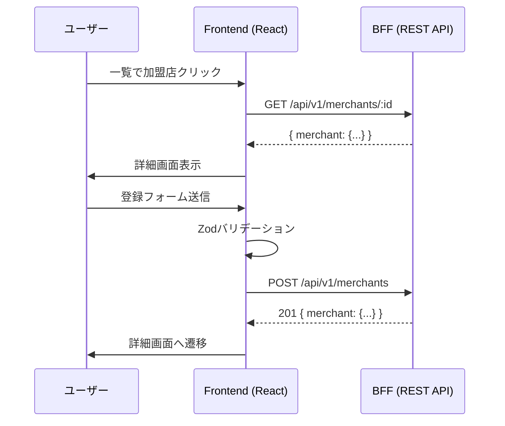

# Frontend 加盟店画面追加 (Phase 3) - 設計

## アーキテクチャ

### 画面遷移図



### データフロー



---

## 新規ファイル

| ファイル | 説明 |
|---------|------|
| `src/app/dashboard/merchants/[id]/page.tsx` | 加盟店詳細ページ |
| `src/app/dashboard/merchants/new/page.tsx` | 加盟店登録ページ |
| `src/components/merchants/MerchantDetail.tsx` | 加盟店詳細コンポーネント |
| `src/components/merchants/MerchantForm.tsx` | 加盟店登録フォームコンポーネント |
| `src/hooks/use-merchant.ts` | 加盟店詳細取得フック |
| `src/hooks/use-create-merchant.ts` | 加盟店登録フック |
| `tests/MerchantDetail.test.tsx` | 詳細コンポーネントテスト |
| `tests/MerchantForm.test.tsx` | フォームコンポーネントテスト |

## 変更ファイル

| ファイル | 変更内容 |
|---------|---------|
| `src/types/api.ts` | OpenAPI型再生成（getMerchant, createMerchant追加） |
| `src/components/merchants/MerchantList.tsx` | 行クリックで詳細遷移、新規登録ボタン追加 |
| `src/app/dashboard/merchants/page.tsx` | 新規登録ボタン追加（ヘッダー部分） |

---

## 加盟店詳細画面

### ページ: `src/app/dashboard/merchants/[id]/page.tsx`

```tsx
'use client';

import { MerchantDetail } from '@/components/merchants/MerchantDetail';
import { useParams } from 'next/navigation';

export default function MerchantDetailPage() {
  const params = useParams();
  const id = params.id as string;
  return <MerchantDetail merchantId={id} />;
}
```

### コンポーネント: `MerchantDetail.tsx`

```tsx
interface MerchantDetailProps {
  merchantId: string;
}

// 表示項目
// - 加盟店コード（merchant_code）
// - 加盟店名（name）
// - 住所（address）
// - 担当者（contact_person）
// - 電話番号（phone）
// - メールアドレス（email）
// - ステータス（is_active → 有効/無効）
// - 登録日（created_at）
// - 更新日（updated_at）
```

**UI構成:**
- shadcn/ui の `Card` でセクション分け
- 項目はラベル + 値の定義リスト形式
- 上部に「一覧に戻る」リンク（← アイコン + テキスト）
- ローディング時はスケルトン表示
- 404時は「加盟店が見つかりません」

---

## 加盟店登録画面

### ページ: `src/app/dashboard/merchants/new/page.tsx`

```tsx
'use client';

import { MerchantForm } from '@/components/merchants/MerchantForm';

export default function NewMerchantPage() {
  return (
    <div className="space-y-6">
      <h2 className="text-2xl font-bold tracking-tight">加盟店登録</h2>
      <MerchantForm />
    </div>
  );
}
```

### コンポーネント: `MerchantForm.tsx`

**Zodスキーマ:**
```typescript
const merchantFormSchema = z.object({
  name: z.string().min(1, '加盟店名は必須です').max(200, '200文字以内で入力してください'),
  address: z.string().min(1, '住所は必須です'),
  contact_person: z.string().min(1, '担当者名は必須です').max(100, '100文字以内で入力してください'),
  phone: z.string().min(1, '電話番号は必須です').max(20, '20文字以内で入力してください'),
  email: z.string().email('メールアドレスの形式が正しくありません').max(255).or(z.literal('')).optional(),
});
```

**UI構成:**
- shadcn/ui の `Card` + `Form` コンポーネント
- 各フィールドに `Label` + `Input` + バリデーションエラー表示
- 「登録」ボタン（送信中はローディング状態）
- 「キャンセル」ボタン（一覧に戻る）
- 登録成功後: `router.push(`/dashboard/merchants/${merchant.merchant_id}`)` で詳細画面へ

**依存ライブラリ（追加が必要な場合）:**
- `zod` - バリデーション
- `react-hook-form` - フォーム管理
- `@hookform/resolvers` - Zodリゾルバー

---

## APIフック

### use-merchant.ts（詳細取得）

```typescript
import { useQuery } from '@tanstack/react-query';
import { apiClient } from '@/lib/api/client';
import type { components } from '@/types/api';

type Merchant = components['schemas']['Merchant'];

export function useMerchant(id: string) {
  return useQuery<{ merchant: Merchant }>({
    queryKey: ['merchant', id],
    queryFn: async () => {
      const response = await apiClient.get(`/api/v1/merchants/${id}`);
      return response.data;
    },
    enabled: !!id,
  });
}
```

### use-create-merchant.ts（登録）

```typescript
import { useMutation, useQueryClient } from '@tanstack/react-query';
import { apiClient } from '@/lib/api/client';

interface CreateMerchantInput {
  name: string;
  address: string;
  contact_person: string;
  phone: string;
  email?: string;
}

export function useCreateMerchant() {
  const queryClient = useQueryClient();

  return useMutation({
    mutationFn: async (input: CreateMerchantInput) => {
      const response = await apiClient.post('/api/v1/merchants', input);
      return response.data;
    },
    onSuccess: () => {
      // 一覧キャッシュを無効化
      queryClient.invalidateQueries({ queryKey: ['merchants'] });
    },
  });
}
```

---

## MerchantList 変更

### 行クリックで詳細遷移

```tsx
import { useRouter } from 'next/navigation';

// TableRowにクリックハンドラーを追加
<TableRow
  key={merchant.merchant_id}
  className="cursor-pointer hover:bg-muted/50"
  onClick={() => router.push(`/dashboard/merchants/${merchant.merchant_id}`)}
>
```

### 新規登録ボタン追加

加盟店一覧ページ（`page.tsx`）のヘッダーに追加:
```tsx
import Link from 'next/link';
import { Button } from '@/components/ui/button';

<div className="flex items-center justify-between">
  <div>
    <h2>加盟店一覧</h2>
    <p>登録済みの加盟店を一覧表示します</p>
  </div>
  <Link href="/dashboard/merchants/new">
    <Button>新規登録</Button>
  </Link>
</div>
```

---

## OpenAPI型再生成

```bash
cd services/frontend
npx openapi-typescript ../../contracts/openapi/bff-api.yaml --output src/types/api.ts
```

Phase 2でOpenAPI仕様に追加された以下が型に反映される:
- `GET /api/v1/merchants/{id}` → `getMerchant` operation
- `POST /api/v1/merchants` → `createMerchant` operation
- `Merchant` スキーマに `email`, `is_active` フィールド

---

## テスト設計

### MerchantDetail.test.tsx

- 正常表示: 全項目が表示されるか
- ローディング状態
- エラー状態: 「取得に失敗しました」表示
- 404: 「見つかりません」表示

### MerchantForm.test.tsx

- バリデーション: 空送信時のエラー表示
- バリデーション: メール形式チェック
- 正常送信: API呼び出し + 遷移
- エラー: APIエラー時のメッセージ表示

---

**作成日:** 2026-04-10
**作成者:** Claude Code
