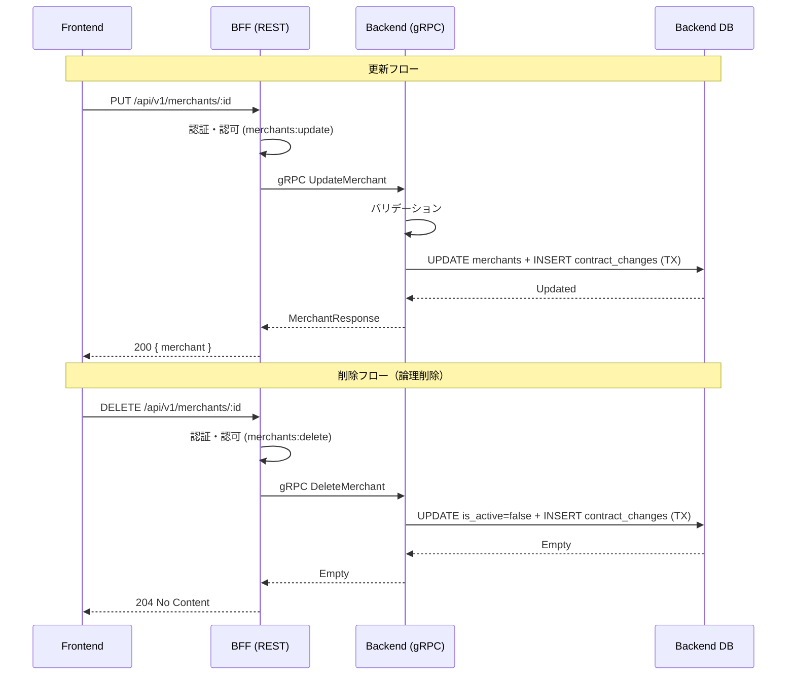

# 加盟店更新・削除機能 - 設計

## アーキテクチャ

### データフロー



---

## Protocol Buffers追加定義

`contracts/proto/merchant.proto` に追加:

```protobuf
// 既存のserviceブロックに追加
service MerchantService {
  // 既存...
  rpc UpdateMerchant(UpdateMerchantRequest) returns (MerchantResponse);
  rpc DeleteMerchant(DeleteMerchantRequest) returns (DeleteMerchantResponse);
}

message UpdateMerchantRequest {
  string merchant_id = 1;
  string name = 2;
  string address = 3;
  string contact_person = 4;
  string phone = 5;
  string email = 6;
  string updated_by = 7; // user_id from BFF (for audit)
}

message DeleteMerchantRequest {
  string merchant_id = 1;
  string deleted_by = 2; // user_id from BFF (for audit)
}

message DeleteMerchantResponse {}
```

---

## Backend変更

### 変更ファイル

| ファイル | 変更内容 |
|---------|---------|
| `db/queries/merchant.sql` | UpdateMerchant, SoftDeleteMerchant クエリ追加 |
| `internal/sqlc/` | sqlc再生成 |
| `internal/pb/` | protoc再生成 |
| `internal/repository/merchant_repository.go` | UpdateMerchant, SoftDeleteMerchant メソッド追加 |
| `internal/service/merchant_service.go` | UpdateMerchant, DeleteMerchant ビジネスロジック追加 |
| `internal/grpc/merchant_server.go` | UpdateMerchant, DeleteMerchant RPC実装 |
| `internal/service/merchant_service_test.go` | テスト追加 |
| `internal/grpc/merchant_server_test.go` | テスト追加 |

### sqlcクエリ追加

```sql
-- name: UpdateMerchant :one
UPDATE merchants
SET name = $2, address = $3, contact_person = $4, phone = $5, email = $6, updated_at = NOW()
WHERE merchant_id = $1 AND is_active = TRUE
RETURNING *;

-- name: SoftDeleteMerchant :exec
UPDATE merchants
SET is_active = FALSE, updated_at = NOW()
WHERE merchant_id = $1 AND is_active = TRUE;
```

### 監査記録（J-SOX）

- **UpdateMerchant**: 変更されたフィールドごとにcontract_changesに記録（old_value/new_value）
- **DeleteMerchant**: change_type='DELETE'としてcontract_changesに記録
- 両方ともトランザクション内で実行（既存のWithTxパターン使用）

---

## BFF変更

### 変更ファイル

| ファイル | 変更内容 |
|---------|---------|
| `internal/pb/` | protoc再生成 |
| `internal/handler/merchant_handler.go` | UpdateMerchant, DeleteMerchant ハンドラー追加 |
| `cmd/server/main.go` | ルート追加 (`PUT /:id`, `DELETE /:id`) |
| `internal/handler/merchant_handler_test.go` | テスト追加 |

### ハンドラー設計

```go
// PUT /api/v1/merchants/:id
func (h *MerchantHandler) UpdateMerchant(c echo.Context) error {
    // 認証・認可 (merchants:update)
    // リクエストバインド + バリデーション
    // gRPC UpdateMerchant呼び出し（user_idをupdated_byとして渡す）
    // 200 + merchant JSON
}

// DELETE /api/v1/merchants/:id
func (h *MerchantHandler) DeleteMerchant(c echo.Context) error {
    // 認証・認可 (merchants:delete)
    // gRPC DeleteMerchant呼び出し（user_idをdeleted_byとして渡す）
    // 204 No Content
}
```

### 権限確認

BFF DB の `permissions` / `role_permissions` テーブルに以下が存在するか確認:
- `merchants:update` → V8で定義済みの場合はOK
- `merchants:delete` → 存在しない場合はFlywayマイグレーション追加

---

## Frontend変更

### 新規ファイル

| ファイル | 説明 |
|---------|------|
| `src/app/dashboard/merchants/[id]/edit/page.tsx` | 編集ページ |
| `src/components/merchants/MerchantEditForm.tsx` | 編集フォーム（プリフィル付き） |
| `src/components/merchants/DeleteMerchantDialog.tsx` | 削除確認ダイアログ |
| `src/hooks/use-update-merchant.ts` | 更新フック（useMutation） |
| `src/hooks/use-delete-merchant.ts` | 削除フック（useMutation） |
| `tests/MerchantEditForm.test.tsx` | 編集フォームテスト |
| `tests/DeleteMerchantDialog.test.tsx` | 削除ダイアログテスト |

### 変更ファイル

| ファイル | 変更内容 |
|---------|---------|
| `src/components/merchants/MerchantDetail.tsx` | 「編集」「削除」ボタン追加 |
| `src/types/api.ts` | OpenAPI型再生成 |

### 編集フォーム設計

- `MerchantForm.tsx` と同じZodスキーマ・バリデーション
- `useMerchant(id)` で既存データ取得 → フォームにプリフィル
- 更新成功 → `router.push(`/dashboard/merchants/${id}`)` で詳細へ

### 削除確認ダイアログ

- ブラウザの `window.confirm` またはカスタムダイアログ
- 「この加盟店を削除しますか？この操作は取り消せません。」
- 確認 → `useDeleteMerchant` 実行 → 一覧画面へ遷移

---

## OpenAPI仕様追加

### PUT /api/v1/merchants/{id}

```yaml
put:
  tags: [Merchants]
  summary: Update merchant
  operationId: updateMerchant
  security: [sessionAuth: []]
  parameters:
    - name: id
      in: path
      required: true
      schema: { type: string, format: uuid }
  requestBody:
    required: true
    content:
      application/json:
        schema:
          type: object
          required: [name, address, contact_person, phone]
          properties:
            name: { type: string, maxLength: 200 }
            address: { type: string }
            contact_person: { type: string, maxLength: 100 }
            phone: { type: string, maxLength: 20 }
            email: { type: string, format: email }
  responses:
    '200': { description: Merchant updated }
    '400': { description: Validation error }
    '404': { description: Merchant not found }
```

### DELETE /api/v1/merchants/{id}

```yaml
delete:
  tags: [Merchants]
  summary: Delete merchant (soft delete)
  operationId: deleteMerchant
  security: [sessionAuth: []]
  parameters:
    - name: id
      in: path
      required: true
      schema: { type: string, format: uuid }
  responses:
    '204': { description: Merchant deleted }
    '404': { description: Merchant not found }
```

---

**作成日:** 2026-04-10
**作成者:** Claude Code
