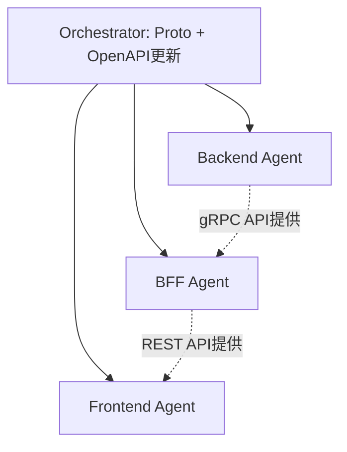

# 加盟店更新・削除機能 - タスクリスト

## 実装方針

**Agent Teamsで3 Agent並行実装する。**
Backend/BFF/Frontendの3サービスに跨る変更のため。

ただし、Backend→BFF→Frontendの依存関係があるため、
Proto定義とOpenAPI仕様をOrchestratorが事前に確定させてから各Agentを起動する。

## Orchestrator（事前作業）

#### Proto定義・OpenAPI仕様更新
- [ ] `contracts/proto/merchant.proto` にUpdateMerchant/DeleteMerchant RPC追加
- [ ] `contracts/openapi/bff-api.yaml` にPUT/DELETEエンドポイント追加
- [ ] BFF DBに `merchants:update` / `merchants:delete` 権限が存在するか確認

---

## Agent別タスク分担

### Backend Agent

**担当範囲:** `services/backend/`

#### protoc再生成
- [ ] `internal/pb/` を最新proto定義から再生成

#### データアクセス層
- [ ] `db/queries/merchant.sql` にUpdateMerchant, SoftDeleteMerchantクエリ追加
- [ ] sqlc再生成

#### リポジトリ層
- [ ] `MerchantRepository` インターフェースにUpdateMerchant, SoftDeleteMerchant追加
- [ ] 実装追加（WithTx対応）

#### サービス層
- [ ] `MerchantService` にUpdateMerchant, DeleteMerchant追加
- [ ] UpdateMerchant: バリデーション + 変更フィールド検出 + 監査記録（トランザクション）
- [ ] DeleteMerchant: 論理削除 + 監査記録（トランザクション）

#### gRPCハンドラー
- [ ] `merchant_server.go` にUpdateMerchant, DeleteMerchant RPC実装
- [ ] エラーハンドリング（NOT_FOUND, INVALID_ARGUMENT）

#### テスト
- [ ] サービス層テスト追加
- [ ] gRPCハンドラーテスト追加
- [ ] `go vet` / `go fmt` クリーン

#### コミット・プッシュ
- [ ] featureブランチでコミット・プッシュ

---

### BFF Agent

**担当範囲:** `services/bff/`

#### protoc再生成
- [ ] `internal/pb/` を最新proto定義から再生成（BFF用go_packageオーバーライド）

#### ハンドラー追加
- [ ] `UpdateMerchant` ハンドラー（PUT /merchants/:id）
  - [ ] 認証・認可（merchants:update）
  - [ ] リクエストバリデーション
  - [ ] gRPC呼び出し（user_idをupdated_byとして渡す）
  - [ ] 200 + merchantレスポンス
- [ ] `DeleteMerchant` ハンドラー（DELETE /merchants/:id）
  - [ ] 認証・認可（merchants:delete）
  - [ ] gRPC呼び出し（user_idをdeleted_byとして渡す）
  - [ ] 204 No Content

#### ルート追加
- [ ] `cmd/server/main.go` にPUT/DELETEルート追加

#### 権限マイグレーション
- [ ] `merchants:update` / `merchants:delete` がBFF DBに存在するか確認
- [ ] 存在しない場合、Flywayマイグレーション追加

#### テスト
- [ ] UpdateMerchant: 正常系、バリデーションエラー、NOT_FOUND、権限エラー
- [ ] DeleteMerchant: 正常系(204)、NOT_FOUND、権限エラー
- [ ] 既存テスト全パス確認
- [ ] `go vet` / `go fmt` クリーン

#### コミット・プッシュ
- [ ] featureブランチでコミット・プッシュ

---

### Frontend Agent

**担当範囲:** `services/frontend/`

#### OpenAPI型再生成
- [ ] `npm run generate:api-types`

#### APIフック追加
- [ ] `src/hooks/use-update-merchant.ts` - useMutation + キャッシュ無効化
- [ ] `src/hooks/use-delete-merchant.ts` - useMutation + キャッシュ無効化

#### 編集画面
- [ ] `src/app/dashboard/merchants/[id]/edit/page.tsx`
- [ ] `src/components/merchants/MerchantEditForm.tsx`
  - [ ] 既存データプリフィル（useMerchantで取得）
  - [ ] Zodバリデーション（登録画面と同じルール）
  - [ ] 更新成功→詳細画面遷移
  - [ ] エラー表示

#### 削除機能
- [ ] `src/components/merchants/DeleteMerchantDialog.tsx` - 確認ダイアログ
- [ ] 削除成功→一覧画面遷移

#### 既存画面変更
- [ ] `MerchantDetail.tsx` に「編集」「削除」ボタン追加

#### テスト
- [ ] `tests/MerchantEditForm.test.tsx`
- [ ] `tests/DeleteMerchantDialog.test.tsx`
- [ ] 既存テスト全パス確認
- [ ] `npm run type-check` / `npm run lint` クリーン

#### コミット・プッシュ
- [ ] featureブランチでコミット・プッシュ

---

## Agent間の依存関係

- Proto定義とOpenAPI仕様をOrchestratorが事前確定
- 各Agentはprotoc/openapi-typescript で各自生成コードを作成
- Backend/BFF/Frontendは並行実装可能（各自モック/生成コードで開発）

---

## 実装順序

### フェーズ1: Orchestrator事前作業
1. Proto定義更新 + コミット
2. OpenAPI仕様更新 + コミット

### フェーズ2: 3 Agent並行実装
1. Backend Agent: protoc再生成 → sqlc → リポジトリ → サービス → gRPC → テスト
2. BFF Agent: protoc再生成 → ハンドラー → ルート → 権限確認 → テスト
3. Frontend Agent: 型再生成 → フック → 画面 → テスト

### フェーズ3: Orchestrator統合確認
1. 統合Docker Compose起動
2. curl / ブラウザで動作確認
3. サブモジュール参照更新 + コミット・プッシュ

---

## 完了条件

### Backend Agent
- [ ] UpdateMerchant / DeleteMerchant gRPC RPCが正常動作
- [ ] 監査記録（contract_changes）にUPDATE/DELETEが記録される
- [ ] テスト全パス、`go vet`/`go fmt` クリーン

### BFF Agent
- [ ] PUT/DELETE エンドポイントが正常動作
- [ ] 権限チェック（merchants:update/delete）が機能
- [ ] テスト全パス、`go vet`/`go fmt` クリーン

### Frontend Agent
- [ ] 編集画面でプリフィル・更新が動作
- [ ] 削除確認ダイアログ→論理削除が動作
- [ ] テスト全パス、型チェック・リントクリーン

### Orchestrator
- [ ] 統合Docker Composeで全サービス動作確認

---

**作成日:** 2026-04-10
**作成者:** Claude Code
