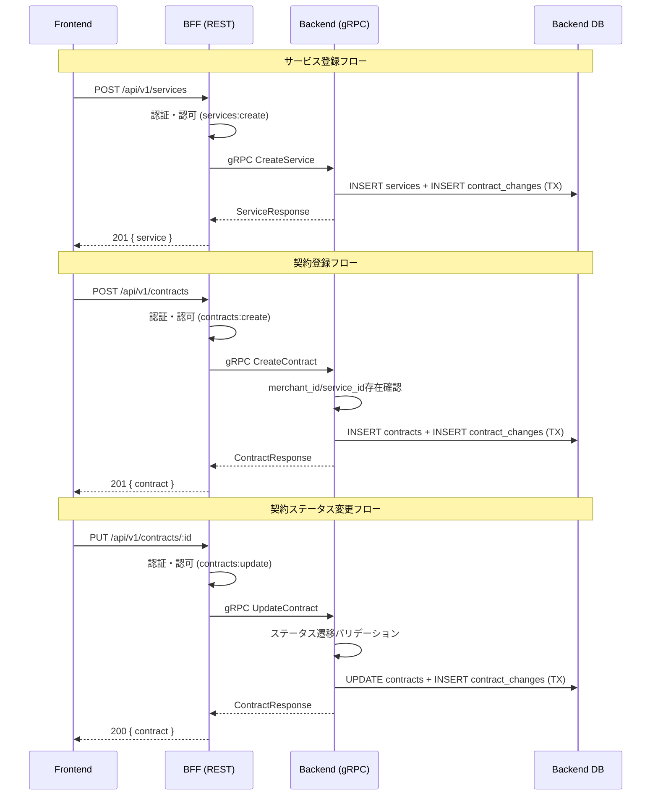

# サービス管理 + 契約管理（Phase 1）- 設計

## アーキテクチャ

### データフロー



---

## Protocol Buffers定義

### `contracts/proto/service.proto`（新規作成）

```protobuf
syntax = "proto3";
package service_mgmt;
option go_package = "github.com/ikechin/agent-teams-backend/internal/pb";

service ServiceMgmtService {
  rpc ListServices(ListServicesRequest) returns (ListServicesResponse);
  rpc GetService(GetServiceRequest) returns (ServiceResponse);
  rpc CreateService(CreateServiceRequest) returns (ServiceResponse);
  rpc UpdateService(UpdateServiceRequest) returns (ServiceResponse);
}

message ServiceItem {
  string service_id = 1;
  string service_code = 2;
  string name = 3;
  string description = 4;
  bool is_active = 5;
  string created_at = 6;
  string updated_at = 7;
}

message ListServicesRequest {
  int32 page = 1;
  int32 limit = 2;
  string search = 3;
}

message ListServicesResponse {
  repeated ServiceItem services = 1;
  Pagination pagination = 2;
}

message Pagination {
  int32 current_page = 1;
  int32 total_pages = 2;
  int32 total_items = 3;
  int32 items_per_page = 4;
}

message GetServiceRequest {
  string service_id = 1;
}

message CreateServiceRequest {
  string name = 1;
  string description = 2;
  string created_by = 3;
}

message UpdateServiceRequest {
  string service_id = 1;
  string name = 2;
  string description = 3;
  bool is_active = 4;
  string updated_by = 5;
}

message ServiceResponse {
  ServiceItem service = 1;
}
```

### `contracts/proto/contract.proto`（新規作成）

```protobuf
syntax = "proto3";
package contract;
option go_package = "github.com/ikechin/agent-teams-backend/internal/pb";

service ContractService {
  rpc ListContracts(ListContractsRequest) returns (ListContractsResponse);
  rpc GetContract(GetContractRequest) returns (ContractResponse);
  rpc CreateContract(CreateContractRequest) returns (ContractResponse);
  rpc UpdateContract(UpdateContractRequest) returns (ContractResponse);
  rpc DeleteContract(DeleteContractRequest) returns (DeleteContractResponse);
}

message ContractItem {
  string contract_id = 1;
  string contract_number = 2;
  string merchant_id = 3;
  string merchant_name = 4;      // JOIN結果
  string service_id = 5;
  string service_name = 6;       // JOIN結果
  string status = 7;             // DRAFT, ACTIVE, SUSPENDED, TERMINATED
  string contract_date = 8;
  string start_date = 9;
  string end_date = 10;
  string monthly_fee = 11;       // DECIMAL→string
  string initial_fee = 12;       // DECIMAL→string
  string created_at = 13;
  string updated_at = 14;
}

message ListContractsRequest {
  int32 page = 1;
  int32 limit = 2;
  string search = 3;             // contract_number or merchant_name
  string status = 4;             // フィルター（空=全件）
  string merchant_id = 5;        // フィルター（空=全件）
  string service_id = 6;         // フィルター（空=全件）
}

message ListContractsResponse {
  repeated ContractItem contracts = 1;
  Pagination pagination = 2;
}

message Pagination {
  int32 current_page = 1;
  int32 total_pages = 2;
  int32 total_items = 3;
  int32 items_per_page = 4;
}

message GetContractRequest {
  string contract_id = 1;
}

message CreateContractRequest {
  string merchant_id = 1;
  string service_id = 2;
  string start_date = 3;
  string end_date = 4;           // optional
  string monthly_fee = 5;
  string initial_fee = 6;
  string created_by = 7;
}

message UpdateContractRequest {
  string contract_id = 1;
  string status = 2;
  string start_date = 3;
  string end_date = 4;
  string monthly_fee = 5;
  string initial_fee = 6;
  string updated_by = 7;
}

message DeleteContractRequest {
  string contract_id = 1;
  string deleted_by = 2;
}

message DeleteContractResponse {}

message ContractResponse {
  ContractItem contract = 1;
}
```

---

## Backend変更

### DBマイグレーション

#### V5__create_services.sql
```sql
CREATE TABLE services (
    service_id UUID PRIMARY KEY DEFAULT gen_random_uuid(),
    service_code VARCHAR(50) UNIQUE NOT NULL,
    name VARCHAR(255) NOT NULL,
    description TEXT,
    is_active BOOLEAN DEFAULT TRUE,
    created_at TIMESTAMPTZ DEFAULT NOW(),
    updated_at TIMESTAMPTZ DEFAULT NOW()
);

CREATE INDEX idx_services_is_active ON services(is_active);
CREATE INDEX idx_services_service_code ON services(service_code);
```

#### V6__create_contracts.sql
```sql
CREATE TABLE contracts (
    contract_id UUID PRIMARY KEY DEFAULT gen_random_uuid(),
    contract_number VARCHAR(50) UNIQUE NOT NULL,
    merchant_id UUID NOT NULL REFERENCES merchants(merchant_id),
    service_id UUID NOT NULL REFERENCES services(service_id),
    status VARCHAR(20) NOT NULL DEFAULT 'DRAFT',
    contract_date DATE,
    start_date DATE NOT NULL,
    end_date DATE,
    monthly_fee DECIMAL(10, 2),
    initial_fee DECIMAL(10, 2),
    created_at TIMESTAMPTZ DEFAULT NOW(),
    updated_at TIMESTAMPTZ DEFAULT NOW(),
    CONSTRAINT chk_contract_status CHECK (status IN ('DRAFT', 'ACTIVE', 'SUSPENDED', 'TERMINATED')),
    CONSTRAINT chk_contract_dates CHECK (end_date IS NULL OR end_date >= start_date)
);

CREATE INDEX idx_contracts_merchant_id ON contracts(merchant_id);
CREATE INDEX idx_contracts_service_id ON contracts(service_id);
CREATE INDEX idx_contracts_status ON contracts(status);
CREATE INDEX idx_contracts_contract_number ON contracts(contract_number);
```

#### V7__seed_services.sql
```sql
INSERT INTO services (service_code, name, description) VALUES
('SVC-00001', '決済サービス', '加盟店向けクレジットカード・電子マネー決済サービス'),
('SVC-00002', 'ポイントサービス', '加盟店向けポイント管理・付与サービス');
```

### 変更ファイル一覧

#### サービス管理

| ファイル | 変更内容 |
|---------|---------|
| `db/migrations/V5__create_services.sql` | servicesテーブル作成 |
| `db/migrations/V7__seed_services.sql` | シードデータ |
| `db/queries/service.sql` | ListServices, GetService, CreateService, UpdateService, CountServices, GetMaxServiceCode クエリ |
| `internal/sqlc/` | sqlc再生成 |
| `internal/model/service.go` | Serviceドメインモデル |
| `internal/pb/` | protoc再生成 |
| `internal/repository/service_repository.go` | ServiceRepository |
| `internal/service/service_service.go` | ServiceServiceビジネスロジック |
| `internal/grpc/service_server.go` | gRPCハンドラー |
| テスト | service_service_test.go, service_server_test.go |

#### 契約管理

| ファイル | 変更内容 |
|---------|---------|
| `db/migrations/V6__create_contracts.sql` | contractsテーブル作成 |
| `db/queries/contract.sql` | ListContracts, GetContract, CreateContract, UpdateContract, SoftDeleteContract, CountContracts, GetMaxContractNumber クエリ |
| `internal/sqlc/` | sqlc再生成 |
| `internal/model/contract.go` | Contractドメインモデル |
| `internal/pb/` | protoc再生成 |
| `internal/repository/contract_repository.go` | ContractRepository |
| `internal/service/contract_service.go` | ContractServiceビジネスロジック |
| `internal/grpc/contract_server.go` | gRPCハンドラー |
| `cmd/server/main.go` | 新gRPCサービス登録 |
| テスト | contract_service_test.go, contract_server_test.go |

### ステータス遷移ルール

```go
var validTransitions = map[string][]string{
    "DRAFT":     {"ACTIVE"},
    "ACTIVE":    {"SUSPENDED", "TERMINATED"},
    "SUSPENDED": {"ACTIVE", "TERMINATED"},
    "TERMINATED": {},  // 終了状態、遷移不可
}
```

### 契約番号自動生成

加盟店コードと同じパターン: `C-XXXXX`（例: C-00001, C-00002）

---

## BFF変更

### 変更ファイル一覧

#### サービス管理

| ファイル | 変更内容 |
|---------|---------|
| `internal/pb/` | protoc再生成（service.proto） |
| `internal/handler/service_handler.go` | ListServices, GetService, CreateService, UpdateService ハンドラー |
| `cmd/server/main.go` | ルート追加 |
| テスト | service_handler_test.go |

#### 契約管理

| ファイル | 変更内容 |
|---------|---------|
| `internal/pb/` | protoc再生成（contract.proto） |
| `internal/handler/contract_handler.go` | ListContracts, GetContract, CreateContract, UpdateContract, DeleteContract ハンドラー |
| `cmd/server/main.go` | ルート追加 |
| テスト | contract_handler_test.go |

### 権限マイグレーション

BFF DBにservices権限が未定義のため、Flywayマイグレーション追加が必要：

```sql
-- V11__seed_service_permissions.sql
INSERT INTO permissions (permission_id, resource, action, description) VALUES
('services:read', 'services', 'read', 'サービス閲覧'),
('services:create', 'services', 'create', 'サービス登録'),
('services:update', 'services', 'update', 'サービス更新');

INSERT INTO role_permissions (role_id, permission_id) VALUES
('system-admin', 'services:read'),
('system-admin', 'services:create'),
('system-admin', 'services:update'),
('contract-manager', 'services:read'),
('sales', 'services:read'),
('viewer', 'services:read');
```

---

## Frontend変更

### 新規ファイル

#### サービス管理

| ファイル | 説明 |
|---------|------|
| `src/app/dashboard/services/page.tsx` | 一覧ページ |
| `src/app/dashboard/services/new/page.tsx` | 登録ページ |
| `src/app/dashboard/services/[id]/page.tsx` | 詳細ページ |
| `src/app/dashboard/services/[id]/edit/page.tsx` | 編集ページ |
| `src/components/services/ServiceList.tsx` | 一覧コンポーネント |
| `src/components/services/ServiceDetail.tsx` | 詳細コンポーネント |
| `src/components/services/ServiceForm.tsx` | 登録フォーム |
| `src/components/services/ServiceEditForm.tsx` | 編集フォーム |
| `src/hooks/use-services.ts` | 一覧取得フック |
| `src/hooks/use-service.ts` | 詳細取得フック |
| `src/hooks/use-create-service.ts` | 登録フック |
| `src/hooks/use-update-service.ts` | 更新フック |
| `src/lib/schemas/service.ts` | Zodバリデーション |

#### 契約管理

| ファイル | 説明 |
|---------|------|
| `src/app/dashboard/contracts/page.tsx` | 一覧ページ |
| `src/app/dashboard/contracts/new/page.tsx` | 登録ページ |
| `src/app/dashboard/contracts/[id]/page.tsx` | 詳細ページ |
| `src/app/dashboard/contracts/[id]/edit/page.tsx` | 編集ページ |
| `src/components/contracts/ContractList.tsx` | 一覧（フィルター付き） |
| `src/components/contracts/ContractDetail.tsx` | 詳細 |
| `src/components/contracts/ContractForm.tsx` | 登録フォーム（加盟店・サービス選択） |
| `src/components/contracts/ContractEditForm.tsx` | 編集フォーム |
| `src/components/contracts/ContractStatusBadge.tsx` | ステータスバッジ |
| `src/components/contracts/TerminateContractDialog.tsx` | 解約確認ダイアログ |
| `src/hooks/use-contracts.ts` | 一覧取得フック |
| `src/hooks/use-contract.ts` | 詳細取得フック |
| `src/hooks/use-create-contract.ts` | 登録フック |
| `src/hooks/use-update-contract.ts` | 更新フック |
| `src/hooks/use-delete-contract.ts` | 解約フック |
| `src/lib/schemas/contract.ts` | Zodバリデーション |

### 変更ファイル

| ファイル | 変更内容 |
|---------|---------|
| `src/components/dashboard/Sidebar.tsx` | 「サービス管理」「契約管理」ナビ追加 |
| `src/types/api.ts` | OpenAPI型再生成 |

---

## OpenAPI仕様追加

`contracts/openapi/bff-api.yaml` に以下のエンドポイントを追加：

### サービス管理
- `GET /api/v1/services` - 一覧
- `GET /api/v1/services/{id}` - 詳細
- `POST /api/v1/services` - 登録
- `PUT /api/v1/services/{id}` - 更新

### 契約管理
- `GET /api/v1/contracts` - 一覧（query: page, limit, search, status, merchant_id, service_id）
- `GET /api/v1/contracts/{id}` - 詳細
- `POST /api/v1/contracts` - 登録
- `PUT /api/v1/contracts/{id}` - 更新
- `DELETE /api/v1/contracts/{id}` - 解約

### 新規スキーマ
- `Service`: service_id, service_code, name, description, is_active, created_at, updated_at
- `Contract`: contract_id, contract_number, merchant_id, merchant_name, service_id, service_name, status, contract_date, start_date, end_date, monthly_fee, initial_fee, created_at, updated_at

---

**作成日:** 2026-04-11
**作成者:** Claude Code
