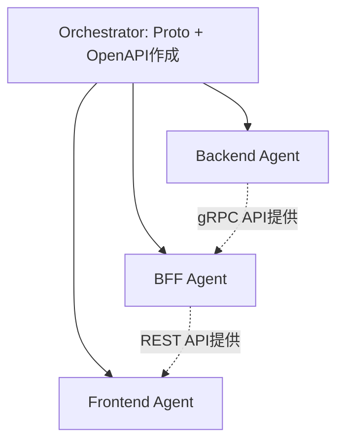

# サービス管理 + 契約管理（Phase 1）- タスクリスト

## 実装方針

**Agent Teamsで3 Agent並行実装する。**
Backend/BFF/Frontendの3サービスに跨る変更のため。

Proto定義とOpenAPI仕様をOrchestratorが事前に確定させてから各Agentを起動する。

## Orchestrator（事前作業）

#### Proto定義・OpenAPI仕様作成
- [ ] `contracts/proto/service.proto` 新規作成（ServiceMgmtService RPC定義）
- [ ] `contracts/proto/contract.proto` 新規作成（ContractService RPC定義）
- [ ] `contracts/openapi/bff-api.yaml` にサービス管理・契約管理エンドポイント追加
- [ ] BFF DBに services 権限が存在するか確認（存在しない場合はBFF Agentに指示）

---

## Agent別タスク分担

### Backend Agent

**担当範囲:** `services/backend/`

#### DBマイグレーション
- [ ] `db/migrations/V5__create_services.sql` - servicesテーブル作成
- [ ] `db/migrations/V6__create_contracts.sql` - contractsテーブル作成
- [ ] `db/migrations/V7__seed_services.sql` - サービスシードデータ

#### protoc再生成
- [ ] `internal/pb/` を最新proto定義（service.proto, contract.proto）から再生成

#### サービス管理: データアクセス層
- [ ] `db/queries/service.sql` - ListServices, GetService, CreateService, UpdateService, CountServices, GetMaxServiceCode
- [ ] sqlc再生成
- [ ] `internal/model/service.go` - Serviceドメインモデル
- [ ] `internal/repository/service_repository.go` - ServiceRepository（WithTx対応）

#### サービス管理: ビジネスロジック
- [ ] `internal/service/service_service.go` - ListServices, GetService, CreateService, UpdateService
- [ ] service_code自動生成（SVC-XXXXX形式）
- [ ] 監査記録（contract_changes）にCREATE/UPDATE記録

#### サービス管理: gRPCハンドラー
- [ ] `internal/grpc/service_server.go` - ListServices, GetService, CreateService, UpdateService RPC実装
- [ ] `cmd/server/main.go` - ServiceMgmtService登録

#### 契約管理: データアクセス層
- [ ] `db/queries/contract.sql` - ListContracts, GetContract, CreateContract, UpdateContract, SoftDeleteContract, CountContracts, GetMaxContractNumber
- [ ] sqlc再生成
- [ ] `internal/model/contract.go` - Contractドメインモデル
- [ ] `internal/repository/contract_repository.go` - ContractRepository（WithTx対応）

#### 契約管理: ビジネスロジック
- [ ] `internal/service/contract_service.go`
  - [ ] CreateContract: merchant_id/service_id存在確認 + contract_number自動生成 + 初期ステータスDRAFT + 監査記録
  - [ ] UpdateContract: ステータス遷移バリデーション + 変更フィールド検出 + 監査記録
  - [ ] DeleteContract: ステータスをTERMINATEDに変更 + 監査記録
  - [ ] ListContracts: ページネーション + status/merchant_id/service_idフィルター
  - [ ] GetContract: 加盟店名・サービス名のJOIN結果を含む

#### 契約管理: gRPCハンドラー
- [ ] `internal/grpc/contract_server.go` - 5 RPC実装
- [ ] `cmd/server/main.go` - ContractService登録

#### テスト
- [ ] `internal/service/service_service_test.go`
- [ ] `internal/grpc/service_server_test.go`
- [ ] `internal/service/contract_service_test.go`
- [ ] `internal/grpc/contract_server_test.go`
- [ ] `go vet` / `go fmt` クリーン

#### コミット・プッシュ
- [ ] featureブランチでコミット・プッシュ

---

### BFF Agent

**担当範囲:** `services/bff/`

#### protoc再生成
- [ ] `internal/pb/` を最新proto定義（service.proto, contract.proto）から再生成

#### 権限マイグレーション
- [ ] `db/migrations/V11__seed_service_permissions.sql` - services:read/create/update 権限追加

#### サービス管理: ハンドラー
- [ ] `internal/handler/service_handler.go`
  - [ ] ListServices（GET /api/v1/services）- 認証 + services:read権限
  - [ ] GetService（GET /api/v1/services/:id）- 認証 + services:read権限 + UUID検証
  - [ ] CreateService（POST /api/v1/services）- 認証 + services:create権限
  - [ ] UpdateService（PUT /api/v1/services/:id）- 認証 + services:update権限 + UUID検証

#### 契約管理: ハンドラー
- [ ] `internal/handler/contract_handler.go`
  - [ ] ListContracts（GET /api/v1/contracts）- 認証 + contracts:read権限 + フィルターパラメータ
  - [ ] GetContract（GET /api/v1/contracts/:id）- 認証 + contracts:read権限 + UUID検証
  - [ ] CreateContract（POST /api/v1/contracts）- 認証 + contracts:create権限
  - [ ] UpdateContract（PUT /api/v1/contracts/:id）- 認証 + contracts:update権限 + UUID検証
  - [ ] DeleteContract（DELETE /api/v1/contracts/:id）- 認証 + contracts:delete権限 + UUID検証

#### ルート追加
- [ ] `cmd/server/main.go` にサービス管理・契約管理ルート追加

#### テスト
- [ ] `internal/handler/service_handler_test.go` - 正常系 + バリデーション + 権限 + UUID検証
- [ ] `internal/handler/contract_handler_test.go` - 正常系 + バリデーション + 権限 + UUID検証
- [ ] 既存テスト全パス
- [ ] `go vet` / `go fmt` クリーン

#### コミット・プッシュ
- [ ] featureブランチでコミット・プッシュ

---

### Frontend Agent

**担当範囲:** `services/frontend/`

#### OpenAPI型再生成
- [ ] `npm run generate:api-types`

#### サイドバー更新
- [ ] `src/components/dashboard/Sidebar.tsx` に「サービス管理」「契約管理」追加

#### サービス管理: フック
- [ ] `src/hooks/use-services.ts` - 一覧取得
- [ ] `src/hooks/use-service.ts` - 詳細取得
- [ ] `src/hooks/use-create-service.ts` - 登録
- [ ] `src/hooks/use-update-service.ts` - 更新

#### サービス管理: 画面
- [ ] `src/lib/schemas/service.ts` - Zodスキーマ
- [ ] `src/app/dashboard/services/page.tsx` - 一覧ページ
- [ ] `src/components/services/ServiceList.tsx` - 一覧コンポーネント
- [ ] `src/app/dashboard/services/[id]/page.tsx` - 詳細ページ
- [ ] `src/components/services/ServiceDetail.tsx` - 詳細コンポーネント
- [ ] `src/app/dashboard/services/new/page.tsx` - 登録ページ
- [ ] `src/components/services/ServiceForm.tsx` - 登録フォーム
- [ ] `src/app/dashboard/services/[id]/edit/page.tsx` - 編集ページ
- [ ] `src/components/services/ServiceEditForm.tsx` - 編集フォーム

#### 契約管理: フック
- [ ] `src/hooks/use-contracts.ts` - 一覧取得（フィルター対応）
- [ ] `src/hooks/use-contract.ts` - 詳細取得
- [ ] `src/hooks/use-create-contract.ts` - 登録
- [ ] `src/hooks/use-update-contract.ts` - 更新
- [ ] `src/hooks/use-delete-contract.ts` - 解約

#### 契約管理: 画面
- [ ] `src/lib/schemas/contract.ts` - Zodスキーマ
- [ ] `src/app/dashboard/contracts/page.tsx` - 一覧ページ
- [ ] `src/components/contracts/ContractList.tsx` - 一覧（ステータスフィルター付き）
- [ ] `src/components/contracts/ContractStatusBadge.tsx` - ステータスバッジ
- [ ] `src/app/dashboard/contracts/[id]/page.tsx` - 詳細ページ
- [ ] `src/components/contracts/ContractDetail.tsx` - 詳細
- [ ] `src/app/dashboard/contracts/new/page.tsx` - 登録ページ
- [ ] `src/components/contracts/ContractForm.tsx` - 登録フォーム（加盟店・サービスドロップダウン）
- [ ] `src/app/dashboard/contracts/[id]/edit/page.tsx` - 編集ページ
- [ ] `src/components/contracts/ContractEditForm.tsx` - 編集フォーム
- [ ] `src/components/contracts/TerminateContractDialog.tsx` - 解約確認ダイアログ

#### テスト
- [ ] サービス管理コンポーネントテスト
- [ ] 契約管理コンポーネントテスト
- [ ] 既存テスト全パス
- [ ] `npm run type-check` / `npm run lint` クリーン

#### コミット・プッシュ
- [ ] featureブランチでコミット・プッシュ

---

## Agent間の依存関係

- Proto定義とOpenAPI仕様をOrchestratorが事前確定
- 各Agentはprotoc/openapi-typescript で各自生成コードを作成
- Backend/BFF/Frontendは並行実装可能

---

## 実装順序

### フェーズ1: Orchestrator事前作業
1. Proto定義作成（service.proto, contract.proto）+ コミット
2. OpenAPI仕様更新 + コミット

### フェーズ2: 3 Agent並行実装
1. Backend Agent: マイグレーション → protoc → sqlc → リポジトリ → サービス → gRPC → テスト
2. BFF Agent: protoc → 権限マイグレーション → ハンドラー → ルート → テスト
3. Frontend Agent: 型再生成 → サイドバー → フック → サービス画面 → 契約画面 → テスト

### フェーズ3: Orchestrator統合確認
1. 統合Docker Compose起動（リビルド）
2. 動作確認
3. E2Eテスト実装・実行
4. サブモジュール参照更新 + コミット・プッシュ

---

## 完了条件

### Backend Agent
- [ ] servicesテーブル + シードデータ作成
- [ ] contractsテーブル作成
- [ ] サービス管理 gRPC 4 RPC正常動作
- [ ] 契約管理 gRPC 5 RPC正常動作
- [ ] ステータス遷移バリデーション機能
- [ ] 監査記録（contract_changes）に全変更記録
- [ ] テスト全パス、`go vet`/`go fmt` クリーン

### BFF Agent
- [ ] サービス管理 REST 4エンドポイント正常動作
- [ ] 契約管理 REST 5エンドポイント正常動作
- [ ] 権限チェック（services:*/contracts:*）機能
- [ ] テスト全パス、`go vet`/`go fmt` クリーン

### Frontend Agent
- [ ] サイドバーに「サービス管理」「契約管理」表示
- [ ] サービスのCRUD画面が動作
- [ ] 契約のCRUD + ステータス管理画面が動作
- [ ] テスト全パス、型チェック・リントクリーン

### Orchestrator
- [ ] 統合Docker Composeで全サービス動作確認
- [ ] E2Eテスト全パス

---

**作成日:** 2026-04-11
**作成者:** Claude Code
