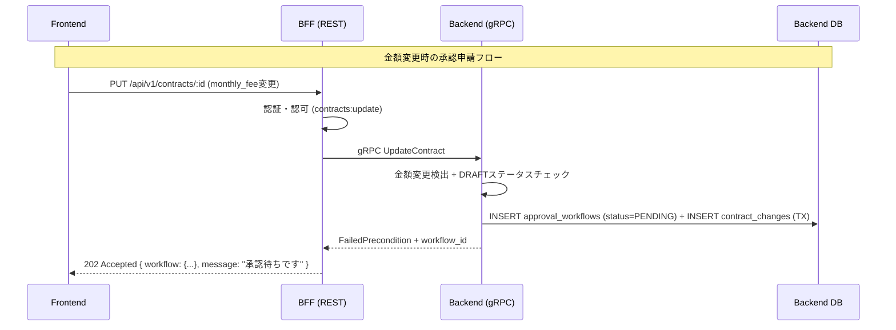
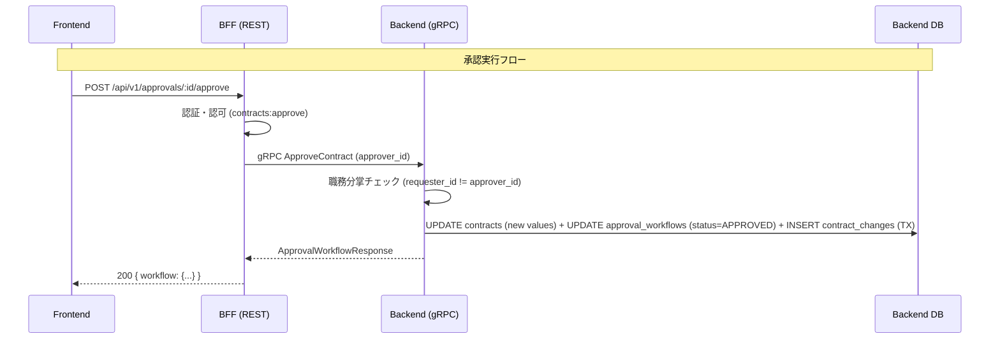
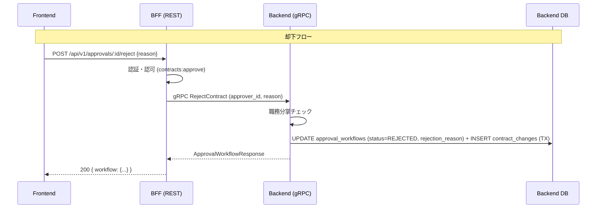

# 契約管理 Phase 2 - 承認ワークフロー 設計

## アーキテクチャ

### データフロー（承認申請フロー）



### データフロー（承認実行フロー）



### データフロー（却下フロー）



---

## Protocol Buffers定義

### `contracts/proto/approval.proto`（新規作成）

```protobuf
syntax = "proto3";

package approval;

import "common.proto";

option go_package = "github.com/ikechin/agent-teams-backend/internal/pb";

service ApprovalService {
  rpc ListPendingApprovals(ListPendingApprovalsRequest) returns (ListPendingApprovalsResponse);
  rpc GetApprovalWorkflow(GetApprovalWorkflowRequest) returns (ApprovalWorkflowResponse);
  rpc ApproveContract(ApproveContractRequest) returns (ApprovalWorkflowResponse);
  rpc RejectContract(RejectContractRequest) returns (ApprovalWorkflowResponse);
}

message ApprovalWorkflowItem {
  string workflow_id = 1;
  string contract_id = 2;
  string contract_number = 3;    // JOIN結果
  string merchant_name = 4;       // JOIN結果
  string service_name = 5;        // JOIN結果
  string requester_id = 6;
  optional string approver_id = 7;         // 承認/却下時のみセット（PENDING時はnil）
  string status = 8;              // PENDING, APPROVED, REJECTED
  string old_monthly_fee = 9;
  string new_monthly_fee = 10;
  string old_initial_fee = 11;
  string new_initial_fee = 12;
  string requested_at = 13;
  optional string approved_at = 14;         // 承認/却下時のみセット
  optional string rejection_reason = 15;    // 却下時のみセット
}

message ListPendingApprovalsRequest {
  int32 page = 1;
  int32 limit = 2;
  string exclude_requester_id = 3; // 申請者自身を除外（職務分掌）
}

message ListPendingApprovalsResponse {
  repeated ApprovalWorkflowItem workflows = 1;
  common.Pagination pagination = 2;
}

message GetApprovalWorkflowRequest {
  string workflow_id = 1;
}

message ApproveContractRequest {
  string workflow_id = 1;
  string approver_id = 2;
}

message RejectContractRequest {
  string workflow_id = 1;
  string approver_id = 2;
  string rejection_reason = 3;
}

message ApprovalWorkflowResponse {
  ApprovalWorkflowItem workflow = 1;
}
```

**Nullable フィールドの扱い:**
- `approver_id`, `approved_at`, `rejection_reason` は `optional` として定義
- Go側: `*string` ポインタで受け取り、nil の場合は JSON レスポンスで省略（`omitempty`）
- Frontend側: TypeScript型で `string | null` として扱う
- BFF側: `contractItemToMap` と同じパターンで空値を `nil` 変換（Phase 1 の `emptyToNil` ヘルパーを再利用）

### `contracts/proto/contract.proto`（修正）

`UpdateContractRequest` のレスポンスは従来通り。金額変更時はgRPCエラー `FailedPrecondition` を返すが、**エラー識別は文字列マッチではなく `google.rpc.ErrorInfo` による構造化エラー** で行う。

**構造化エラーの仕様:**
```go
import (
    errdetails "google.golang.org/genproto/googleapis/rpc/errdetails"
    "google.golang.org/grpc/status"
)

// 金額変更 → 承認待ち作成時
st := status.New(codes.FailedPrecondition, "金額変更には承認が必要です")
detail := &errdetails.ErrorInfo{
    Reason: "APPROVAL_REQUIRED",
    Domain: "contract.example.com",
    Metadata: map[string]string{
        "workflow_id": workflow.WorkflowID,
        "contract_id": req.ContractId,
    },
}
stWithDetails, _ := st.WithDetails(detail)
return nil, stWithDetails.Err()

// 二重申請エラー時
st := status.New(codes.FailedPrecondition, "既に承認待ちの変更があります")
detail := &errdetails.ErrorInfo{
    Reason: "APPROVAL_PENDING",
    Domain: "contract.example.com",
    Metadata: map[string]string{
        "workflow_id": existing.WorkflowID,
    },
}
```

**BFF側の判定ロジック:**
```go
st, ok := status.FromError(err)
if ok && st.Code() == codes.FailedPrecondition {
    for _, detail := range st.Details() {
        if errInfo, ok := detail.(*errdetails.ErrorInfo); ok {
            switch errInfo.Reason {
            case "APPROVAL_REQUIRED":
                return c.JSON(http.StatusAccepted, map[string]interface{}{
                    "message":     "承認待ちです",
                    "workflow_id": errInfo.Metadata["workflow_id"],
                })
            case "APPROVAL_PENDING":
                return c.JSON(http.StatusConflict, map[string]interface{}{
                    "error":       "既に承認待ちの変更があります",
                    "workflow_id": errInfo.Metadata["workflow_id"],
                })
            }
        }
    }
}
```

これにより文字列マッチの脆さを排除し、i18n対応やメッセージ変更にも強い設計となる。

---

## Backend変更

### DBマイグレーション

#### V8__create_approval_workflows.sql
```sql
CREATE TABLE approval_workflows (
    workflow_id UUID PRIMARY KEY DEFAULT gen_random_uuid(),
    contract_id UUID NOT NULL REFERENCES contracts(contract_id),
    requester_id UUID NOT NULL,
    approver_id UUID,
    status VARCHAR(20) NOT NULL DEFAULT 'PENDING',
    old_monthly_fee DECIMAL(10, 2),
    new_monthly_fee DECIMAL(10, 2),
    old_initial_fee DECIMAL(10, 2),
    new_initial_fee DECIMAL(10, 2),
    requested_at TIMESTAMPTZ DEFAULT NOW(),
    approved_at TIMESTAMPTZ,
    rejection_reason TEXT,
    CONSTRAINT chk_approval_status CHECK (status IN ('PENDING', 'APPROVED', 'REJECTED')),
    CONSTRAINT chk_approval_segregation CHECK (approver_id IS NULL OR approver_id != requester_id)
);

CREATE INDEX idx_approval_workflows_contract_id ON approval_workflows(contract_id);
CREATE INDEX idx_approval_workflows_status ON approval_workflows(status);
CREATE INDEX idx_approval_workflows_requester_id ON approval_workflows(requester_id);
CREATE INDEX idx_approval_workflows_requested_at ON approval_workflows(requested_at DESC);

-- 二重申請禁止: 同一契約で PENDING 状態のワークフローは1件のみ
CREATE UNIQUE INDEX idx_approval_workflows_pending_contract 
ON approval_workflows(contract_id) 
WHERE status = 'PENDING';
```

### 変更ファイル一覧

| ファイル | 変更内容 |
|---------|---------|
| `db/migrations/V8__create_approval_workflows.sql` | approval_workflowsテーブル作成 |
| `db/queries/approval.sql` | ListPendingApprovals, GetApprovalWorkflow, CreateWorkflow, ApproveWorkflow, RejectWorkflow, GetPendingByContract クエリ |
| `internal/sqlc/approval.sql.go` | sqlc再生成 |
| `internal/model/approval.go` | ApprovalWorkflowドメインモデル + ValidStatusTransitions |
| `internal/pb/approval.pb.go` | protoc再生成 |
| `internal/pb/approval_grpc.pb.go` | protoc再生成 |
| `internal/repository/approval_repository.go` | ApprovalRepository（WithTx対応） |
| `internal/service/approval_service.go` | 承認ビジネスロジック |
| `internal/service/contract_service.go` | UpdateContract修正: 金額変更検出時にワークフロー作成 |
| `internal/grpc/approval_server.go` | ApprovalService gRPCハンドラー |
| `cmd/server/main.go` | ApprovalService登録 |
| テスト | approval_service_test.go, approval_server_test.go, contract_service_test.go（修正） |

### ContractService.UpdateContract の修正ロジック

**ロック方針（要件#7対応）:**
承認待ち中（PENDING ワークフローが存在する）の契約は、金額以外の変更（ステータス遷移、日付等）も含めて**全面ロック**する。これにより承認フロー中の契約状態が安定し、監査証跡の一貫性が保たれる。

```go
import (
    errdetails "google.golang.org/genproto/googleapis/rpc/errdetails"
    "google.golang.org/grpc/status"
    "google.golang.org/grpc/codes"
)

func (s *ContractService) UpdateContract(ctx context.Context, req *pb.UpdateContractRequest) (*model.Contract, error) {
    current, err := s.repo.GetContract(ctx, req.ContractId)
    if err != nil {
        return nil, ErrNotFound
    }

    // DRAFTステータスは承認フロー対象外（自由に更新可）
    if current.Status == "DRAFT" {
        return s.directUpdate(ctx, req, current)
    }

    // 承認待ち中の全面ロック: PENDINGワークフローが存在する場合、
    // 金額変更であれ他のフィールド変更であれ、すべて拒否する
    existing, _ := s.approvalRepo.GetPendingByContract(ctx, req.ContractId)
    if existing != nil {
        return nil, buildApprovalPendingError(existing.WorkflowID, req.ContractId)
    }

    // 金額変更検出
    amountChanged := req.MonthlyFee != current.MonthlyFee || req.InitialFee != current.InitialFee
    
    if amountChanged {
        // 承認ワークフロー作成
        workflow := &model.ApprovalWorkflow{
            ContractID:     req.ContractId,
            RequesterID:    req.UpdatedBy,
            Status:         "PENDING",
            OldMonthlyFee:  current.MonthlyFee,
            NewMonthlyFee:  req.MonthlyFee,
            OldInitialFee:  current.InitialFee,
            NewInitialFee:  req.InitialFee,
        }
        
        err = s.db.WithTx(ctx, func(tx *sql.Tx) error {
            if err := s.approvalRepo.WithTx(tx).Create(ctx, workflow); err != nil {
                return err
            }
            return s.changeRepo.WithTx(tx).Create(ctx, &model.ContractChange{
                ResourceType: "approval_workflow",
                ResourceID:   workflow.WorkflowID,
                ChangeType:   "CREATE",
                ChangedBy:    req.UpdatedBy,
            })
        })
        
        if err != nil {
            return nil, err
        }
        
        return nil, buildApprovalRequiredError(workflow.WorkflowID, req.ContractId)
    }

    // 金額変更なし: 即座に更新（既存ロジック）
    return s.directUpdate(ctx, req, current)
}

// 構造化エラーヘルパー（文字列マッチ回避のため）
func buildApprovalRequiredError(workflowID, contractID string) error {
    st := status.New(codes.FailedPrecondition, "金額変更には承認が必要です")
    detail := &errdetails.ErrorInfo{
        Reason: "APPROVAL_REQUIRED",
        Domain: "contract.example.com",
        Metadata: map[string]string{
            "workflow_id": workflowID,
            "contract_id": contractID,
        },
    }
    stWithDetails, _ := st.WithDetails(detail)
    return stWithDetails.Err()
}

func buildApprovalPendingError(workflowID, contractID string) error {
    st := status.New(codes.FailedPrecondition, "承認待ちのため変更できません")
    detail := &errdetails.ErrorInfo{
        Reason: "APPROVAL_PENDING",
        Domain: "contract.example.com",
        Metadata: map[string]string{
            "workflow_id": workflowID,
            "contract_id": contractID,
        },
    }
    stWithDetails, _ := st.WithDetails(detail)
    return stWithDetails.Err()
}
```

**注意点:**
- DRAFT→PENDINGワークフローは起こり得ない（DRAFTは承認不要で直接更新されるため）が、データ整合性のため DRAFT チェックを先に行う
- 承認待ち中は契約詳細画面から「編集」ボタンを非活性にする（Frontend側で UX 改善）

### 職務分掌チェック（ApprovalService）

```go
func (s *ApprovalService) ApproveContract(ctx context.Context, req *pb.ApproveContractRequest) (*model.ApprovalWorkflow, error) {
    workflow, err := s.repo.GetByID(ctx, req.WorkflowId)
    if err != nil {
        return nil, ErrNotFound
    }

    // 職務分掌チェック
    if workflow.RequesterID == req.ApproverId {
        return nil, status.Error(codes.PermissionDenied, "申請者自身は承認できません")
    }

    if workflow.Status != "PENDING" {
        return nil, status.Errorf(codes.FailedPrecondition, "このワークフローは既に処理済みです (status=%s)", workflow.Status)
    }

    // 承認実行: 契約更新 + ワークフロー更新 + 監査記録（トランザクション）
    err = s.db.WithTx(ctx, func(tx *sql.Tx) error {
        // 契約更新
        if err := s.contractRepo.WithTx(tx).UpdateFees(ctx, workflow.ContractID, workflow.NewMonthlyFee, workflow.NewInitialFee); err != nil {
            return err
        }
        // ワークフロー承認
        workflow.Status = "APPROVED"
        workflow.ApproverID = &req.ApproverId
        now := time.Now()
        workflow.ApprovedAt = &now
        if err := s.repo.WithTx(tx).Approve(ctx, workflow); err != nil {
            return err
        }
        // 監査記録
        return s.changeRepo.WithTx(tx).Create(ctx, &model.ContractChange{
            ResourceType: "approval_workflow",
            ResourceID:   workflow.WorkflowID,
            ChangeType:   "APPROVE",
            FieldName:    "status",
            OldValue:     "PENDING",
            NewValue:     "APPROVED",
            ChangedBy:    req.ApproverId,
        })
    })

    return workflow, err
}
```

---

## BFF変更

### 変更ファイル一覧

| ファイル | 変更内容 |
|---------|---------|
| `internal/pb/approval.pb.go` | protoc再生成 |
| `internal/pb/approval_grpc.pb.go` | protoc再生成 |
| `internal/grpc/client.go` | ApprovalServiceClient追加 |
| `internal/handler/approval_handler.go` | ListPendingApprovals, GetApprovalWorkflow, ApproveContract, RejectContract ハンドラー |
| `internal/handler/contract_handler.go` | UpdateContract修正: FailedPrecondition時のレスポンス処理（202 Accepted） |
| `cmd/server/main.go` | 承認ルート追加 |
| `db/migrations/V13__seed_approval_permissions.sql` | contracts:approve権限の割り当て確認（既存なら不要） |
| テスト | approval_handler_test.go |

### contracts:approve 権限の割り当て

**確認済み:** 既存のBFFマイグレーションで以下が定義済みのため、Phase 2では新規マイグレーション不要。
- `V8__seed_permissions.sql`: `contracts:approve` 権限を定義済み
- `V9__seed_role_permissions.sql`: `system-admin` および `contract-manager` に `contracts:approve` を付与済み

Orchestrator事前作業で既存マイグレーションの内容を確認し、矛盾がないことを確認する。

**注意:** Phase 2では `contract-manager` ロールが申請（`contracts:update`）と承認（`contracts:approve`）の両方を保持する。ユーザー単位の職務分掌チェック（requester_id != approver_id）で担保し、運用上は別担当者で申請・承認を分担する前提とする（requirements.md 参照）。将来的に専用ロール `contract-approver` への分離はPhase 3以降で検討する。

### UpdateContractハンドラーの修正

構造化エラー（`google.rpc.ErrorInfo`）による判定を行う。文字列マッチは使用しない。

```go
import (
    errdetails "google.golang.org/genproto/googleapis/rpc/errdetails"
    "google.golang.org/grpc/status"
    "google.golang.org/grpc/codes"
)

func (h *ContractHandler) UpdateContract(c echo.Context) error {
    // ... gRPC呼び出し ...
    
    resp, err := h.grpcClient.Contract.UpdateContract(ctx, req)
    if err != nil {
        st, ok := status.FromError(err)
        if ok && st.Code() == codes.FailedPrecondition {
            // ErrorInfo の Reason で分岐
            for _, detail := range st.Details() {
                if errInfo, ok := detail.(*errdetails.ErrorInfo); ok {
                    workflowID := errInfo.Metadata["workflow_id"]
                    switch errInfo.Reason {
                    case "APPROVAL_REQUIRED":
                        // 承認ワークフロー作成 → 202 Accepted
                        return c.JSON(http.StatusAccepted, map[string]interface{}{
                            "message":     "承認待ちです",
                            "workflow_id": workflowID,
                        })
                    case "APPROVAL_PENDING":
                        // 二重申請 → 409 Conflict
                        return c.JSON(http.StatusConflict, map[string]interface{}{
                            "error":       "既に承認待ちの変更があります",
                            "workflow_id": workflowID,
                        })
                    }
                }
            }
        }
        return handleGRPCError(c, err, "contract")
    }
    
    return c.JSON(http.StatusOK, map[string]interface{}{"contract": contractToMap(resp.Contract)})
}
```

---

## Frontend変更

### 新規ファイル

#### 承認管理

| ファイル | 説明 |
|---------|------|
| `src/app/dashboard/approvals/page.tsx` | 承認待ち一覧ページ |
| `src/app/dashboard/approvals/[id]/page.tsx` | 承認詳細ページ |
| `src/components/approvals/ApprovalList.tsx` | 承認待ち一覧コンポーネント |
| `src/components/approvals/ApprovalDetail.tsx` | 承認詳細（old vs new比較表示） |
| `src/components/approvals/ApproveConfirmDialog.tsx` | 承認確認ダイアログ |
| `src/components/approvals/RejectDialog.tsx` | 却下ダイアログ（理由入力付き） |
| `src/components/approvals/ApprovalStatusBadge.tsx` | 承認ステータスバッジ（PENDING/APPROVED/REJECTED） |
| `src/hooks/use-pending-approvals.ts` | 承認待ち一覧取得フック |
| `src/hooks/use-approval.ts` | 承認詳細取得フック |
| `src/hooks/use-approve-contract.ts` | 承認実行フック |
| `src/hooks/use-reject-contract.ts` | 却下実行フック |
| `src/lib/schemas/approval.ts` | Zodバリデーション（却下理由） |

### 変更ファイル

| ファイル | 変更内容 |
|---------|---------|
| `src/components/dashboard/Sidebar.tsx` | 「承認管理」ナビ追加（contracts:approve 権限持ちのみ表示） |
| `src/components/contracts/ContractEditForm.tsx` | 金額変更検出 → ボタン文言を「承認申請する」に変更 |
| `src/components/contracts/ContractDetail.tsx` | 承認状態バッジ追加（承認待ち中の場合） |
| `src/hooks/use-update-contract.ts` | 202 Acceptedレスポンスのハンドリング |
| `src/types/api.ts` | OpenAPI型再生成 |

### 承認詳細画面のUI設計

```
┌─────────────────────────────────────────────┐
│ 承認: C-00001                    [PENDING]  │
├─────────────────────────────────────────────┤
│ 加盟店: テスト加盟店1                        │
│ サービス: 決済サービス                        │
│ 申請者: 山田太郎                              │
│ 申請日時: 2026-04-12 10:30                   │
├─────────────────────────────────────────────┤
│ 変更内容                                     │
│                                              │
│         変更前          変更後                │
│ 月額:   ¥50,000   →    ¥60,000              │
│ 初期費: ¥100,000  →    ¥120,000             │
├─────────────────────────────────────────────┤
│ [却下] [承認]                                │
└─────────────────────────────────────────────┘
```

---

## OpenAPI仕様追加

`contracts/openapi/bff-api.yaml` に以下を追加：

### 承認管理
- `GET /api/v1/approvals` - 承認待ち一覧
- `GET /api/v1/approvals/{id}` - 承認詳細
- `POST /api/v1/approvals/{id}/approve` - 承認実行
- `POST /api/v1/approvals/{id}/reject` - 却下実行

### 新規スキーマ
- `ApprovalWorkflow`: workflow_id, contract_id, contract_number, merchant_name, service_name, requester_id, approver_id, status, old_monthly_fee, new_monthly_fee, old_initial_fee, new_initial_fee, requested_at, approved_at, rejection_reason

### 変更
- `PUT /api/v1/contracts/{id}` のレスポンスに `202 Accepted` を追加（承認待ち時）

---

## glossary.md への追加

```markdown
## 承認ワークフロー関連

| 日本語 | 英語 | コード上の命名 | 定義 |
|-------|------|-------------|------|
| 承認ワークフロー | Approval Workflow | ApprovalWorkflow, approval_workflow | 契約金額変更時に承認を経るプロセス |
| 申請者 | Requester | requester, requester_id | 契約変更を申請したユーザー |
| 承認者 | Approver | approver, approver_id | 変更内容を承認/却下するユーザー |
| 承認待ち | Pending | PENDING | 承認ワークフローが開始され結果待ちの状態 |
| 承認済み | Approved | APPROVED | 承認ワークフローが承認された状態 |
| 却下 | Rejected | REJECTED | 承認ワークフローが却下された状態 |
| 職務分掌 | Segregation of Duties | - | 申請者と承認者を分離する原則（J-SOX要件） |
| 却下理由 | Rejection Reason | rejection_reason | 却下時に必須で入力する理由 |
```

---

**作成日:** 2026-04-12
**作成者:** Claude Code
