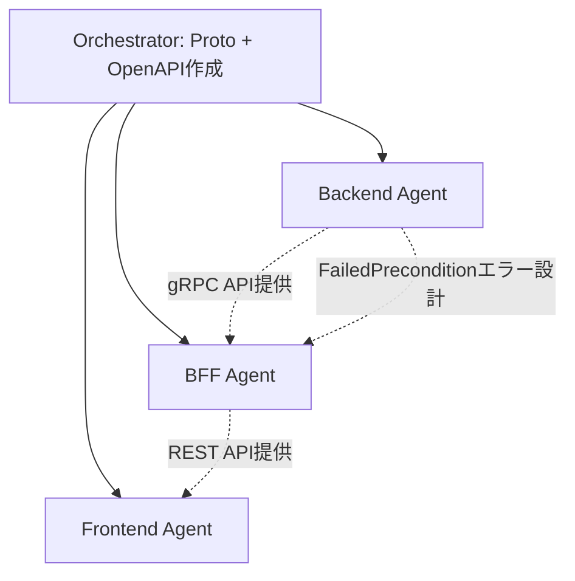

# 契約管理 Phase 2 - 承認ワークフロー タスクリスト

## 実装方針

**Agent Teamsで3 Agent並行実装する。**
Backend/BFF/Frontendの3サービスに跨る変更のため、Phase 1と同じパターンで実装。

Proto定義とOpenAPI仕様をOrchestratorが事前に確定させてから各Agentを起動する。

## Orchestrator（事前作業）

#### Proto定義・OpenAPI仕様作成
- [ ] `contracts/proto/approval.proto` 新規作成（ApprovalService RPC定義）
- [ ] `contracts/openapi/bff-api.yaml` に承認管理エンドポイント追加
- [ ] BFF DBに `contracts:approve` 権限が存在するか確認（既存マイグレーションV8/V9で定義済みの想定）
- [ ] `docs/glossary.md` に承認ワークフロー用語を追加
- [ ] 各サブモジュールでfeatureブランチ作成: `feature/contract-management-phase2`

---

## Agent別タスク分担

### Backend Agent

**担当範囲:** `services/backend/`

#### DBマイグレーション
- [ ] `db/migrations/V8__create_approval_workflows.sql` - approval_workflowsテーブル作成
  - workflow_id, contract_id, requester_id, approver_id, status, old/new_monthly_fee, old/new_initial_fee, requested_at, approved_at, rejection_reason
  - chk_approval_segregation制約（requester_id != approver_id）
  - 二重申請禁止のUNIQUE INDEX（PENDING状態のみ）

#### protoc再生成
- [ ] `internal/pb/approval.pb.go`, `approval_grpc.pb.go` - approval.protoから生成

#### 承認管理: データアクセス層
- [ ] `db/queries/approval.sql`
  - ListPendingApprovals（契約情報JOIN、申請者除外オプション）
  - GetApprovalWorkflow
  - CountPendingApprovals
  - CreateApprovalWorkflow
  - ApproveWorkflow
  - RejectWorkflow
  - GetPendingByContract（二重申請チェック用）
- [ ] sqlc再生成
- [ ] `internal/model/approval.go` - ApprovalWorkflowドメインモデル + ValidStatusTransitions map
- [ ] `internal/repository/approval_repository.go` - ApprovalRepository（WithTx対応）

#### 承認管理: ビジネスロジック
- [ ] `internal/service/approval_service.go`
  - [ ] ListPendingApprovals: ページネーション + 申請者除外
  - [ ] GetApprovalWorkflow
  - [ ] ApproveContract: 職務分掌チェック + 契約更新 + ワークフロー更新 + 監査記録（トランザクション）
  - [ ] RejectContract: 職務分掌チェック + ワークフロー更新 + 監査記録
- [ ] エラー定義: ErrSelfApproval, ErrAlreadyProcessed, ErrDuplicatePendingWorkflow

#### ContractService修正
- [ ] `internal/service/contract_service.go` - UpdateContract メソッド修正
  - [ ] 既存PENDINGワークフローチェック（二重申請禁止）
  - [ ] DRAFTステータスは承認不要
  - [ ] 金額変更検出（monthly_fee/initial_fee のいずれか）
  - [ ] 金額変更時: ApprovalWorkflow作成 + 監査記録 + FailedPreconditionエラー返却
  - [ ] 金額変更なし: 従来通り直接更新
- [ ] 承認待ち中の契約は金額以外の変更もブロック（要検討: 制約の強さ）

#### 承認管理: gRPCハンドラー
- [ ] `internal/grpc/approval_server.go` - ApprovalService 4 RPC実装
- [ ] エラーコードマッピング（NotFound, PermissionDenied, FailedPrecondition）
- [ ] `cmd/server/main.go` - ApprovalService登録

#### テスト
- [ ] `internal/service/approval_service_test.go`
  - [ ] 承認成功パス
  - [ ] 却下成功パス
  - [ ] 職務分掌違反（申請者自身の承認/却下）→ PermissionDenied
  - [ ] 既に処理済みワークフローの再承認 → FailedPrecondition
  - [ ] 存在しないワークフロー → NotFound
- [ ] `internal/service/contract_service_test.go` - UpdateContract修正分のテスト追加
  - [ ] DRAFT契約の金額変更は承認不要で直接更新
  - [ ] ACTIVE契約の金額変更でワークフロー作成
  - [ ] 二重申請エラー
  - [ ] 金額変更なしは従来通り更新
- [ ] `internal/grpc/approval_server_test.go` - gRPCハンドラーテスト
- [ ] `go vet` / `go fmt` クリーン

#### コミット・プッシュ
- [ ] featureブランチでコミット・プッシュ

---

### BFF Agent

**担当範囲:** `services/bff/`

#### protoc再生成
- [ ] `internal/pb/approval.pb.go`, `approval_grpc.pb.go` - approval.protoから生成
- [ ] `proto/approval.proto` をBFFローカルにコピー（Phase 1パターン踏襲）

#### gRPCクライアント拡張
- [ ] `internal/grpc/client.go` - ApprovalServiceClient追加

#### 権限マイグレーション（必要な場合）
- [ ] 既存マイグレーションで `contracts:approve` の割り当てを確認
- [ ] 未定義なら `db/migrations/V13__seed_approval_permissions.sql` 作成

#### 承認管理: ハンドラー
- [ ] `internal/handler/approval_handler.go`
  - [ ] ListPendingApprovals（GET /api/v1/approvals）- 認証 + contracts:approve + 自動で自分の申請を除外
  - [ ] GetApprovalWorkflow（GET /api/v1/approvals/:id）- 認証 + contracts:approve + UUID検証
  - [ ] ApproveContract（POST /api/v1/approvals/:id/approve）- 認証 + contracts:approve + UUID検証
  - [ ] RejectContract（POST /api/v1/approvals/:id/reject）- 認証 + contracts:approve + UUID検証 + 却下理由必須バリデーション

#### ContractHandler修正
- [ ] `internal/handler/contract_handler.go` - UpdateContract修正
  - [ ] Backendからの FailedPrecondition エラー判定
  - [ ] 承認ワークフロー作成の場合: 202 Accepted + workflow情報を返す
  - [ ] 二重申請の場合: 409 Conflict
  - [ ] エラーメッセージのパース（workflow_id抽出）

#### ルート追加
- [ ] `cmd/server/main.go` に承認管理ルート追加

#### テスト
- [ ] `internal/handler/approval_handler_test.go`
  - [ ] 正常系（一覧取得、詳細取得、承認、却下）
  - [ ] 認証エラー（401）
  - [ ] 権限エラー（403）
  - [ ] UUID検証エラー（400）
  - [ ] 却下理由空のバリデーション（400）
  - [ ] 職務分掌違反（gRPCから PermissionDenied を受けた場合の403変換）
- [ ] `internal/handler/contract_handler_test.go` - UpdateContract修正分
  - [ ] 金額変更時の202 Accepted
  - [ ] 二重申請時の409 Conflict
- [ ] 既存テスト全パス
- [ ] `go vet` / `go fmt` クリーン

#### コミット・プッシュ
- [ ] featureブランチでコミット・プッシュ

---

### Frontend Agent

**担当範囲:** `services/frontend/`

#### OpenAPI型再生成
- [ ] `npm run generate:api-types` - ApprovalWorkflow型が追加される

#### サイドバー更新
- [ ] `src/components/dashboard/Sidebar.tsx` に「承認管理」追加
  - [ ] `contracts:approve` 権限を持つユーザーのみ表示
  - [ ] 承認待ち件数バッジ（オプション、余裕があれば）

#### 承認管理: フック
- [ ] `src/hooks/use-pending-approvals.ts` - 承認待ち一覧取得
- [ ] `src/hooks/use-approval.ts` - 承認詳細取得
- [ ] `src/hooks/use-approve-contract.ts` - 承認実行
- [ ] `src/hooks/use-reject-contract.ts` - 却下実行

#### 承認管理: 画面
- [ ] `src/lib/schemas/approval.ts` - Zodスキーマ（却下理由バリデーション: 必須、最小10文字）
- [ ] `src/app/dashboard/approvals/page.tsx` - 承認待ち一覧ページ
- [ ] `src/components/approvals/ApprovalList.tsx` - 一覧コンポーネント（契約番号、加盟店名、申請者、変更サマリー）
- [ ] `src/app/dashboard/approvals/[id]/page.tsx` - 承認詳細ページ
- [ ] `src/components/approvals/ApprovalDetail.tsx` - 詳細（変更前後の比較表示）
- [ ] `src/components/approvals/ApproveConfirmDialog.tsx` - 承認確認ダイアログ
- [ ] `src/components/approvals/RejectDialog.tsx` - 却下ダイアログ（理由入力）
- [ ] `src/components/approvals/ApprovalStatusBadge.tsx` - ステータスバッジ

#### 契約編集画面の修正
- [ ] `src/components/contracts/ContractEditForm.tsx`
  - [ ] 金額変更を検出して、ボタン文言を「承認申請する」に変更
  - [ ] 202 Acceptedレスポンスを受け取った場合、「承認待ちです」のトーストを表示
  - [ ] 承認待ちリストへの遷移リンクを表示
- [ ] `src/hooks/use-update-contract.ts` - 202 Acceptedのハンドリング追加

#### 契約詳細画面の修正
- [ ] `src/components/contracts/ContractDetail.tsx`
  - [ ] 承認待ちワークフローがある場合、承認状態バッジを表示
  - [ ] 却下理由の表示（却下後に再編集可能にするため）

#### テスト
- [ ] `tests/ApprovalList.test.tsx` - 一覧表示テスト
- [ ] `tests/ApprovalDetail.test.tsx` - 詳細表示テスト（変更前後の比較）
- [ ] `tests/ApprovalStatusBadge.test.tsx` - バッジテスト
- [ ] `tests/RejectDialog.test.tsx` - 却下理由バリデーション
- [ ] 既存テスト全パス
- [ ] `npm run type-check` / `npm run lint` クリーン

#### コミット・プッシュ
- [ ] featureブランチでコミット・プッシュ

---

## Agent間の依存関係

- Proto定義・OpenAPI仕様をOrchestratorが事前確定
- 各Agentはprotoc/openapi-typescript で各自生成コードを作成
- **ポイント**: Backend の `FailedPrecondition` エラー設計は BFF と共有が必要（エラーメッセージ形式、workflow_idの受け渡し方法）
- Agent間直接通信: BFF AgentがBackend Agentに実装詳細（エラーメッセージフォーマット等）を確認してOK
- 設計方針変更が必要な場合はOrchestrator経由

---

## 実装順序

### フェーズ1: Orchestrator事前作業
1. Proto定義作成（approval.proto）+ コミット
2. OpenAPI仕様更新 + コミット
3. glossary.md更新 + コミット
4. featureブランチ作成

### フェーズ2: 3 Agent並行実装（パターン1: 全Agent並行起動）
1. Backend Agent: マイグレーション → protoc → sqlc → リポジトリ → サービス（承認+契約修正）→ gRPC → テスト
2. BFF Agent: protoc → クライアント拡張 → ハンドラー（承認+契約修正）→ ルート → テスト
3. Frontend Agent: 型再生成 → サイドバー → フック → 承認画面 → 契約編集画面修正 → テスト

### フェーズ3: Orchestrator統合確認
1. 統合Docker Compose起動（リビルド）
2. 動作確認（承認申請→承認→承認、承認申請→却下→再申請のフロー）
3. E2Eテスト実装・実行
4. サブモジュール参照更新 + コミット・プッシュ

---

## 完了条件

### Backend Agent
- [ ] approval_workflowsテーブル作成 + 職務分掌制約
- [ ] 承認管理 gRPC 4 RPC正常動作
- [ ] ContractService.UpdateContract の金額変更検出・ワークフロー作成が動作
- [ ] 職務分掌チェック（申請者=承認者で403）
- [ ] 二重申請チェック（PENDING状態の重複防止）
- [ ] DRAFTステータスは承認不要で動作
- [ ] 監査記録（contract_changes）に全アクション記録
- [ ] テスト全パス、`go vet`/`go fmt` クリーン

### BFF Agent
- [ ] 承認管理 REST 4エンドポイント正常動作
- [ ] ContractHandler.UpdateContractの202 Accepted/409 Conflict対応
- [ ] 権限チェック（contracts:approve）機能
- [ ] 却下理由のバリデーション
- [ ] テスト全パス、`go vet`/`go fmt` クリーン

### Frontend Agent
- [ ] サイドバーに「承認管理」表示（権限ベース）
- [ ] 承認待ち一覧画面が動作
- [ ] 承認詳細画面で変更前後が比較表示
- [ ] 承認/却下ダイアログが動作
- [ ] 契約編集画面の「承認申請する」ボタン表示
- [ ] 契約詳細画面の承認状態バッジ表示
- [ ] テスト全パス、型チェック・リントクリーン

### Orchestrator
- [ ] 統合Docker Composeで全サービス動作確認
- [ ] E2Eテスト全パス（承認申請→承認フロー、承認申請→却下フロー、職務分掌違反の403確認）
- [ ] 既存E2Eテストがデグレしない

---

**作成日:** 2026-04-12
**作成者:** Claude Code
