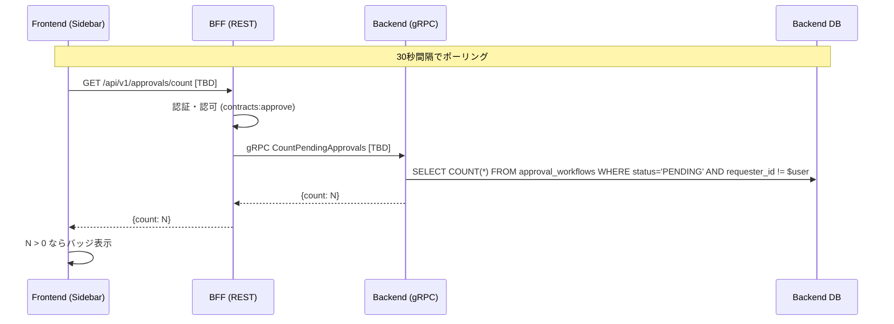

# 承認待ち件数バッジ 設計

## アーキテクチャ概要



---

## 実装方針の分岐 (Agent 合意形成ポイント)

以下は **Agent Teams 運用で合意すべき判断**。Orchestrator は事前決定しない。

### 分岐 A: Backend RPC 設計

**選択肢 A1: 独立 RPC 新設**
```protobuf
service ApprovalService {
  // ... 既存 5 RPC ...
  rpc CountPendingApprovals(CountPendingApprovalsRequest) returns (CountPendingApprovalsResponse);
}

message CountPendingApprovalsRequest {
  string exclude_requester_id = 1;  // 空文字なら SoD 除外なし
}

message CountPendingApprovalsResponse {
  int64 count = 1;
}
```
- **利点:** 意図が明確、将来の最適化 (index only scan) 余地あり、軽量レスポンス
- **欠点:** proto 再生成、gRPC サーバ登録、リポジトリ層に CountPendingApprovals
  (実は Phase 2 で既存) の公開化が必要

**選択肢 A2: 既存 ListPendingApprovals 流用**
- BFF から `ListPendingApprovalsRequest{page:1, limit:1}` を呼び、
  レスポンスの `pagination.total_items` を読む
- **利点:** Backend コード変更ゼロ
- **欠点:** 無駄に行を 1 行取得する、意図が不明確

**合意に必要な DM:**
- Backend Agent → BFF Agent: 「A1/A2 どちらで実装するか?」
- BFF Agent → Frontend Agent: 「エンドポイント形状が A1 なら `/count`、A2 なら
  既存 `/approvals?limit=1` のどちらにするか?」

### 分岐 B: BFF REST 設計

**選択肢 B1: 新規エンドポイント `GET /api/v1/approvals/count`**
```yaml
/api/v1/approvals/count:
  get:
    responses:
      '200':
        content:
          application/json:
            schema:
              type: object
              properties:
                count: { type: integer }
```
- Backend A1 と対応

**選択肢 B2: 既存 `GET /api/v1/approvals?limit=1` を流用**
- Backend A2 と対応
- Frontend は `response.pagination.total_items` を読む

**合意:** Backend の A1/A2 選択と必ず対応させる。独立判断は禁止。

### 分岐 C: Frontend フック設計

**選択肢 C1: 新規 `useApprovalCount` フック**
```typescript
export function useApprovalCount() {
  return useQuery({
    queryKey: ['approval-count'],
    queryFn: () => apiClient.get('/api/v1/approvals/count'),
    refetchInterval: 30_000,
  });
}
```

**選択肢 C2: 既存 `usePendingApprovals({limit:1})` を流用**
- 既存フックの戻り値 `data.pagination.total_items` を使う
- ただし既存フックはフルリストを取得する設計なので `limit: 1` を渡す運用が必要

**合意:** BFF の B1/B2 と必ず対応させる。

### 分岐 D: `include_own` の扱い 🎯最重要

**選択肢 D1: 除外する (SoD 厳守)**
- BFF は現ユーザーの `user_id` を `exclude_requester_id` に自動セット
- バッジ = 「自分が承認可能な件数」
- Phase 2 の既存 `ListPendingApprovals` のデフォルト挙動と整合

**選択肢 D2: 含める**
- BFF は `exclude_requester_id=""` で呼ぶ
- バッジ = 「全 PENDING 件数 (自分の申請も含む)」
- ユーザーに「自分の申請も承認待ちだよ」と知らせる意味合い

**推奨:** D1 (既存仕様と整合) だが、**意図的に未確定** として残す。

**合意ポイント:** これは **Phase 2 H1 の再発リスク最大の論点**。Backend Agent が
SQL クエリを書く時点、BFF Agent がハンドラを書く時点、Frontend Agent がバッジ表示
の意味を書く時点、3 タイミングで齟齬が発生しうる。**最初にこの論点に気付いた Agent
が他 2 Agent に即時 DM する義務**がある。

### 分岐 E: ポーリング間隔

- 30s / 10s / 60s のいずれか
- BFF Agent に「現在 login 以外の rate limit はあるか? audit_log 書き込みのボトルネックは?」
  を確認した上で Frontend Agent が決定する

---

## Backend 変更

### 変更ファイル一覧 (選択肢 A1 の場合)

| ファイル | 変更内容 |
|---|---|
| `contracts/proto/approval.proto` | `CountPendingApprovals` RPC 追加 |
| `internal/pb/approval.pb.go` | protoc 再生成 |
| `internal/pb/approval_grpc.pb.go` | protoc 再生成 |
| `internal/service/approval_service.go` | `CountPendingApprovals(ctx, excludeID)` メソッド追加 (既に存在、公開すれば OK) |
| `internal/grpc/approval_server.go` | gRPC ハンドラ追加 |
| `internal/service/approval_service_test.go` | テスト追加 |
| `internal/grpc/approval_server_test.go` | テスト追加 |

### 変更ファイル一覧 (選択肢 A2 の場合)
- ゼロ (変更なし)

---

## BFF 変更

### 変更ファイル一覧 (選択肢 B1 の場合)

| ファイル | 変更内容 |
|---|---|
| `contracts/openapi/bff-api.yaml` | `/api/v1/approvals/count` エンドポイント追加 |
| `proto/approval.proto` | Backend から同期 (`cp` 済) |
| `internal/pb/approval.{pb,grpc.pb}.go` | protoc 再生成 |
| `internal/handler/approval_handler.go` | `GetApprovalCount` ハンドラ追加 |
| `cmd/server/main.go` | ルート登録 `/api/v1/approvals/count` |
| `internal/handler/approval_handler_test.go` | テスト追加 |

---

## Frontend 変更

### 変更ファイル一覧 (選択肢 C1 + D1 の場合)

| ファイル | 変更内容 |
|---|---|
| `src/types/api.ts` | openapi-typescript 再生成 |
| `src/hooks/use-approval-count.ts` | 新規フック |
| `src/components/dashboard/Sidebar.tsx` | バッジ表示、`useApprovalCount` 呼び出し |
| `tests/Sidebar.test.tsx` or 新規 | バッジのレンダリング・件数 0 非表示テスト |

### バッジ UI 仕様

```
┌─────────────────────────┐
│ 📋 契約管理              │
│ ✓  承認管理     [ 3 ]   │   ← 件数バッジ (0件のとき非表示)
│ 🏬 加盟店管理           │
└─────────────────────────┘
```

バッジの Tailwind クラス (既存 `ApprovalStatusBadge` と整合):
```tsx
<span className="ml-2 inline-flex items-center rounded-full bg-yellow-100 px-2 py-0.5 text-xs font-medium text-yellow-800">
  {count}
</span>
```

### ポーリング戦略

```typescript
const { data } = useQuery({
  queryKey: ['approval-count'],
  queryFn: fetchCount,
  refetchInterval: 30_000,       // 30秒ごと
  refetchOnWindowFocus: true,    // タブ切り替え時も
  staleTime: 25_000,             // キャッシュは 25 秒
});
```

**承認・却下実行後の即時更新:**
```typescript
const approveMutation = useMutation({
  // ...
  onSuccess: () => {
    queryClient.invalidateQueries({ queryKey: ['approval-count'] });
    queryClient.invalidateQueries({ queryKey: ['pending-approvals'] });
  },
});
```

---

## E2E 変更

### 新規シナリオ `e2e/tests/contracts/approval-count-badge.spec.ts`

```
describe('承認待ち件数バッジ', () => {
  test('初期状態: 承認待ち 0 件でバッジ非表示', async () => { ... });
  test('申請者には自分の申請はカウントされない (SoD)', async () => { ... });
  test('承認者には他人の申請が件数に含まれる', async () => { ... });
  test('承認実行後、バッジ件数が減少する', async () => { ... });
  test('権限がないユーザーにはサイドバーに承認管理が表示されない', async () => { ... });
});
```

---

## glossary.md 更新
- **不要** (Phase 2 の用語で足りる)

---

## OpenAPI 仕様追加 (選択肢 B1 の場合)

`contracts/openapi/bff-api.yaml` に以下を追加:

```yaml
/api/v1/approvals/count:
  get:
    tags: [Approvals]
    summary: 承認待ち件数取得
    description: |
      現在ユーザーが承認可能な承認待ちワークフロー件数を返す。
      職務分掌 (SoD) により自分自身の申請は除外される。
    operationId: getApprovalCount
    security:
      - sessionAuth: []
    responses:
      '200':
        description: 承認待ち件数
        content:
          application/json:
            schema:
              type: object
              required: [count]
              properties:
                count:
                  type: integer
                  example: 3
      '401': { ... }
      '403': { ... }
```

---

## 実装順序の想定

Agent Teams 真運用での**推奨**順序:

```
Phase 1: Orchestrator 事前作業
  - TeamCreate("20260413-approval-count-badge")
  - 横断的制約リストの収集 (rate limit / middleware / seed)
  - featureブランチ作成

Phase 2: 並行実装 (Agent Teams)
  ※ 意図的に D1-D4 を未確定にするため、各 Agent は実装前に
     他 Agent と合意形成する必要がある

  Backend Agent, BFF Agent, Frontend Agent を同時 spawn
  → 各 Agent が他 Agent に DM して D1-D4 を合意
  → 合意後に実装開始

Phase 3: 統合確認 + E2E
Phase 4: shutdown_request → TeamDelete
```

---

**作成日:** 2026-04-13
**作成者:** Claude Code
