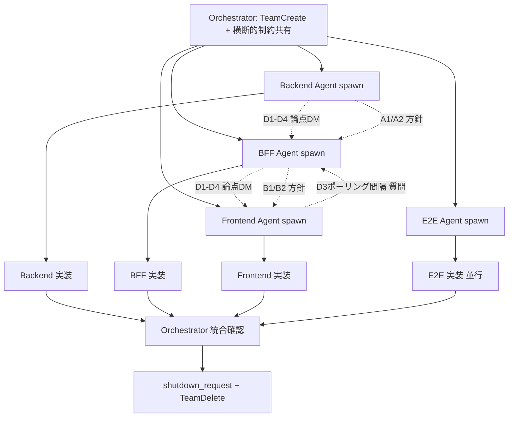

# 承認待ち件数バッジ タスクリスト

## 実装方針

**真の Agent Teams (`TeamCreate` + `team_name` + `SendMessage` 自動配信) で 3 Agent
並行実装する。本タスクは動作検証を兼ねるため、Phase 2 で発覚した認識齟齬リスクを
意図的に残している (design.md の D1-D4 参照)。**

## Orchestrator 事前作業

### TeamCreate 必須
- [ ] `TeamCreate(team_name="20260413-approval-count-badge", description="承認待ち件数バッジ + Agent Teams 検証")`
- [ ] `TaskCreate` で以下のタスクをチーム共有 TaskList に登録

### 横断的制約の収集 (Agent 起動プロンプトに埋め込む)
- [ ] BFF login rate limit 値の確認 (`services/bff/cmd/server/main.go` の `loginRateLimitMiddleware`)
- [ ] BFF の audit_log middleware が全リクエストで書き込みを発生させる旨の確認
- [ ] 既存 seed user (`test@example.com` のみ) の把握
- [ ] Phase 2 で E2E テスト用に追加した `approver@example.com` の扱い (DB 再初期化で消える)
- [ ] 構造化エラー規約 (`google.rpc.ErrorInfo`, Domain=`contract.example.com`)

### featureブランチ作成 (3 サブモジュール + 親)
- [ ] backend: `feature/approval-count-badge`
- [ ] bff: `feature/approval-count-badge`
- [ ] frontend: `feature/approval-count-badge`
- [ ] 親: `feature/approval-count-badge`

### Agent 起動 (team_name 指定必須)
- [ ] `Agent(name="backend-agent", team_name="20260413-approval-count-badge", ...)`
- [ ] `Agent(name="bff-agent", team_name="20260413-approval-count-badge", ...)`
- [ ] `Agent(name="frontend-agent", team_name="20260413-approval-count-badge", ...)`
- [ ] `TaskUpdate(owner=...)` で各 Agent にタスク割り当て

### 意図的に伝えないこと (検証のため)
- ⚠️ D1-D4 の判断 (include_own / 新規 RPC vs 既存流用 / ポーリング間隔 / レスポンス形状)
- ⚠️ Agent には「他 Agent に DM で合意形成すること」という指示のみ伝える

---

## Agent 別タスク分担

### Backend Agent

**担当範囲:** `services/backend/`

#### 合意形成フェーズ (実装前)
- [ ] BFF Agent にメッセージ送信: 「CountPendingApprovals の実装方針 (新規 RPC vs 既存流用) はどちらにするか? include_own はどう扱うか? レスポンス形状は?」
- [ ] BFF / Frontend Agent の返信を待ち、3 者で合意するまで実装開始しない

#### 実装フェーズ (合意後)
選択肢 A1 (独立 RPC) の場合:
- [ ] `contracts/proto/approval.proto` に `CountPendingApprovals` RPC とメッセージ型を追加 (合意した `include_own` を反映)
- [ ] `make proto` で再生成
- [ ] `internal/service/approval_service.go` に `CountPendingApprovals` メソッドを追加 (既存の `approvalRepo.CountPendingApprovals` を呼ぶだけ)
- [ ] `internal/grpc/approval_server.go` にハンドラ追加
- [ ] `ApprovalServiceInterface` に追加
- [ ] `internal/service/approval_service_test.go` + `internal/grpc/approval_server_test.go` にテスト追加
- [ ] mock 更新 (`mockApprovalService`, `mockApprovalRepo`)

選択肢 A2 (既存流用) の場合:
- [ ] Backend は変更なし
- [ ] BFF Agent にその旨を DM で返信

#### 共通
- [ ] `go vet ./...` / `go fmt ./...` クリーン
- [ ] `go test ./...` 全パス
- [ ] コミット・プッシュ: `feature/approval-count-badge`
- [ ] TaskUpdate で completed マーク

---

### BFF Agent

**担当範囲:** `services/bff/`

#### 合意形成フェーズ (実装前)
- [ ] Backend Agent との RPC 方針合意 (A1/A2)
- [ ] Frontend Agent とのエンドポイント形状合意 (B1/B2)
- [ ] `include_own` の扱いを 3 Agent で合意
- [ ] ポーリング間隔について Frontend Agent に「rate limit / middleware 挙動 / DB 負荷」の情報を提供

#### 実装フェーズ (合意後)
選択肢 B1 (新規エンドポイント) の場合:
- [ ] `contracts/openapi/bff-api.yaml` に `/api/v1/approvals/count` を追加
- [ ] `proto/approval.proto` を Backend から同期 (cp)
- [ ] `internal/pb/approval.{pb,grpc.pb}.go` 再生成
- [ ] `internal/handler/approval_handler.go` に `GetApprovalCount` ハンドラ追加
  - 認証 + `contracts:approve` 権限チェック
  - 合意した `include_own` に従って `exclude_requester_id` を設定
- [ ] `cmd/server/main.go` にルート登録
- [ ] `internal/handler/approval_handler_test.go` にテスト追加
  - 正常系 / 401 / 403 / SoD 除外確認

選択肢 B2 (既存流用) の場合:
- [ ] OpenAPI ドキュメントは変更不要
- [ ] ただし既存 `ListPendingApprovals` のコメントに「`limit=1` で count 取得にも使える」旨追記

#### 共通
- [ ] `go vet ./...` / `go fmt ./...` クリーン
- [ ] `go test ./...` 全パス
- [ ] コミット・プッシュ
- [ ] TaskUpdate で completed マーク

---

### Frontend Agent

**担当範囲:** `services/frontend/`

#### 合意形成フェーズ (実装前)
- [ ] Backend/BFF Agent とエンドポイント仕様合意
- [ ] `include_own` の扱いを合意 (バッジの意味が決まる)
- [ ] BFF Agent に「現在の rate limit 状況」を確認し、ポーリング間隔を 30s/10s/60s から選ぶ

#### 実装フェーズ (合意後)
- [ ] `npm run generate:api-types` (B1 の場合、新しい型が生成される)
- [ ] `src/hooks/use-approval-count.ts` 新規作成 (C1 の場合)
  - または `usePendingApprovals` の流用 (C2 の場合)
  - 合意したポーリング間隔を `refetchInterval` に設定
- [ ] `src/components/dashboard/Sidebar.tsx` にバッジ表示追加
  - 0 件のとき非表示
  - `contracts:approve` 権限保持者のみ表示 (既存ロジック踏襲)
- [ ] 承認・却下実行後に `queryClient.invalidateQueries(['approval-count'])` を呼ぶ
  - `src/hooks/use-approve-contract.ts` の `onSuccess`
  - `src/hooks/use-reject-contract.ts` の `onSuccess`
- [ ] `tests/Sidebar.test.tsx` (新規 or 既存更新) にテスト追加
  - バッジ表示 / 0件非表示 / 権限なし時の非表示

#### 共通
- [ ] `npm run lint` クリーン
- [ ] `npm run type-check` クリーン
- [ ] `npm test` 全パス
- [ ] コミット・プッシュ
- [ ] TaskUpdate で completed マーク

---

### E2E Agent (オプション: 並行起動、依存なし)

**担当範囲:** `e2e/tests/contracts/approval-count-badge.spec.ts`

#### 実装フェーズ
- [ ] 5 シナリオ実装:
  1. 初期状態: 承認待ち 0 件でバッジ非表示
  2. 申請者には自分の申請がカウントされない (SoD 検証)
  3. 承認者には他人の申請が件数に含まれる
  4. 承認実行後、バッジ件数が減少する
  5. 権限がないユーザーにはサイドバーに承認管理が表示されない
- [ ] BFF login rate limit を考慮し、ログイン回数を最小化 (Phase 2 振り返りの教訓)
- [ ] `ensureApproverUser()` ヘルパーを docker exec 経由で再利用
- [ ] 既存の approval-workflow.spec.ts と共存できることを確認
- [ ] `npx playwright test approval-count-badge.spec.ts` で単独パス
- [ ] フルスイート `npx playwright test --workers=1` もパス

---

## Agent 間の依存関係 (合意形成フロー)

**重要:**
- 合意形成フェーズで最低 1 ラウンドの DM 往復が発生するはず
- Orchestrator は `SendMessage` 自動配信を待つだけ。`git status` 覗き見しない
- D1-D4 で齟齬が出たら `SendMessage` のログからどの時点で検出されたかを記録

---

## 完了条件

### Backend Agent
- [ ] 合意した方針 (A1/A2) を実装
- [ ] include_own の扱いが BFF/Frontend と一致
- [ ] テスト全パス、go vet/go fmt クリーン

### BFF Agent
- [ ] 合意した方針 (B1/B2) を実装
- [ ] include_own の扱いが Backend/Frontend と一致
- [ ] 権限チェック (contracts:approve) が機能
- [ ] テスト全パス、go vet/go fmt クリーン

### Frontend Agent
- [ ] サイドバーにバッジが表示 / 0 件で非表示 / 権限なしで非表示
- [ ] 合意したポーリング間隔で再フェッチ
- [ ] 承認/却下後に即時 invalidate
- [ ] テスト全パス、type-check/lint クリーン

### E2E Agent
- [ ] 5 シナリオ全パス
- [ ] 既存フルスイートもデグレなし

### Orchestrator
- [ ] 統合 docker compose で動作確認
- [ ] D1-D4 の合意が実装までに成立したかを検証
- [ ] `shutdown_request` → `TeamDelete` でクリーンアップ
- [ ] 振り返り用の定量データ収集 (メッセージ数、齟齬検出タイミング、Phase 2 比較)

---

## 振り返り観点 (本タスク固有)

実装完了後の `/retrospective` では以下を記録:

1. **Agent 間 DM の総数とパターン**
   - 合意形成フェーズでの往復数
   - 実装中の追加 DM の数
   - broadcast (`to: "*"`) の使用回数
2. **D1-D4 の齟齬発生有無**
   - 合意形成フェーズで全て解消したか
   - 実装後にずれが見つかったか
   - E2E 失敗で発覚したか
3. **Orchestrator の介入回数**
   - 方針決定を求められた回数
   - git status 覗き見に誘惑された回数
4. **Phase 2 との比較**
   - 認識齟齬の数 (Phase 2 は 1 件 H1)
   - 実装時間
   - 単位時間あたりのコスト増加

---

**作成日:** 2026-04-13
**作成者:** Claude Code
