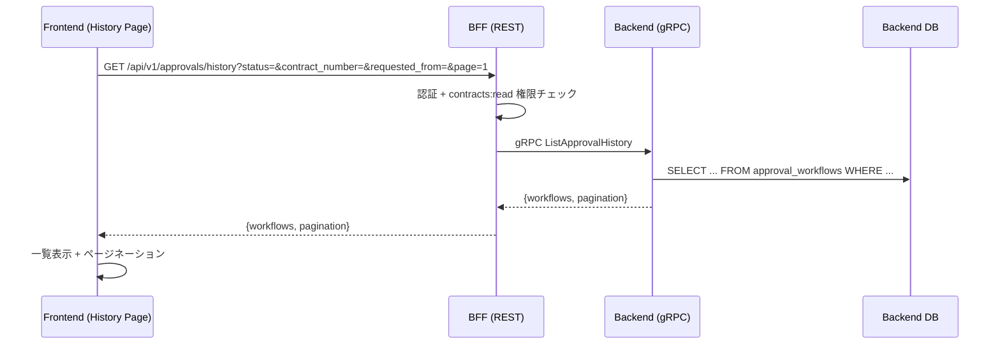
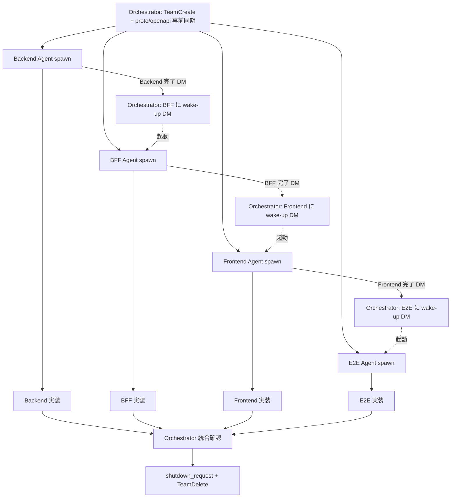

# 承認履歴検索画面 設計

## アーキテクチャ概要



---

## Backend 変更

### 新規 SQL クエリ

`services/backend/db/queries/approval.sql` に追加:

```sql
-- name: ListApprovalHistory :many
SELECT
  aw.workflow_id,
  aw.contract_id,
  c.contract_number,
  m.name AS merchant_name,
  s.name AS service_name,
  aw.requester_id,
  aw.approver_id,
  aw.status,
  aw.old_monthly_fee,
  aw.new_monthly_fee,
  aw.old_initial_fee,
  aw.new_initial_fee,
  aw.requested_at,
  aw.approved_at,
  aw.rejection_reason
FROM approval_workflows aw
JOIN contracts c ON aw.contract_id = c.contract_id
JOIN merchants m ON c.merchant_id = m.merchant_id
JOIN services s ON c.service_id = s.service_id
WHERE (@status_filter::text = '' OR aw.status = @status_filter::text)
  AND (@contract_number_filter::text = '' OR c.contract_number ILIKE '%' || @contract_number_filter::text || '%')
  AND (@requester_id_filter::text = '' OR aw.requester_id::text = @requester_id_filter::text)
  AND (@approver_id_filter::text = '' OR aw.approver_id::text = @approver_id_filter::text)
  AND (@requested_from::timestamptz IS NULL OR aw.requested_at >= @requested_from::timestamptz)
  AND (@requested_to::timestamptz IS NULL OR aw.requested_at <= @requested_to::timestamptz)
ORDER BY aw.requested_at DESC
LIMIT @row_limit OFFSET @row_offset;

-- name: CountApprovalHistory :one
SELECT COUNT(*)
FROM approval_workflows aw
JOIN contracts c ON aw.contract_id = c.contract_id
WHERE (@status_filter::text = '' OR aw.status = @status_filter::text)
  AND (@contract_number_filter::text = '' OR c.contract_number ILIKE '%' || @contract_number_filter::text || '%')
  AND (@requester_id_filter::text = '' OR aw.requester_id::text = @requester_id_filter::text)
  AND (@approver_id_filter::text = '' OR aw.approver_id::text = @approver_id_filter::text)
  AND (@requested_from::timestamptz IS NULL OR aw.requested_at >= @requested_from::timestamptz)
  AND (@requested_to::timestamptz IS NULL OR aw.requested_at <= @requested_to::timestamptz);
```

### proto 追加

`contracts/proto/approval.proto`:

```protobuf
service ApprovalService {
  // 既存 6 RPC
  rpc ListPendingApprovals(...) returns (...);
  rpc ListWorkflowsByContract(...) returns (...);
  rpc GetApprovalWorkflow(...) returns (...);
  rpc ApproveContract(...) returns (...);
  rpc RejectContract(...) returns (...);
  rpc CountPendingApprovals(...) returns (...);
  // 新規
  rpc ListApprovalHistory(ListApprovalHistoryRequest) returns (ListApprovalHistoryResponse);
}

message ListApprovalHistoryRequest {
  string status_filter = 1;          // "", "PENDING", "APPROVED", "REJECTED"
  string contract_number = 2;         // 部分一致、空文字で無視
  string requester_id = 3;            // 完全一致、空文字で無視
  string approver_id = 4;             // 完全一致、空文字で無視
  string requested_from = 5;          // ISO8601、空文字で無視
  string requested_to = 6;            // ISO8601、空文字で無視
  int32 page = 7;
  int32 limit = 8;
}

message ListApprovalHistoryResponse {
  repeated ApprovalWorkflowItem workflows = 1;  // 既存 message 再利用
  common.Pagination pagination = 2;
}
```

### 変更ファイル一覧

| ファイル | 変更内容 |
|---|---|
| `contracts/proto/approval.proto` | `ListApprovalHistory` RPC 追加 (Orchestrator 事前同期) |
| `internal/pb/approval.pb.go` | protoc 再生成 |
| `internal/pb/approval_grpc.pb.go` | protoc 再生成 |
| `db/queries/approval.sql` | `ListApprovalHistory` + `CountApprovalHistory` クエリ追加 |
| `internal/sqlc/approval.sql.go` | sqlc 再生成 |
| `internal/repository/approval_repository.go` | `ListApprovalHistory(ctx, params) / CountApprovalHistory(ctx, params)` 追加 |
| `internal/service/approval_service.go` | `ListApprovalHistory(ctx, ...) (workflows, pagination, error)` 追加 |
| `internal/grpc/approval_server.go` | gRPC ハンドラ追加 + `mapApprovalErr` 経由 |
| `internal/service/approval_service_test.go` | 単体テスト追加 (フィルタ各種 + pagination) |
| `internal/grpc/approval_server_test.go` | gRPC ハンドラテスト追加 + mock 拡張 |

---

## BFF 変更

### 新規 REST エンドポイント

```yaml
GET /api/v1/approvals/history
  Query parameters:
    status: string (optional, enum: PENDING/APPROVED/REJECTED)
    contract_number: string (optional, 部分一致)
    requester_id: string (optional, UUID)
    approver_id: string (optional, UUID)
    requested_from: string (optional, ISO8601)
    requested_to: string (optional, ISO8601)
    page: integer (default 1)
    limit: integer (default 20, max 100)
  Responses:
    200: {workflows: ApprovalWorkflow[], pagination: Pagination}
    400: 無効なクエリパラメータ
    401: 未認証
    403: 権限不足 (contracts:read なし)
```

### 権限・監査方針

- **権限**: `contracts:read` が必要 (既存の `contracts` グループの権限と統一)
- **audit_log**: **対象** (既存 approvals グループに含める)
  - Phase 3 の `pending-count` とは方針が異なる。履歴閲覧は監査担当者のアクセスを追跡する
    必要があるため audit 対象にする

### 変更ファイル一覧

| ファイル | 変更内容 |
|---|---|
| `contracts/openapi/bff-api.yaml` | `/api/v1/approvals/history` エンドポイント追加 (Orchestrator 事前同期) |
| `proto/approval.proto` | Backend から同期 |
| `internal/pb/approval.{pb,grpc.pb}.go` | protoc 再生成 |
| `internal/handler/approval_handler.go` | `GetApprovalHistory(c echo.Context)` 追加 |
| `cmd/server/main.go` | 既存 `approvals` グループに `GET /history` を追加 (AuditLog 対象) |
| `internal/handler/approval_handler_test.go` | ハンドラテスト追加 (フィルタ各種、権限エラー、UUID 検証) |

### エラーハンドリング

- 400: `status` が不正値 / UUID 形式不正 / ISO8601 パース失敗 / limit/page 不正
- 401: セッション無効
- 403: `contracts:read` 権限なし
- 500: Backend gRPC エラー (既存 `handleApprovalGRPCError` 流用)

---

## Frontend 変更

### 新規ページ

`src/app/dashboard/approvals/history/page.tsx`:
```tsx
'use client';
import { ApprovalHistoryFilters } from '@/components/approvals/ApprovalHistoryFilters';
import { ApprovalHistoryList } from '@/components/approvals/ApprovalHistoryList';

export default function ApprovalHistoryPage() {
  return (
    <div className="space-y-6">
      <div>
        <h1 className="text-2xl font-bold">承認履歴</h1>
        <p className="text-sm text-muted-foreground">
          過去の承認ワークフローを検索・閲覧できます
        </p>
      </div>
      <ApprovalHistoryFilters />
      <ApprovalHistoryList />
    </div>
  );
}
```

### 新規コンポーネント

| ファイル | 役割 |
|---|---|
| `src/components/approvals/ApprovalHistoryFilters.tsx` | フィルタフォーム (react-hook-form + Zod) |
| `src/components/approvals/ApprovalHistoryList.tsx` | 結果表示 + ページネーション (既存 ApprovalList.tsx を参考) |

### フィルタ状態管理

**選択肢:**
- 案A: URL クエリパラメータと同期 (ブックマーク可能、ページ更新で復元)
- 案B: コンポーネント内 state のみ (シンプル)

**選択**: **案A** (URL クエリパラメータ同期) を採用
- Next.js `useSearchParams` + `useRouter` で実装
- ページリロード・ブックマーク・ページ遷移の復元が自然に動く
- ページネーション状態も URL に含まれる

### 新規フック

`src/hooks/use-approval-history.ts`:
```ts
interface ApprovalHistoryFilters {
  status?: 'PENDING' | 'APPROVED' | 'REJECTED';
  contractNumber?: string;
  requesterId?: string;
  approverId?: string;
  requestedFrom?: string;
  requestedTo?: string;
  page?: number;
  limit?: number;
}

export function useApprovalHistory(filters: ApprovalHistoryFilters) {
  return useQuery({
    queryKey: ['approval-history', filters],
    queryFn: async () => {
      const params = new URLSearchParams();
      if (filters.status) params.set('status', filters.status);
      // ... 他のフィルタ
      params.set('page', String(filters.page ?? 1));
      params.set('limit', String(filters.limit ?? 20));
      const response = await apiClient.get(`/api/v1/approvals/history?${params.toString()}`);
      return response.data;
    },
    keepPreviousData: true, // ページネーション時にちらつかない
  });
}
```

### Zod スキーマ

`src/lib/schemas/approval-history.ts`:
```ts
export const approvalHistoryFilterSchema = z.object({
  status: z.enum(['PENDING', 'APPROVED', 'REJECTED']).optional(),
  contractNumber: z.string().optional(),
  requesterId: z.string().uuid().optional().or(z.literal('')),
  approverId: z.string().uuid().optional().or(z.literal('')),
  requestedFrom: z.string().optional(),  // YYYY-MM-DD
  requestedTo: z.string().optional(),
});
```

### サイドバー更新

`src/components/dashboard/Sidebar.tsx`:
- 「承認履歴」ナビ追加
- `requiredPermission: 'contracts:read'` (Phase 2 既存パターン)
- Phase 3 のバッジは既存の「承認管理」ナビにだけ表示 (変更なし)

### 既存画面への遷移リンク追加

`src/app/dashboard/approvals/page.tsx` の上部に:
```tsx
<Link href="/dashboard/approvals/history" className="...">
  履歴を見る &rarr;
</Link>
```

### 変更ファイル一覧

| ファイル | 変更内容 |
|---|---|
| `src/types/api.ts` | openapi-typescript 再生成 (新規エンドポイント型追加) |
| `src/app/dashboard/approvals/history/page.tsx` | 新規ページ |
| `src/components/approvals/ApprovalHistoryFilters.tsx` | 新規フィルタコンポーネント |
| `src/components/approvals/ApprovalHistoryList.tsx` | 新規リストコンポーネント |
| `src/hooks/use-approval-history.ts` | 新規フック |
| `src/lib/schemas/approval-history.ts` | 新規 Zod スキーマ |
| `src/components/dashboard/Sidebar.tsx` | 「承認履歴」ナビ追加 |
| `src/app/dashboard/approvals/page.tsx` | 「履歴を見る」リンク追加 |
| `tests/ApprovalHistoryFilters.test.tsx` | 新規テスト |
| `tests/ApprovalHistoryList.test.tsx` | 新規テスト |
| `tests/Sidebar.test.tsx` | 既存テスト更新 (新規ナビ追加) |

---

## 親リポ変更

### contracts/proto/approval.proto (Orchestrator 事前)
`ListApprovalHistory` RPC + request/response メッセージ追加

### contracts/openapi/bff-api.yaml (Orchestrator 事前)
`/api/v1/approvals/history` エンドポイント + レスポンススキーマ追加

### e2e/tests/contracts/approval-history-search.spec.ts (E2E Agent)

4〜5 シナリオ:
1. **初期表示**: 履歴ページにアクセスして全件 (PENDING/APPROVED/REJECTED 混在) が表示される
2. **ステータスフィルタ**: APPROVED のみ / REJECTED のみを切り替えて結果が絞り込まれる
3. **契約番号部分一致**: `C-00001` で検索すると該当契約の履歴のみ表示される
4. **権限制御**: `contracts:read` なしのユーザーにはサイドバーに「承認履歴」が表示されない
5. **詳細画面遷移**: 結果行クリックで `/dashboard/approvals/[id]` に遷移する

---

## Agent 間の依存関係



**ポイント:**
- 4 Agent すべてを **並行 spawn** するが、実質的には Backend → BFF → Frontend → E2E の
  順で実装が進む
- 上流完了のたびに Orchestrator が下流に明示的 wake-up DM を送る (A1/A2 ルール)
- 非依存部分 (UI 設計、テスト骨格等) は spawn 直後から並行で進められる

---

## glossary.md 更新
- **不要** (「承認履歴」は Phase 2 の用語で十分、新規用語なし)

---

**作成日:** 2026-04-14
**作成者:** Claude Code
