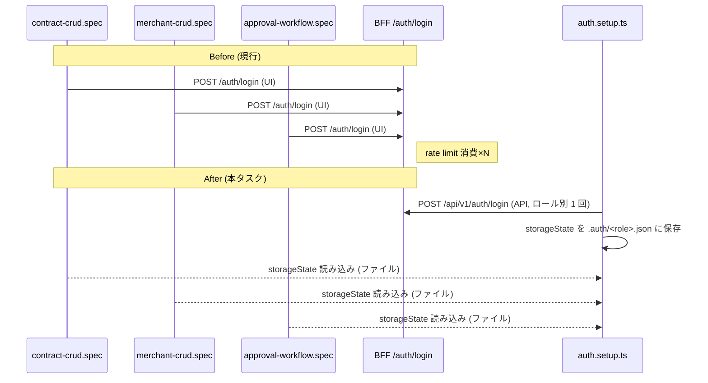

# E2E Login パターン構造刷新 設計

## アーキテクチャ概要

現行: **各 spec の `beforeAll` で UI login** を呼び出し、その後の test は page を流用する。
spec 数分の UI login が発生し、BFF rate limit (10/min/IP + burst 10) を flaky に超過する。

改修: **Playwright 標準の "setup project + storageState"** パターンへ全面移行。
セットアップ project が 1 回だけ API login を行ってロール別 storageState を保存し、
後続 spec は `test.use({ storageState: ... })` で認証済み状態を得る。
通常テスト実行中の UI login は **ゼロ** になる。

### Before / After



---

## 設計選択肢

### storageState の保存方式
- **案A: Playwright "setup project" + `.auth/*.json` ファイル** — Playwright 公式推奨。`setup` project が先に走り、テスト project が `dependencies: ['setup']` で参照する
- 案B: モジュールレベルメモリキャッシュ (関数初回呼び出しでログイン) — worker 跨ぎで共有できない、ファイルより fragile
- 案C: グローバルセットアップ (`globalSetup` hook) — 可能だが setup project より粒度が粗く、失敗時のリトライ制御が弱い

**選択: 案A** — Playwright 標準、ドキュメント充実、ロール単位で独立プロジェクト化しやすい。

### ロールの粒度
現行 seed user を踏襲して以下 3 ロールで storageState を生成:
- `contract-manager` — `test@example.com` (Phase 2 seed)
- `approver` — `approver@example.com` (Phase 3 で docker exec 作成済み)
- `viewer` — `viewer@example.com` (Phase 3 で作成済み)

`system-admin` / `sales` は現行 spec で未使用のため本タスクでは生成しない (必要時に追加可能な設計にしておく)。

### API login か UI login か
setup project 内では **API login を優先**:
- `POST /api/v1/auth/login` を APIRequestContext で叩く → 返却された Cookie を context に適用 → `context.storageState()` で保存
- UI login より高速かつ rate limit 消費が最小
- フルスイートで各ロール 1 API call / **合計 3 API calls** に集約

UI login (`page.goto('/login')` 経由) は **使わない** — auth フロー自体は `login-flow.spec.ts` が引き続き検証する。

---

## ディレクトリ構造

```
e2e/
├── .auth/                        # 新規 (gitignore 対象)
│   ├── contract-manager.json
│   ├── approver.json
│   └── viewer.json
├── tests/
│   ├── auth.setup.ts             # 新規 (setup project 本体)
│   ├── auth/
│   │   └── login-flow.spec.ts    # 変更なし (login UI をテスト)
│   ├── contracts/
│   │   ├── contract-crud.spec.ts        # 移行
│   │   ├── approval-workflow.spec.ts    # 移行
│   │   ├── approval-count-badge.spec.ts # 変更なし (既に storageState 方式)
│   │   └── approval-history-search.spec.ts # 変更なし (既に storageState 方式)
│   ├── merchants/
│   │   ├── merchant-list.spec.ts        # 移行
│   │   └── merchant-crud.spec.ts        # 移行
│   └── services/
│       └── service-crud.spec.ts         # 移行
├── utils/
│   ├── test-helpers.ts           # login() は残すが deprecation コメント付与
│   └── roles.ts                  # 新規: ロール定義とファイルパスの単一ソース
├── playwright.config.ts          # projects を再編 (setup + chromium-auth)
├── .gitignore                    # .auth/ を追加
└── README.md                     # storageState パターン説明追記
```

---

## 実装詳細

### 1. `e2e/utils/roles.ts` (新規)

ロールとパスの単一ソース。各 spec・setup が import する。

```ts
import path from 'path';

export type RoleName = 'contract-manager' | 'approver' | 'viewer';

export interface RoleCredentials {
  name: RoleName;
  email: string;
  password: string;
  storageStatePath: string;
}

const AUTH_DIR = path.resolve(__dirname, '../.auth');

export const ROLES: Record<RoleName, RoleCredentials> = {
  'contract-manager': {
    name: 'contract-manager',
    email: process.env.TEST_USER_EMAIL ?? 'test@example.com',
    password: process.env.TEST_USER_PASSWORD ?? 'password123',
    storageStatePath: path.join(AUTH_DIR, 'contract-manager.json'),
  },
  approver: {
    name: 'approver',
    email: 'approver@example.com',
    password: 'password123',
    storageStatePath: path.join(AUTH_DIR, 'approver.json'),
  },
  viewer: {
    name: 'viewer',
    email: 'viewer@example.com',
    password: 'password123',
    storageStatePath: path.join(AUTH_DIR, 'viewer.json'),
  },
};
```

### 2. `e2e/tests/auth.setup.ts` (新規)

Playwright test.describe としてロールごとに `test('authenticate as X')` を定義。各 test が
API login → storageState 保存を行う。

```ts
import { test as setup, expect, request } from '@playwright/test';
import { ROLES, RoleName } from '../utils/roles';
import fs from 'fs';
import path from 'path';

const BFF_URL = process.env.BFF_URL ?? 'http://localhost:8080';

async function authenticateRole(role: RoleName) {
  const credentials = ROLES[role];
  fs.mkdirSync(path.dirname(credentials.storageStatePath), { recursive: true });

  const ctx = await request.newContext({ baseURL: BFF_URL });
  const response = await ctx.post('/api/v1/auth/login', {
    data: { email: credentials.email, password: credentials.password },
  });
  expect(response.status(), `login for ${role}`).toBe(200);

  // セッション Cookie を storageState に保存
  await ctx.storageState({ path: credentials.storageStatePath });
  await ctx.dispose();
}

setup('authenticate as contract-manager', async () => {
  await authenticateRole('contract-manager');
});

setup('authenticate as approver', async () => {
  await authenticateRole('approver');
});

setup('authenticate as viewer', async () => {
  await authenticateRole('viewer');
});
```

### 3. `e2e/playwright.config.ts` の project 再編

```ts
export default defineConfig({
  testDir: './tests',
  fullyParallel: true,
  retries: process.env.CI ? 2 : 0,
  workers: process.env.CI ? 1 : undefined,
  reporter: [['html'], ['list']],
  timeout: 30000,
  use: {
    baseURL: process.env.FRONTEND_URL || 'http://localhost:3000',
    trace: 'on-first-retry',
    screenshot: 'only-on-failure',
    locale: 'ja-JP',
    timezoneId: 'Asia/Tokyo',
  },
  projects: [
    {
      name: 'setup',
      testMatch: /auth\.setup\.ts/,
    },
    {
      name: 'chromium',
      use: { ...devices['Desktop Chrome'] },
      dependencies: ['setup'],
      // デフォルト storageState は contract-manager (一番使われるロール)。
      // spec 側で test.use({ storageState: ... }) で上書き可能。
      // ただしログイン自体をテストする login-flow は test.use({ storageState: { cookies: [], origins: [] } }) で無効化する
    },
  ],
});
```

### 4. 既存 spec の移行パターン

#### Before (contract-crud.spec.ts)
```ts
test.describe.serial('契約管理CRUD操作', () => {
  let page: Page;
  test.beforeAll(async ({ browser }) => {
    page = await browser.newPage();
    await login(page, 'test@example.com', 'password123');
  });
  test.afterAll(async () => await page.close());
  test('...', async () => { ... });
});
```

#### After
```ts
import { ROLES } from '../../utils/roles';
test.use({ storageState: ROLES['contract-manager'].storageStatePath });

test.describe.serial('契約管理CRUD操作', () => {
  let page: Page;
  test.beforeAll(async ({ browser }) => {
    page = await browser.newPage({ storageState: ROLES['contract-manager'].storageStatePath });
  });
  test.afterAll(async () => await page.close());
  test('...', async () => { ... });
});
```

より簡潔には `{ page }` fixture で直接受け取る形 (ただし `describe.serial` + shared page パターンを維持する場合は browser.newPage が必要)。

移行対象 spec:
1. `contract-crud.spec.ts` — `contract-manager` ロール
2. `merchant-list.spec.ts` — `contract-manager`
3. `merchant-crud.spec.ts` — `contract-manager`
4. `service-crud.spec.ts` — `contract-manager`
5. `approval-workflow.spec.ts` — 複数ロール要確認 (承認者操作を含む場合 `approver`)、個別調査

### 5. `auth/login-flow.spec.ts` の扱い

- login UI フローそのものをテストしているため storageState を当ててはならない
- `test.use({ storageState: { cookies: [], origins: [] } })` で空の state を明示的に指定し、
  未ログイン状態でページにアクセスできるようにする

### 6. `test-helpers.ts` の `login()` 関数

- **残置** する (一部 ad-hoc 用途や将来の setup から呼び出される可能性を考慮)
- ただし JSDoc に「通常 spec からの呼び出しは非推奨。storageState 方式を使うこと」と明記
- リトライロジックは最後の保険として有効

### 7. `.gitignore` 追記

```
e2e/.auth/
```

---

## マイグレーション方針

- DB 変更なし
- Flyway 不要
- BFF / Backend / Frontend 無変更
- E2E ディレクトリのみの変更

## エラーハンドリング

- setup project が失敗した場合、依存する chromium project は実行されない
- 各 spec は setup が成功したことを前提としてよい
- storageState ファイルが存在しない場合 Playwright が起動時にエラー → ユーザーに明瞭なメッセージ

## Docker Compose との関係

- setup project は BFF (`http://localhost:8080`) に API call するため、docker-compose で BFF/Backend が起動していることが前提
- 既存の E2E 実行手順と同一 (`docker compose up -d` → `npx playwright test`)
- 変更不要

---

## 検証方法

1. **単発実行**: `npx playwright test` で setup → 全 spec が順に走り、全 pass
2. **連続実行**: 5 回連続 `npx playwright test` 実行して全 pass
3. **rate limit 観察**: BFF ログで `rate_limit_exceeded` / 429 が発生しないことを確認
4. **login ヘルパーの retry 発火**: ログに「login retry」が出ないことを確認 (通常運用では不要のはず)
5. **フルスイート件数**: 既存 41 件 + setup の 3 件 = **44 件 pass** が目標

---

## 影響を受けるドキュメント

- `e2e/README.md` — storageState パターンの説明追加
- `CLAUDE.md` — E2E 実行の前提条件に `e2e/.auth/` が自動生成されることを追記 (optional)
- `docs/development-workflow.md` — E2E 新規 spec 作成ガイドに storageState 使用を追記 (optional)

## 後方互換性

- **login() ヘルパーは残置** — 非推奨扱いだが削除しない (ad-hoc デバッグ用途)
- **既存 seed user** 無変更
- **BFF login API** 無変更

---

**作成日:** 2026-04-14
**作成者:** Claude Code
