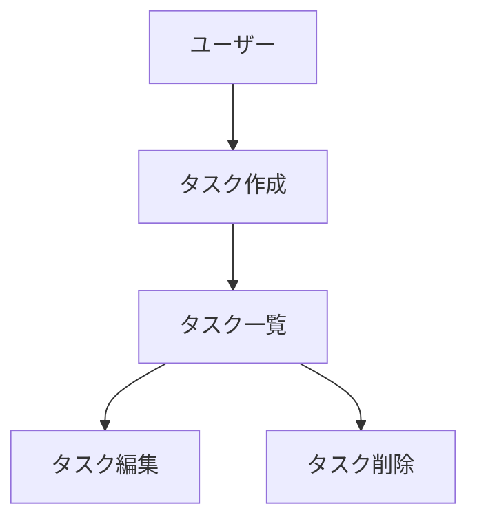

# CLAUDE.md (プロジェクトメモリ)

## 🚀 新しいセッション・新しい開発者へ

**コンテキストがクリーンな状態でこのプロジェクトを開始する場合は、まず [`docs/QUICKSTART.md`](docs/QUICKSTART.md) を読んでください。**

このファイルは、プロジェクト全体のルールを網羅的に説明していますが、新しいセッションでは情報量が多すぎます。
QUICKSTARTガイドでは、必要最小限の情報で素早く開発を開始できるようにまとめています。

---

## 概要
開発を進めるうえで遵守すべき標準ルールを定義します。

このプロジェクトは**マイクロサービスアーキテクチャ**を採用しており、複数のサービスが協調して動作します。
各サービスは独立したドキュメント構造を持ちつつ、このルートCLAUDE.mdの規則を継承します。

### 重要なドキュメントリンク
- **[`docs/QUICKSTART.md`](docs/QUICKSTART.md)** - 新セッション開始時はここから（最優先）
- **[`docs/ENVIRONMENT.md`](docs/ENVIRONMENT.md)** - ポート番号・環境変数のチートシート
- **[`docs/initial-setup-tasks.md`](docs/initial-setup-tasks.md)** - 初回セットアップの全体タスクリスト（進捗確認用）

## マイクロサービス構成

### ⚠️ 重要: サブモジュール構成

このプロジェクトは**Gitサブモジュール**構成を採用しています。
各サービスは独立したGitリポジトリとして管理されており、実環境のマイクロサービス開発に近い構成です。

**サブモジュールリポジトリ:**
- **services/frontend/**: https://github.com/ikechin/agent-teams-frontend
- **services/bff/**: https://github.com/ikechin/agent-teams-bff
- **services/backend/**: https://github.com/ikechin/agent-teams-backend

**サブモジュールの初期化（新しいクローン時）:**
```bash
git clone https://github.com/ikechin/agent-teams-sample.git
cd agent-teams-sample
git submodule update --init --recursive
```

### サービス一覧
- **frontend**: ユーザーインターフェース（Next.js/React） - サブモジュール
- **bff**: Backend for Frontend（API Gateway） - サブモジュール
- **backend**: ビジネスロジック・データ管理 - サブモジュール

### Agent分担（Agent Teams運用時）
- **Orchestrator Agent**: 全体調整、ルートの`docs/`と`.steering/`を管理
- **Frontend Agent**: `services/frontend/`を担当
- **BFF Agent**: `services/bff/`を担当
- **Backend Agent**: `services/backend/`を担当
- **E2E Test Agent**: `e2e/`を担当、全サービス統合テストを実装
- **QA/Security Agent**: 横断的な品質・セキュリティチェック（J-SOX対応含む）

### Agent間の協調ルール
1. **契約ファーストアプローチ**: API契約は`contracts/`で一元管理し、各Agentが参照
2. **用語統一**: `docs/glossary.md`の用語を全Agentが遵守
3. **横断的要件**: J-SOX、セキュリティ要件は`docs/`で定義し、各サービスで実装
4. **変更影響分析**: 1つのサービス変更が他サービスに影響する場合、ルートの`.steering/`で調整
5. **並行開発**: 各Agentは独立して作業可能だが、定期的に統合確認

### Agent Teams運用方針

#### 使用フェーズ
**Agent Teamsは実装フェーズでのみ使用します（コスト最適化のため）**

- ❌ **ドキュメント作成フェーズ**: 通常のClaude Code（単一Agent）で順次作成
- ✅ **実装フェーズ**: Claude Code Agent Teams機能で並行実装

#### 実装フェーズでのAgent Teams活用

**前提条件：**
- すべてのドキュメント（`docs/`と各サービスの`docs/`）が完成していること
- `.steering/[YYYYMMDD]-[開発タイトル]/tasklist.md`でAgent別タスクが定義されていること
- API契約（`contracts/`）の方針が確定していること

**実行方法：**
```
Claude Code settings.json に以下を設定：
{
  "env": {
    "CLAUDE_CODE_EXPERIMENTAL_AGENT_TEAMS": "1"
  }
}

Orchestratorが Taskツール を使用して複数Agentを並行起動：

Task 1 (Frontend Agent):
  subagent_type: general-purpose
  workspace: services/frontend/
  prompt: "ルートとサービスのCLAUDE.mdに従い、tasklist.mdのFrontend担当タスクを実装"

Task 2 (BFF Agent):
  subagent_type: general-purpose
  workspace: services/bff/
  prompt: "ルートとサービスのCLAUDE.mdに従い、tasklist.mdのBFF担当タスクを実装"

Task 3 (Backend Agent):
  subagent_type: general-purpose
  workspace: services/backend/
  prompt: "ルートとサービスのCLAUDE.mdに従い、tasklist.mdのBackend担当タスクを実装"
```

**Agent間の調整メカニズム：**
- **API契約**: BFF Agentが`contracts/openapi/`にOpenAPI仕様を配置
- **型定義**: 共通型は`contracts/types/`に配置
- **進捗確認**: Orchestratorが定期的に各Agentの進捗を統合確認
- **依存関係**: API契約確定後、Frontend/Backendが並行実装開始

#### Agent別の責務

**Frontend Agent:**
- `services/frontend/`配下の実装
- `services/frontend/CLAUDE.md`と`services/frontend/docs/`に従う
- `contracts/openapi/`のAPI仕様を参照してAPI呼び出し実装
- UI/UXの実装

**BFF Agent:**
- `services/bff/`配下の実装
- `services/bff/CLAUDE.md`と`services/bff/docs/`に従う
- `contracts/openapi/`にAPI仕様を定義・配置
- Frontend向けAPIとBackend呼び出しの実装

**Backend Agent:**
- `services/backend/`配下の実装
- `services/backend/CLAUDE.md`と`services/backend/docs/`に従う
- ビジネスロジック、データアクセス層の実装
- `docs/jsox-compliance.md`の要件を厳密に実装（監査ログ等）

**E2E Test Agent:**
- `e2e/`配下の実装
- Docker Composeで全サービスを起動してテスト実行
- Playwrightを使用した統合E2Eテスト
- Frontend/BFF/Backend全体のユーザーフローテスト

**QA/Security Agent（必要に応じて）:**
- 横断的なテスト実装
- セキュリティスキャン
- J-SOX要件の実装確認

## プロジェクト構造

### ドキュメントの分類

#### 1. ルート永続的ドキュメント（`docs/`）

**マイクロサービス全体**の「**何を作るか**」「**どう作るか**」を定義する恒久的なドキュメント。
全サービスに共通する設計や方針を記述し、各Agentが参照します。

- **product-requirements.md** - システム全体のプロダクト要求定義書
  - プロダクトビジョンと目的
  - ターゲットユーザーと課題・ニーズ
  - 主要な機能一覧（サービス横断的な機能）
  - 成功の定義
  - ビジネス要件
  - ユーザーストーリー
  - 受け入れ条件
  - 非機能要件（全体）

- **system-architecture.md** - システムアーキテクチャ設計書
  - マイクロサービス全体構成図
  - サービス間通信方式
  - インフラ構成
  - デプロイ戦略
  - スケーリング方針

- **glossary.md** - ユビキタス言語定義（全サービス共通）
  - ドメイン用語の定義（加盟店、契約、サービス等）
  - ビジネス用語の定義
  - 英語・日本語対応表
  - コード上の命名規則

- **jsox-compliance.md** - J-SOX対応設計書
  - 監査証跡設計
  - 職務分掌設計
  - アクセス制御設計
  - データ保護設計
  - 承認フロー設計

- **security-guidelines.md** - セキュリティガイドライン
  - 認証・認可方式
  - データ暗号化方針
  - セキュリティベストプラクティス

- **service-contracts.md** - サービス間API契約方針
  - API契約管理方法（OpenAPI等）
  - バージョニング戦略
  - 後方互換性ポリシー

#### 2. サービス別永続的ドキュメント（`services/{service}/docs/`）

各サービス固有の設計を定義します。

- **functional-design.md** - サービス固有の機能設計書
  - コンポーネント設計
  - データモデル（サービス固有）
  - UI設計（frontendの場合）
  - API設計（bff/backendの場合）

- **repository-structure.md** - サービス内のリポジトリ構造
  - フォルダ・ファイル構成
  - ディレクトリの役割

- **development-guidelines.md** - サービス固有の開発ガイドライン
  - コーディング規約
  - テスト規約
  - ルートの`docs/security-guidelines.md`や`docs/jsox-compliance.md`の実装方法


#### 3. 作業単位のドキュメント（`.steering/[YYYYMMDD]-[開発タイトル]/`）

特定の開発作業における「**今回何をするか**」を定義する一時的なステアリングファイル。
作業完了後は参照用として保持されますが、新しい作業では新しいディレクトリを作成します。

**ルートのステアリング（`.steering/`）**: 複数サービスにまたがる作業の場合
**サービス別ステアリング（`services/{service}/.steering/`）**: サービス内完結の作業の場合

- **requirements.md** - 今回の作業の要求内容
  - 変更・追加する機能の説明
  - 影響するサービス（マイクロサービス横断の場合）
  - ユーザーストーリー
  - 受け入れ条件
  - 制約事項

- **design.md** - 変更内容の設計
  - 実装アプローチ
  - 変更するコンポーネント
  - API契約の変更（ある場合）
  - データ構造の変更
  - 影響範囲の分析（サービス間影響含む）

- **tasklist.md** - タスクリスト（Agent別に分担）
  - 具体的な実装タスク
  - 担当Agent（Frontend/BFF/Backend）
  - タスクの進捗状況
  - 完了条件
  - Agent間の依存関係

### ステアリングディレクトリの命名規則

```
.steering/[YYYYMMDD]-[開発タイトル]/
```

**例：**
- `.steering/20250103-initial-implementation/`
- `.steering/20250115-add-tag-feature/`
- `.steering/20250120-fix-filter-bug/`
- `.steering/20250201-improve-performance/`

## 開発プロセス

### 開発フェーズの区分

#### フェーズ1: ドキュメント作成（Agent Teams不使用）
**目的:** マイクロサービス全体の設計と各サービスの設計を確立

**作業内容:**
1. ルート永続的ドキュメント（`docs/`）の作成
2. 各サービスのCLAUDE.mdと設計ドキュメント作成
3. 初回実装用ステアリングファイル作成

**Agent構成:**
- 単一Agent（通常のClaude Code）が順次作成
- コスト効率重視
- 各ドキュメント作成後、承認を得てから次へ進む

#### フェーズ2: 実装（Agent Teams使用）✅
**目的:** 3サービスを並行実装し、統合されたシステムを構築

**作業内容:**
1. Frontend/BFF/Backendの並行実装
2. API契約の実装と共有
3. E2Eテストの並行実装
4. 統合テスト

**Agent構成:**
- 複数Agent（Claude Code Agent Teams）が並行作業
- Frontend Agent、BFF Agent、Backend Agent、E2E Test Agent
- Orchestratorが全体調整

**前提条件:**
- フェーズ1のすべてのドキュメントが完成していること

### 初回セットアップ時の手順（サブモジュール構成）

#### 1. 親リポジトリのフォルダ作成

```bash
# 親リポジトリ（agent-teams-sample）で実行
mkdir -p docs .steering contracts/openapi contracts/types
mkdir -p e2e/tests/{auth,merchants,contracts}
```

**⚠️ 重要: サブモジュール構成について**
- `services/`配下はGitサブモジュールとして独立したリポジトリで管理
- 各サービスのディレクトリ構造は、各サブモジュールリポジトリ内で個別に管理
- 親リポジトリから`services/`内にディレクトリを作成しない

**サブモジュールリポジトリ:**
- Frontend: https://github.com/ikechin/agent-teams-frontend
- BFF: https://github.com/ikechin/agent-teams-bff
- Backend: https://github.com/ikechin/agent-teams-backend

#### 2. ルート永続的ドキュメント作成（`docs/`）

マイクロサービス全体の設計を定義します。
各ドキュメントを作成後、必ず確認・承認を得てから次に進みます。

1. `docs/product-requirements.md` - システム全体のプロダクト要求定義書
2. `docs/system-architecture.md` - システムアーキテクチャ設計書
3. `docs/glossary.md` - ユビキタス言語定義
4. `docs/jsox-compliance.md` - J-SOX対応設計書
5. `docs/security-guidelines.md` - セキュリティガイドライン
6. `docs/service-contracts.md` - サービス間API契約方針

**重要：** 1ファイルごとに作成後、必ず確認・承認を得てから次のファイル作成を行う

#### 3. サブモジュール内のCLAUDE.mdとドキュメント作成

**注意:** 各サービスは独立したGitリポジトリ（サブモジュール）として管理されています。
各サブモジュールリポジトリ内で以下のドキュメントを作成してください。

**Frontend サブモジュール (services/frontend/):**
```bash
cd services/frontend
# サブモジュール内でドキュメント作成
# 1. CLAUDE.md - Frontend開発ルール
# 2. docs/functional-design.md - Frontend機能設計
# 3. docs/repository-structure.md
# 4. docs/development-guidelines.md
```

**BFF サブモジュール (services/bff/):**
```bash
cd services/bff
# 同様にCLAUDE.md + docs/ 3ファイルを作成
```

**Backend サブモジュール (services/backend/):**
```bash
cd services/backend
# 同様にCLAUDE.md + docs/ 3ファイルを作成
```

**重要:**
- 各サービスのCLAUDE.mdはルートのCLAUDE.mdを継承する形で記述
- 各サブモジュールで個別にコミット・プッシュが必要
- サブモジュール内の変更は、親リポジトリでサブモジュール参照を更新する必要がある

#### 4. 初回実装用のステアリングファイル作成

初回実装用のディレクトリを作成し、実装に必要なドキュメントを配置します。

```bash
mkdir -p .steering/[YYYYMMDD]-initial-implementation
```

作成するドキュメント：
1. `.steering/[YYYYMMDD]-initial-implementation/requirements.md` - 初回実装の要求（MVP定義）
2. `.steering/[YYYYMMDD]-initial-implementation/design.md` - 実装設計（サービス横断）
3. `.steering/[YYYYMMDD]-initial-implementation/tasklist.md` - 実装タスク（Agent別分担）

**Agent別タスク分担の記載例：**
```markdown
## Frontend Agent
- [ ] 加盟店一覧画面の実装
- [ ] 契約詳細画面の実装

## BFF Agent
- [ ] 加盟店取得APIの実装
- [ ] 契約管理APIの実装

## Backend Agent
- [ ] 加盟店管理ドメインロジックの実装
- [ ] データベーススキーマの作成
```

#### 5. 環境セットアップ

各サービスの環境をセットアップします（Agent別に並行可能）。

#### 6. 実装開始（Agent Teams並行実装）

`.steering/[YYYYMMDD]-initial-implementation/tasklist.md` に基づいて、各Agentが担当サービスを並行実装します。

**Agent間の調整ポイント：**
- API契約の確定と`contracts/`への配置
- 用語の統一（`docs/glossary.md`参照）
- J-SOX要件の実装確認

#### 7. 統合確認・品質チェック

各サービスの統合テストとセキュリティチェックを実施します。

### 機能追加・修正時の手順

#### 1. 影響分析

- 永続的ドキュメント（`docs/`）への影響を確認
- 変更が基本設計に影響する場合は `docs/` を更新

#### 2. ステアリングディレクトリ作成

新しい作業用のディレクトリを作成します。

```bash
mkdir -p .steering/[YYYYMMDD]-[開発タイトル]
```

**例：**
```bash
mkdir -p .steering/20250115-add-tag-feature
```

#### 3. 作業ドキュメント作成

作業単位のドキュメントを作成します。
各ドキュメント作成後、必ず確認・承認を得てから次に進みます。

1. `.steering/[YYYYMMDD]-[開発タイトル]/requirements.md` - 要求内容
2. `.steering/[YYYYMMDD]-[開発タイトル]/design.md` - 設計
3. `.steering/[YYYYMMDD]-[開発タイトル]/tasklist.md` - タスクリスト

**重要：** 1ファイルごとに作成後、必ず確認・承認を得てから次のファイル作成を行う

#### 4. 永続的ドキュメント更新（必要な場合のみ）

変更が基本設計に影響する場合、該当する `docs/` 内のドキュメントを更新します。

#### 5. 実装開始

`.steering/[YYYYMMDD]-[開発タイトル]/tasklist.md` に基づいて実装を進めます。

#### 6. 品質チェック

## ドキュメント管理の原則（マイクロサービス）

### ルート永続的ドキュメント（`docs/`）
- **マイクロサービス全体**の基本設計を記述
- 全Agent・全サービスが参照する「北極星」
- 横断的要件（J-SOX、セキュリティ、用語）を一元管理
- 頻繁に更新されない
- 大きなアーキテクチャ変更時のみ更新

### サービス別永続的ドキュメント（`services/{service}/docs/`）
- 各サービス固有の設計を記述
- 担当Agentが主に参照・更新
- ルートの`docs/`に記載された横断的要件の実装方法を記述

### 作業単位のドキュメント（`.steering/`）
- **ルートのステアリング**: 複数サービスにまたがる作業
- **サービス別ステアリング**: サービス内完結の作業
- 作業ごとに新しいディレクトリを作成
- Agent別のタスク分担を明記
- 作業完了後は履歴として保持
- 変更の意図と経緯を記録

### Agent間のドキュメント共有ルール
1. **用語**: `docs/glossary.md`を全Agentが遵守
2. **API契約**: `contracts/`に配置し、全Agentが参照
3. **横断的要件**: `docs/jsox-compliance.md`等を全Agentが実装
4. **変更通知**: あるAgentの変更が他Agentに影響する場合、ルートの`.steering/`で調整

## 図表・ダイアグラムの記載ルール

### 記載場所
設計図やダイアグラムは、関連する永続的ドキュメント内に直接記載します。
独立したdiagramsフォルダは作成せず、手間を最小限に抑えます。

**配置例：**
- ER図、データモデル図 → `functional-design.md` 内に記載
- ユースケース図 → `functional-design.md` または `product-requirements.md` 内に記載
- 画面遷移図、ワイヤフレーム → `functional-design.md` 内に記載
- システム構成図 → `functional-design.md` または `architecture.md` 内に記載

### 記述形式
1. **Mermaid記法（推奨）**
   - Markdownに直接埋め込める
   - バージョン管理が容易
   - ツール不要で編集可能



2. **ASCII アート**
   - シンプルな図表に使用
   - テキストエディタで編集可能

```
┌─────────────┐
│   Header    │
└─────────────┘
       │
       ↓
┌─────────────┐
│  Task List  │
└─────────────┘
```

3. **画像ファイル（必要な場合のみ）**
   - 複雑なワイヤフレームやモックアップ
   - `docs/images/` フォルダに配置
   - PNG または SVG 形式を推奨

### 図表の更新
- 設計変更時は対応する図表も同時に更新
- 図表とコードの乖離を防ぐ

## 注意事項

- ドキュメントの作成・更新は段階的に行い、各段階で承認を得る
- `.steering/` のディレクトリ名は日付と開発タイトルで明確に識別できるようにする
- 永続的ドキュメントと作業単位のドキュメントを混同しない
- コード変更後は必ずリント・型チェックを実施する
- 共通のデザインシステム（Tailwind CSS）を使用して統一感を保つ
- セキュリティを考慮したコーディング（XSS対策、入力バリデーションなど）
- 図表は必要最小限に留め、メンテナンスコストを抑える