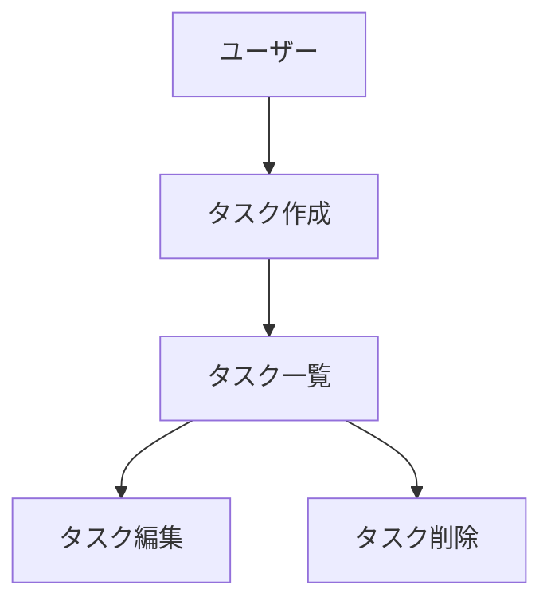

# CLAUDE.md (プロジェクトメモリ)

## 🚀 新しいセッション・新しい開発者へ

**コンテキストがクリーンな状態でこのプロジェクトを開始する場合は、まず [`docs/QUICKSTART.md`](docs/QUICKSTART.md) を読んでください。**

このファイルは、プロジェクト全体のルールを網羅的に説明していますが、新しいセッションでは情報量が多すぎます。
QUICKSTARTガイドでは、必要最小限の情報で素早く開発を開始できるようにまとめています。

---

## 概要
開発を進めるうえで遵守すべき標準ルールを定義します。

このプロジェクトは**マイクロサービスアーキテクチャ**を採用しており、複数のサービスが協調して動作します。
各サービスは独立したドキュメント構造を持ちつつ、このルートCLAUDE.mdの規則を継承します。

### 重要なドキュメントリンク
- **[`docs/QUICKSTART.md`](docs/QUICKSTART.md)** - 新セッション開始時はここから（最優先）
- **[`docs/development-workflow.md`](docs/development-workflow.md)** - 開発ワークフロー全体像（SPEC駆動型開発の手順ガイド）
- **[`docs/ENVIRONMENT.md`](docs/ENVIRONMENT.md)** - ポート番号・環境変数のチートシート
- **[`docs/initial-setup-tasks.md`](docs/initial-setup-tasks.md)** - 初回セットアップの全体タスクリスト（進捗確認用）

## マイクロサービス構成

### ⚠️ 重要: サブモジュール構成

このプロジェクトは**Gitサブモジュール**構成を採用しています。
各サービスは独立したGitリポジトリとして管理されており、実環境のマイクロサービス開発に近い構成です。

**サブモジュールリポジトリ:**
- **services/frontend/**: https://github.com/ikechin/agent-teams-frontend
- **services/bff/**: https://github.com/ikechin/agent-teams-bff
- **services/backend/**: https://github.com/ikechin/agent-teams-backend

**サブモジュールの初期化（新しいクローン時）:**
```bash
git clone https://github.com/ikechin/agent-teams-sample.git
cd agent-teams-sample
git submodule update --init --recursive
```

### サービス一覧
- **frontend**: ユーザーインターフェース（Next.js/React） - サブモジュール
- **bff**: Backend for Frontend（API Gateway） - サブモジュール
- **backend**: ビジネスロジック・データ管理 - サブモジュール

### Agent分担（Agent Teams運用時）
- **Orchestrator Agent**: 全体調整、ルートの`docs/`と`.steering/`を管理
- **Frontend Agent**: `services/frontend/`を担当
- **BFF Agent**: `services/bff/`を担当
- **Backend Agent**: `services/backend/`を担当
- **E2E Test Agent**: `e2e/`を担当、全サービス統合テストを実装
- **QA/Security Agent**: 横断的な品質・セキュリティチェック（J-SOX対応含む）

### Agent間の協調ルール
1. **契約ファーストアプローチ**: API契約は`contracts/`で一元管理し、各Agentが参照
2. **用語統一**: `docs/glossary.md`の用語を全Agentが遵守
3. **横断的要件**: J-SOX、セキュリティ要件は`docs/`で定義し、各サービスで実装
4. **変更影響分析**: 1つのサービス変更が他サービスに影響する場合、ルートの`.steering/`で調整
5. **並行開発**: 各Agentは独立して作業可能だが、定期的に統合確認

### Agent Teams運用方針

#### 使用フェーズ
**Agent Teamsは実装フェーズでのみ使用します（コスト最適化のため）**

- ❌ **ドキュメント作成フェーズ**: 通常のClaude Code（単一Agent）で順次作成
- ✅ **実装フェーズ**: Claude Code Agent Teams機能で並行実装

#### Orchestratorの運用ルール（必須）

**Agent Teamsを使用する際は、以下のルールを必ず遵守すること：**

1. **Orchestrator（リーダー Agent）は常にユーザー応答可能な状態を維持する**
   - `TeamCreate` でチーム context を作成し、`Agent` ツールに `team_name` を指定して各メンバーを spawn する
   - 子 Agent からのメッセージ・idle 通知は新しい会話ターンとして**自動配信**されるため、Orchestrator は他の作業をしながらメンバーの完了を待てる
   - ユーザーの質問にいつでも応答できる状態を維持する
   - Agent 間の通信ルールは「Agent Teams の正しい使い方」セクションに従う

2. **ユーザーへの進捗報告**
   - ユーザーから進捗を聞かれた場合、各Agentの状態（実行中/完了/失敗）を報告する
   - 開発途中でもユーザーの質問に回答する（Agentの完了を待たない）

3. **Orchestratorの事前作業**
   - **`TeamCreate` でチーム context を作成** (専用 TaskList が同時に作られる)
   - API契約（Proto/OpenAPI）の確定
   - 各サブモジュールで featureブランチの作成
   - **横断的制約リスト**を収集 (rate limit / セッション / middleware / seed データ / 構造化エラー規約 等) — 各 Agent 起動プロンプトに埋め込む
   - `TaskCreate` でチーム共有タスクリストに各 Agent 担当タスクを作成
   - `Agent` ツールに **`team_name` 必須指定**で各メンバーを spawn
   - `TaskUpdate(owner=...)` でタスクをメンバーに割り当て

#### Agent Teams の正しい使い方（`CLAUDE_CODE_EXPERIMENTAL_AGENT_TEAMS=1`）

**重要な前提:**
真の Agent Teams は `TeamCreate` でチーム context を作成し、その中に
`Agent` ツールで `team_name` を指定してメンバーを spawn することで成立する。
**`TeamCreate` を呼ばず、`team_name` も指定しない場合、ただの並列バックグラウンド
subagent でしかなく、子 Agent 同士の `SendMessage` 直接通信は成立しない。**

##### 起動フロー（必須順序）

```
1. TeamCreate(team_name="<task-name>", description="...")
   → ~/.claude/teams/<task-name>/config.json と
     ~/.claude/tasks/<task-name>/ が同時作成される
   → Team = TaskList の 1:1 対応

2. TaskCreate(...) でチーム共有タスクを作成
   → 自動的に当該チームの TaskList に登録される

3. Agent(
     subagent_type="general-purpose",
     name="backend-agent",
     team_name="<task-name>",   ← 必須
     prompt="...",
   )
   各メンバー (Backend / BFF / Frontend / E2E) を同様に spawn
   → 子 Agent は team config の members 配列に登録され、
     互いを name で参照できるようになる

4. TaskUpdate(taskId="X", owner="backend-agent")
   タスクをメンバー名で割り当て

5. メンバーが作業 → TaskUpdate で完了マーク → 自動的に idle 通知

6. 全タスク完了 → **実装レビュー → レビュー指摘の修正まで同一 Team で実行**
   - 各メンバーは完了後 idle 待機する (シャットダウンしない)
   - Orchestrator が /review-implementation でレビュー → 指摘を該当メンバーに DM で再割当
   - Medium/Low 指摘を複数 Agent に並列 DM することで <5 分で解消可能
   - 再 spawn 不要、背景知識が Agent context に残るためコンテキスト再ロードコストゼロ

7. レビュー修正まで完了後に shutdown:
   SendMessage({to: "*", message: {type: "shutdown_request"}})
   各メンバーが shutdown_response で承認 → プロセス終了

8. TeamDelete でチーム context とタスクディレクトリをクリーンアップ
```

**長寿命 Team パターン (2026-04-14 振り返り由来):**
`.steering/20260414-approval-history-search/retrospective.md` での学び。
タスク #4 completed → 即 shutdown ではなく、**レビュー + 修正完了まで Team を維持**する。
Phase 3 では shutdown 後にレビューしたため context を失い、修正が非効率だった。
本タスクでは長寿命パターンで 4 件の指摘を <5 分で並列解消できた。

##### 重要な仕様

**メッセージは自動配信される:**
- 子 Agent からのメッセージは新しい会話ターンとして Orchestrator に自動的に届く
- inbox を確認する必要はない
- ファイルシステム (`git status`) で間接的に進捗を覗き見る必要もない

**Peer DM の可視性:**
- 子 Agent 同士の DM は、送信側の idle 通知に「サマリ」が含まれて Orchestrator にも見える
- 詳細本文は見えないので、重要決定は Orchestrator にも CC するのが望ましい

**Idle は正常状態:**
- Agent は1ターンごとに idle になる — これは「終了」ではなく「次の入力待ち」
- Idle 通知が来ても **「Agent が終わった」と誤解しない**
- Idle Agent に SendMessage すると wake up して次のターンを実行する

**broadcast (`to: "*"`) は高コスト:**
- メンバー数に線形で課金される
- 全員に本当に必要な情報のみに限定する

**Phase 2 で何が間違っていたか:**
Phase 2 (`.steering/20260412-contract-management-phase2/retrospective.md`) では
そもそも `TeamCreate` を呼ばず、`team_name` 指定もしていなかったため、子 Agent
同士は互いを認識できず、Backend が `WHERE status='PENDING'` でハードコードした
事実が他 Agent に伝わる経路がなかった。これが H1 (却下理由が永久に表示されない
仕様バグ) の根本原因。正しい Agent Teams を使えば実装中に検知できる。

##### 通信ルール

1. **Orchestrator 経由が必須のケース（方針・最終決定）**
   - 設計方針の変更・新規方針の決定（例: エラーコード体系の変更、新しい認証方式）
   - API契約の変更（Proto/OpenAPI を物理ファイルとして修正する場合）
   - 複数 Agent にまたがる横断的課題で方向性を決めかねるとき
   - スコープ外の追加要求

2. **Agent 間 DM が必須のケース — 実装の暗黙前提共有（フルメッシュ）**
   各 Agent は以下を発見・決定した時点で、関係する Agent（および Orchestrator に CC）
   へ **SendMessage で即座に発信する義務** を負う:
   - **クエリ・条件式のハードコード**（例: `WHERE status='PENDING'`）
   - **レスポンス形状の選択**（フィールド命名、optional/required、null 表現）
   - **エラー区分の追加・変更**（新しいエラーコード、HTTPステータス、構造化エラー Reason）
   - **バリデーションの境界値**（min/max、形式、空文字の扱い）
   - **権限・認可の判定基準**（必要パーミッション、SoD除外ルール）
   - **横断的制約の発見**（rate limit、セッション、middleware の挙動）

3. **Agent 間 DM が推奨のケース（事実確認）**
   - 実装済みのメソッド名・型名・フィールド名の確認
   - gRPC レスポンスの構造確認
   - 既存コードのパターン確認
   - テストデータの確認

4. **発信のお作法**
   - **設計判断ログ**: 1〜3 行の簡潔な要約をコミット前に関係 Agent に DM する
   - **plain text で送る** — 構造化 JSON ステータス（`{"type":"idle",...}` 等）は禁止
   - **TaskUpdate で進捗管理** — 完了は SendMessage ではなく `TaskUpdate(status="completed")` で
   - **設計変更が必要と判明したら**勝手に決めず Orchestrator に上げる
   - **矛盾する指示を受けたら** Orchestrator に確認する
   - **broadcast (`to: "*"`) は最終手段** — 全員に本当に必要な情報のみに限定

##### Orchestrator が各 Agent 起動時に伝える指示の例

```
あなたは <name> Agent (Backend/BFF/Frontend/E2E) です。

【Agent 間通信 - フルメッシュ型 Agent Teams】
- チーム名: <team-name>
- チーム config: ~/.claude/teams/<team-name>/config.json (members を Read で確認可能)
- 他のメンバーには SendMessage({to: "<name>", message: "...", summary: "..."}) で
  直接 DM 可能。積極的に活用すること
- 自分宛のメッセージは自動配信される (inbox 確認不要)
- TaskList を定期的に確認し、自分に割り当てられたタスクを TaskUpdate で進める
- 完了は TaskUpdate(status="completed") でマーク (SendMessage で完了報告は不要)

【発信義務 - 以下を発見・決定した時点で関係 Agent に即 DM する】
* クエリ・条件式のハードコード (例: WHERE status='PENDING')
* レスポンス形状の選択 (フィールド命名、optional/null 表現)
* エラー区分の追加・変更 (新コード、HTTP ステータス、ErrorInfo Reason)
* バリデーション境界値、権限判定基準、横断的制約の発見
※ 1〜3 行の簡潔な「設計判断ログ」をコミット前に送ること
※ 設計方針の変更が必要と判明したら勝手に決めず team-lead (Orchestrator) に上げる

【横断的制約 (事前共有事項)】
<Orchestrator が事前に収集した rate limit / セッション / middleware /
 seed データ / 構造化エラー規約 等を列挙>
```

##### Orchestrator の進捗把握

- **メッセージ自動配信を待つのが基本** — 子 Agent からの DM・idle 通知が新しい会話ターンとして届く
- ファイルシステム（`git status`）覗き見は補助手段に留める（Phase 2 では誤って主手段にしてしまった）
- 主要層完了時 (例: Backend のリポジトリ層完了時) には能動的に「他 Agent が知るべき決定はあるか」と問い合わせてもよい

##### 依存関係のある Agent 間のハンドオフ (必須ルール)

**Agent Teams の運用で最も見落とされやすいポイント:**
子 Agent は **他 Agent の `TaskUpdate(completed)` を自律的に検知しません**。
`TaskList` を能動的にポーリングする設計ではなく、**次のメッセージが届くまで idle のまま待機** します。
つまり「Backend が終わったら Frontend が自動で動き出す」ということは起きません。

これを放置すると、下流 Agent (Frontend 等) は上流 Agent (Backend/BFF) の完了を永久に待ち続けてタスクが停止します。
実例: `.steering/20260413-approval-count-badge/retrospective.md` — Frontend Agent が BFF 完了後も
idle のまま動かず、Orchestrator の明示的 wake up DM でようやく実装開始した。

**ハンドオフの必須ルール (Orchestrator 主導):**

1. **上流 Agent の完了通知を Orchestrator が受け取る** — 子 Agent からの
   `TaskUpdate(completed)` または「完了しました」DM が会話ターンとして届く
2. **Orchestrator が下流 Agent に明示的な wake-up DM を送る** — 下流が「次に何をすべきか」
   を理解できる具体的な内容で:
   - 何が完了したか (例: "backend-agent 完了、proto が main に merge 済み")
   - 次にやるべきこと (例: "`cd ../.. && git pull` で親リポ同期 → 型再生成 → 実装")
   - 合意済み仕様の再掲 (D1-D4 の結論等)
   - 完了条件と TaskUpdate 完了マークの指示
3. **下流 Agent は wake-up DM を受け取って起動** — `TaskList` を再確認して自分の
   タスクを in_progress にし、実装開始

**代替案と推奨:**

| 方式 | メリット | デメリット | 推奨 |
|---|---|---|---|
| **Orchestrator 主導 (推奨)** | 方針判断責任と一貫、進捗可視性あり | Orchestrator の手動介入が必要 | ✅ デフォルト |
| 上流 Agent が下流に完了 DM | Orchestrator の手数が減る | 上流 Agent が下流の事情を知る必要あり (責任拡大) | 特殊ケースのみ |
| ポーリング自律起動 | 完全自律 | TaskList ポーリングは現仕様で不可 | ❌ 不可能 |

**TaskCreate 時の依存関係明示 (併用推奨):**

`TaskCreate` の description に依存関係を明記し、`TaskUpdate` の `addBlockedBy` /
`addBlocks` パラメータで blocker を設定する。例:

```
TaskCreate(
  subject="Frontend: サイドバーバッジ実装",
  description="依存: Task #2 (BFF /pending-count 完了) の OpenAPI 更新後に型再生成 → 実装"
)
TaskUpdate(taskId="3", addBlockedBy=["2"])
```

これにより:
- 下流 Agent が起動時に `TaskList` で「自分のタスクは blocked」と認識できる
- Orchestrator が依存グラフを把握しやすい
- 誤って blocker 未完了のまま実装開始する事故を防げる

**ただし blocker 解消を自律検知する仕組みはない**ため、Orchestrator の明示的 wake-up DM は
引き続き必要です。TaskCreate の依存関係明示は「待機理由の文書化」としての価値に留まります。

#### 依存関係に応じたフェーズ分け実行

**全Agentを常に同時起動するのではなく、依存関係に応じて段階的に起動する。**

**パターン1: API契約が確定済み → 全Agent並行起動**
```
Phase 1: Orchestrator事前作業（Proto/OpenAPI確定）
Phase 2: Backend + BFF + Frontend 並行起動
Phase 3: E2E Test Agent（全Agent完了後）
```

**パターン2: Backend実装に依存する場合 → 段階的起動**
```
Phase 1: Backend Agent（DB + gRPC実装）
Phase 2: BFF Agent（Backend完了後）+ Frontend Agent（OpenAPI型確定後）
Phase 3: E2E Test Agent
```

**パターン3: 単一サービス内の変更 → 単一Agent**
```
サービス内完結の変更はAgent Teamsを使わず、単一Agentで実装する。
（コスト最適化）
```

**判断基準:**
- API契約が事前確定できる → パターン1（並行）
- 新しいgRPC/RESTの設計が必要 → パターン2（段階的）
- 影響が1サービス内 → パターン3（単一Agent）

#### レビュー・修正フェーズのAgent活用

**実装完了後のレビュー・修正もAgentに委任できる。**

1. **レビュー**: 各サービスのレビューAgentを並行起動し、差分ベースでチェック
2. **修正**: レビュー指摘をサービス別の修正Agentに並行で委任
3. **E2Eテスト**: 統合動作確認後にE2E Agent起動

**注意:** レビュー・修正Agentは実装Agentとは別に起動する（コンテキストが汚染されないため）

#### 実装フェーズでのAgent Teams活用

**前提条件：**
- すべてのドキュメント（`docs/`と各サービスの`docs/`）が完成していること
- `.steering/[YYYYMMDD]-[開発タイトル]/tasklist.md`でAgent別タスクが定義されていること
- API契約（`contracts/`）の方針が確定していること

**実行方法：**
```
1. settings.json に CLAUDE_CODE_EXPERIMENTAL_AGENT_TEAMS=1 を設定:
{
  "env": {
    "CLAUDE_CODE_EXPERIMENTAL_AGENT_TEAMS": "1"
  }
}

2. Orchestrator が TeamCreate でチーム context を作成:
TeamCreate(team_name="<task-name>", description="承認ワークフロー Phase 2")

3. TaskCreate でチーム共有タスクを作成 (Backend / BFF / Frontend / E2E 分):
TaskCreate(subject="...", description="...")  # チームに自動所属

4. Agent ツールに team_name 必須指定で各メンバーを spawn:

Agent(
  subagent_type="general-purpose",
  name="backend-agent",
  team_name="<task-name>",          ← 必須 (これがないと team に参加しない)
  prompt="<横断的制約 + Agent 通信ルールを含むテンプレ>",
)
# Same for bff-agent / frontend-agent / e2e-agent

5. TaskUpdate でタスクを各メンバーに割り当て:
TaskUpdate(taskId="1", owner="backend-agent")
TaskUpdate(taskId="2", owner="bff-agent")
...

6. メンバー作業完了 → 自動 idle 通知 → Orchestrator 統合確認
7. **実装レビュー (/review-implementation) → 指摘修正も同一 Team で実行** (長寿命 Team パターン)
8. レビュー修正完了後に SendMessage({to: "*", message: {type: "shutdown_request"}}) で全員停止
9. TeamDelete でクリーンアップ
```

**注意:** `TeamCreate` を呼ばず `team_name` も指定しないと、ただの並列バックグラウンド
subagent でしかなく、子 Agent 同士の `SendMessage` 通信は成立しない。これは
**真の Agent Teams ではない**。Phase 2 ではこれを誤って「Agent Teams」と呼んでいた。

**Agent間の調整メカニズム：**
- **API契約**: Orchestratorが事前に`contracts/proto/`と`contracts/openapi/`を確定してから各Agentを起動
- **共通課題**: 複数Agentに影響する課題（型共有、共通ライブラリ等）はOrchestratorが方針決定し全Agentに指示
- **型定義**: 共通型は`contracts/types/`に配置
- **進捗確認**: Orchestrator はチーム共有 `TaskList` で全体進捗を把握。各 Agent は `TaskUpdate` で進捗報告。子 Agent からの DM・idle 通知は自動配信されるため、ファイルシステム覗き見は不要
- **依存関係**: 「フェーズ分け実行」に従い、依存関係に応じた起動順序を決定
- **直接通信 (フルメッシュ型 Agent Teams)**: `TeamCreate` + `team_name` 指定で spawn された Agent 同士は `SendMessage({to: "<name>"})` で直接 DM 可能。実装の暗黙前提（クエリのハードコード、レスポンス形状、エラー区分等）は発見した時点で関係 Agent に即座に DM する義務あり。方針変更のみ Orchestrator 経由

#### Agent別の責務

**Frontend Agent:**
- `services/frontend/`配下の実装
- `services/frontend/CLAUDE.md`と`services/frontend/docs/`に従う
- `contracts/openapi/`のAPI仕様を参照してAPI呼び出し実装
- UI/UXの実装

**BFF Agent:**
- `services/bff/`配下の実装
- `services/bff/CLAUDE.md`と`services/bff/docs/`に従う
- `contracts/openapi/`にAPI仕様を定義・配置
- Frontend向けAPIとBackend呼び出しの実装

**Backend Agent:**
- `services/backend/`配下の実装
- `services/backend/CLAUDE.md`と`services/backend/docs/`に従う
- ビジネスロジック、データアクセス層の実装
- `docs/jsox-compliance.md`の要件を厳密に実装（監査ログ等）

**E2E Test Agent:**
- `e2e/`配下の実装
- Docker Composeで全サービスを起動してテスト実行
- Playwrightを使用した統合E2Eテスト
- Frontend/BFF/Backend全体のユーザーフローテスト

**QA/Security Agent（必要に応じて）:**
- 横断的なテスト実装
- セキュリティスキャン
- J-SOX要件の実装確認

## プロジェクト構造

### ドキュメントの分類

#### 1. ルート永続的ドキュメント（`docs/`）

**マイクロサービス全体**の「**何を作るか**」「**どう作るか**」を定義する恒久的なドキュメント。
全サービスに共通する設計や方針を記述し、各Agentが参照します。

- **product-requirements.md** - システム全体のプロダクト要求定義書
  - プロダクトビジョンと目的
  - ターゲットユーザーと課題・ニーズ
  - 主要な機能一覧（サービス横断的な機能）
  - 成功の定義
  - ビジネス要件
  - ユーザーストーリー
  - 受け入れ条件
  - 非機能要件（全体）

- **system-architecture.md** - システムアーキテクチャ設計書
  - マイクロサービス全体構成図
  - サービス間通信方式
  - インフラ構成
  - デプロイ戦略
  - スケーリング方針

- **glossary.md** - ユビキタス言語定義（全サービス共通）
  - ドメイン用語の定義（加盟店、契約、サービス等）
  - ビジネス用語の定義
  - 英語・日本語対応表
  - コード上の命名規則

- **jsox-compliance.md** - J-SOX対応設計書
  - 監査証跡設計
  - 職務分掌設計
  - アクセス制御設計
  - データ保護設計
  - 承認フロー設計

- **security-guidelines.md** - セキュリティガイドライン
  - 認証・認可方式
  - データ暗号化方針
  - セキュリティベストプラクティス

- **service-contracts.md** - サービス間API契約方針
  - API契約管理方法（OpenAPI等）
  - バージョニング戦略
  - 後方互換性ポリシー

#### 2. サービス別永続的ドキュメント（`services/{service}/docs/`）

各サービス固有の設計を定義します。

- **functional-design.md** - サービス固有の機能設計書
  - コンポーネント設計
  - データモデル（サービス固有）
  - UI設計（frontendの場合）
  - API設計（bff/backendの場合）

- **repository-structure.md** - サービス内のリポジトリ構造
  - フォルダ・ファイル構成
  - ディレクトリの役割

- **development-guidelines.md** - サービス固有の開発ガイドライン
  - コーディング規約
  - テスト規約
  - ルートの`docs/security-guidelines.md`や`docs/jsox-compliance.md`の実装方法


#### 3. 作業単位のドキュメント（`.steering/[YYYYMMDD]-[開発タイトル]/`）

特定の開発作業における「**今回何をするか**」を定義する一時的なステアリングファイル。
作業完了後は参照用として保持されますが、新しい作業では新しいディレクトリを作成します。

**ルートのステアリング（`.steering/`）**: 複数サービスにまたがる作業の場合
**サービス別ステアリング（`services/{service}/.steering/`）**: サービス内完結の作業の場合

- **requirements.md** - 今回の作業の要求内容
  - 変更・追加する機能の説明
  - 影響するサービス（マイクロサービス横断の場合）
  - ユーザーストーリー
  - 受け入れ条件
  - 制約事項

- **design.md** - 変更内容の設計
  - 実装アプローチ
  - 変更するコンポーネント
  - API契約の変更（ある場合）
  - データ構造の変更
  - 影響範囲の分析（サービス間影響含む）

- **tasklist.md** - タスクリスト（Agent別に分担）
  - 具体的な実装タスク
  - 担当Agent（Frontend/BFF/Backend）
  - タスクの進捗状況
  - 完了条件
  - Agent間の依存関係

### ステアリングディレクトリの命名規則

```
.steering/[YYYYMMDD]-[開発タイトル]/
```

**例：**
- `.steering/20250103-initial-implementation/`
- `.steering/20250115-add-tag-feature/`
- `.steering/20250120-fix-filter-bug/`
- `.steering/20250201-improve-performance/`

## 開発プロセス

### 開発フェーズの区分

#### フェーズ1: ドキュメント作成（Agent Teams不使用）
**目的:** マイクロサービス全体の設計と各サービスの設計を確立

**作業内容:**
1. ルート永続的ドキュメント（`docs/`）の作成
2. 各サービスのCLAUDE.mdと設計ドキュメント作成
3. 初回実装用ステアリングファイル作成

**Agent構成:**
- 単一Agent（通常のClaude Code）が順次作成
- コスト効率重視
- 各ドキュメント作成後、承認を得てから次へ進む

#### フェーズ2: 実装（Agent Teams使用）✅
**目的:** 3サービスを並行実装し、統合されたシステムを構築

**作業内容:**
1. Frontend/BFF/Backendの並行実装
2. API契約の実装と共有
3. E2Eテストの並行実装
4. 統合テスト

**Agent構成:**
- 複数Agent（Claude Code Agent Teams）が並行作業
- Frontend Agent、BFF Agent、Backend Agent、E2E Test Agent
- Orchestratorが全体調整

**前提条件:**
- フェーズ1のすべてのドキュメントが完成していること

### 初回セットアップ時の手順（サブモジュール構成）

#### 1. 親リポジトリのフォルダ作成

```bash
# 親リポジトリ（agent-teams-sample）で実行
mkdir -p docs .steering contracts/openapi contracts/types
mkdir -p e2e/tests/{auth,merchants,contracts}
```

**⚠️ 重要: サブモジュール構成について**
- `services/`配下はGitサブモジュールとして独立したリポジトリで管理
- 各サービスのディレクトリ構造は、各サブモジュールリポジトリ内で個別に管理
- 親リポジトリから`services/`内にディレクトリを作成しない

**サブモジュールリポジトリ:**
- Frontend: https://github.com/ikechin/agent-teams-frontend
- BFF: https://github.com/ikechin/agent-teams-bff
- Backend: https://github.com/ikechin/agent-teams-backend

#### 2. ルート永続的ドキュメント作成（`docs/`）

マイクロサービス全体の設計を定義します。
各ドキュメントを作成後、必ず確認・承認を得てから次に進みます。

1. `docs/product-requirements.md` - システム全体のプロダクト要求定義書
2. `docs/system-architecture.md` - システムアーキテクチャ設計書
3. `docs/glossary.md` - ユビキタス言語定義
4. `docs/jsox-compliance.md` - J-SOX対応設計書
5. `docs/security-guidelines.md` - セキュリティガイドライン
6. `docs/service-contracts.md` - サービス間API契約方針

**重要：** 1ファイルごとに作成後、必ず確認・承認を得てから次のファイル作成を行う

#### 3. サブモジュール内のCLAUDE.mdとドキュメント作成

**注意:** 各サービスは独立したGitリポジトリ（サブモジュール）として管理されています。
各サブモジュールリポジトリ内で以下のドキュメントを作成してください。

**Frontend サブモジュール (services/frontend/):**
```bash
cd services/frontend
# サブモジュール内でドキュメント作成
# 1. CLAUDE.md - Frontend開発ルール
# 2. docs/functional-design.md - Frontend機能設計
# 3. docs/repository-structure.md
# 4. docs/development-guidelines.md
```

**BFF サブモジュール (services/bff/):**
```bash
cd services/bff
# 同様にCLAUDE.md + docs/ 3ファイルを作成
```

**Backend サブモジュール (services/backend/):**
```bash
cd services/backend
# 同様にCLAUDE.md + docs/ 3ファイルを作成
```

**重要:**
- 各サービスのCLAUDE.mdはルートのCLAUDE.mdを継承する形で記述
- 各サブモジュールで個別にコミット・プッシュが必要
- サブモジュール内の変更は、親リポジトリでサブモジュール参照を更新する必要がある

#### 4. 初回実装用のステアリングファイル作成

初回実装用のディレクトリを作成し、実装に必要なドキュメントを配置します。

```bash
mkdir -p .steering/[YYYYMMDD]-initial-implementation
```

作成するドキュメント：
1. `.steering/[YYYYMMDD]-initial-implementation/requirements.md` - 初回実装の要求（MVP定義）
2. `.steering/[YYYYMMDD]-initial-implementation/design.md` - 実装設計（サービス横断）
3. `.steering/[YYYYMMDD]-initial-implementation/tasklist.md` - 実装タスク（Agent別分担）

**Agent別タスク分担の記載例：**
```markdown
## Frontend Agent
- [ ] 加盟店一覧画面の実装
- [ ] 契約詳細画面の実装

## BFF Agent
- [ ] 加盟店取得APIの実装
- [ ] 契約管理APIの実装

## Backend Agent
- [ ] 加盟店管理ドメインロジックの実装
- [ ] データベーススキーマの作成
```

#### 5. 環境セットアップ

各サービスの環境をセットアップします（Agent別に並行可能）。

#### 6. 実装開始（Agent Teams並行実装）

`.steering/[YYYYMMDD]-initial-implementation/tasklist.md` に基づいて、各Agentが担当サービスを並行実装します。

**Agent間の調整ポイント：**
- API契約の確定と`contracts/`への配置
- 用語の統一（`docs/glossary.md`参照）
- J-SOX要件の実装確認

#### 7. 統合確認・品質チェック

各サービスの統合テストとセキュリティチェックを実施します。

### 機能追加・修正時の手順

#### 1. 影響分析

- 永続的ドキュメント（`docs/`）への影響を確認
- 変更が基本設計に影響する場合は `docs/` を更新

#### 2. ステアリングディレクトリ作成

新しい作業用のディレクトリを作成します。

```bash
mkdir -p .steering/[YYYYMMDD]-[開発タイトル]
```

**例：**
```bash
mkdir -p .steering/20250115-add-tag-feature
```

#### 3. 作業ドキュメント作成

作業単位のドキュメントを作成します。
各ドキュメント作成後、必ず確認・承認を得てから次に進みます。

1. `.steering/[YYYYMMDD]-[開発タイトル]/requirements.md` - 要求内容
2. `.steering/[YYYYMMDD]-[開発タイトル]/design.md` - 設計
3. `.steering/[YYYYMMDD]-[開発タイトル]/tasklist.md` - タスクリスト

**重要：** 1ファイルごとに作成後、必ず確認・承認を得てから次のファイル作成を行う

#### 4. 永続的ドキュメント更新（必要な場合のみ）

変更が基本設計に影響する場合、該当する `docs/` 内のドキュメントを更新します。

#### 5. 実装開始

`.steering/[YYYYMMDD]-[開発タイトル]/tasklist.md` に基づいて実装を進めます。

#### 6. 品質チェック

## ドキュメント管理の原則（マイクロサービス）

### ルート永続的ドキュメント（`docs/`）
- **マイクロサービス全体**の基本設計を記述
- 全Agent・全サービスが参照する「北極星」
- 横断的要件（J-SOX、セキュリティ、用語）を一元管理
- 頻繁に更新されない
- 大きなアーキテクチャ変更時のみ更新

### サービス別永続的ドキュメント（`services/{service}/docs/`）
- 各サービス固有の設計を記述
- 担当Agentが主に参照・更新
- ルートの`docs/`に記載された横断的要件の実装方法を記述

### 作業単位のドキュメント（`.steering/`）
- **ルートのステアリング**: 複数サービスにまたがる作業
- **サービス別ステアリング**: サービス内完結の作業
- 作業ごとに新しいディレクトリを作成
- Agent別のタスク分担を明記
- 作業完了後は履歴として保持
- 変更の意図と経緯を記録

### Agent間のドキュメント共有ルール
1. **用語**: `docs/glossary.md`を全Agentが遵守
2. **API契約**: `contracts/`に配置し、全Agentが参照
3. **横断的要件**: `docs/jsox-compliance.md`等を全Agentが実装
4. **変更通知**: あるAgentの変更が他Agentに影響する場合、ルートの`.steering/`で調整

## 図表・ダイアグラムの記載ルール

### 記載場所
設計図やダイアグラムは、関連する永続的ドキュメント内に直接記載します。
独立したdiagramsフォルダは作成せず、手間を最小限に抑えます。

**配置例：**
- ER図、データモデル図 → `functional-design.md` 内に記載
- ユースケース図 → `functional-design.md` または `product-requirements.md` 内に記載
- 画面遷移図、ワイヤフレーム → `functional-design.md` 内に記載
- システム構成図 → `functional-design.md` または `architecture.md` 内に記載

### 記述形式
1. **Mermaid記法（推奨）**
   - Markdownに直接埋め込める
   - バージョン管理が容易
   - ツール不要で編集可能



2. **ASCII アート**
   - シンプルな図表に使用
   - テキストエディタで編集可能

```
┌─────────────┐
│   Header    │
└─────────────┘
       │
       ↓
┌─────────────┐
│  Task List  │
└─────────────┘
```

3. **画像ファイル（必要な場合のみ）**
   - 複雑なワイヤフレームやモックアップ
   - `docs/images/` フォルダに配置
   - PNG または SVG 形式を推奨

### 図表の更新
- 設計変更時は対応する図表も同時に更新
- 図表とコードの乖離を防ぐ

## 注意事項

- ドキュメントの作成・更新は段階的に行い、各段階で承認を得る
- `.steering/` のディレクトリ名は日付と開発タイトルで明確に識別できるようにする
- 永続的ドキュメントと作業単位のドキュメントを混同しない
- コード変更後は必ずリント・型チェックを実施する
- 共通のデザインシステム（Tailwind CSS）を使用して統一感を保つ
- セキュリティを考慮したコーディング（XSS対策、入力バリデーションなど）
- 図表は必要最小限に留め、メンテナンスコストを抑える