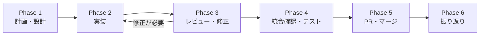
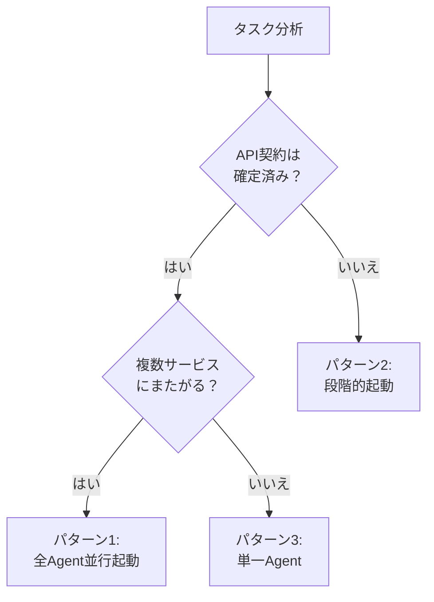
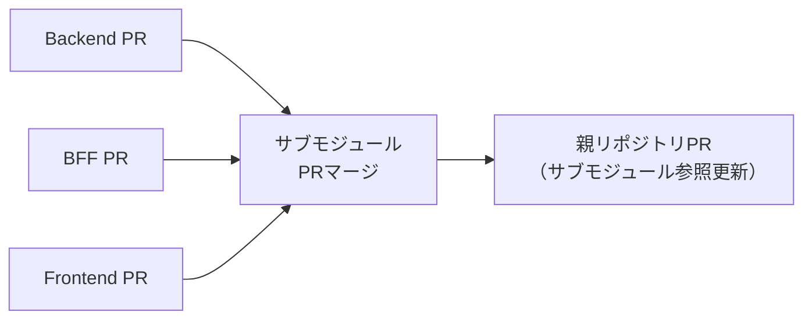

# 開発ワークフロー

## 1. 概要

### SPEC駆動型開発とは

このプロジェクトでは **SPEC駆動型開発（Steering-driven / Specification-driven Development）** を採用しています。実装を開始する前に、ステアリングファイル（requirements.md, design.md, tasklist.md）で「何を」「なぜ」「どう作るか」を明文化し、その仕様に基づいて実装・レビュー・振り返りまでを一貫して進めるアプローチです。

### なぜこのワークフローか

- **品質**: 仕様を事前に確定することで、手戻りや仕様漏れを最小化する
- **再現性**: スキル（スラッシュコマンド）により、誰が実行しても同じ手順で開発を進められる
- **Agent Teams活用**: ステアリングファイルがAgent間の共通言語となり、並行実装を可能にする
- **チーム開発**: 設計意図と経緯がドキュメントに残り、新メンバーのオンボーディングが容易になる

### 対象読者

- プロジェクトに新しく参加するメンバー
- Claude Codeおよび Agent Teams機能の初学者
- 開発プロセスの全体像を把握したい方

---

## 2. 開発ワークフロー全体像



### 各フェーズの概要

| Phase | 名称 | 概要 | Agent構成 | 主なスキル |
|-------|------|------|-----------|-----------|
| 1 | 計画・設計 | ステアリングファイルを作成し、レビュー・承認を得る | 単一Agent | `/plan-task`, `/review-steering` |
| 2 | 実装 | Agent Teamsで各サービスを並行実装する | Agent Teams | `/start-implementation` |
| 3 | レビュー・修正 | 成果物をステアリング仕様と照合しレビューする | 単一Agent（レビュー用） | `/review-implementation` |
| 4 | 統合確認・テスト | Docker Composeで全サービスを起動し、統合動作を確認する | 単一Agent | `/run-tests` |
| 5 | PR・マージ | PR準備チェックを実施し、サブモジュール順にPRを作成する | 単一Agent | `/prepare-pr` |
| 6 | 振り返り | 定量データと主観的フィードバックから改善アクションを導出する | 単一Agent | `/retrospective` |

### 入力と出力

| Phase | 入力 | 出力 |
|-------|------|------|
| 1 | ユーザーの要求、既存ドキュメント（`docs/`） | `.steering/[YYYYMMDD]-[タスク名]/` 配下の3ファイル |
| 2 | ステアリングファイル、API契約（`contracts/`） | 各サービスの実装コード（featureブランチ） |
| 3 | ステアリングファイル、git diff | レビューレポート（`review-report.md`） |
| 4 | 全サービスのコード | テスト結果、動作確認結果 |
| 5 | レビュー済みコード | Pull Request |
| 6 | 全フェーズの成果物、ユーザーの振り返り回答 | `retrospective.md`、改善アクション |

---

## 3. Phase 1: 計画・設計

### 使用スキル

```
/plan-task
/review-steering <steering-directory-name>
```

### 手順

1. **`/plan-task` を実行** - 対話形式でヒアリングが始まり、以下の情報を収集する
   - タスクの基本情報（名前、概要、背景）
   - 影響範囲（対象サービス、既存機能への影響）
   - タスクサイズ判定（分割が必要か自動判定）
   - 技術的変更点（API、DB、新規用語）
   - 非機能要件、受け入れ条件、制約事項

2. **ステアリングファイルが自動生成される**
   - `requirements.md` - 要求定義
   - `design.md` - 実装設計
   - `tasklist.md` - Agent別タスクリスト

3. **1ファイルごとにユーザー承認** を得る

4. **`/review-steering` でレビュー** - 7カテゴリのチェック（構造・整合性・API契約・タスク品質・リスク・Agent Teams準備状態など）を実施

5. **mainブランチにコミット・プッシュ** - ステアリングファイルは設計ドキュメントとしてmainに配置する

### ステアリングディレクトリの命名規則

```
.steering/[YYYYMMDD]-[開発タイトル]/
```

例:
- `.steering/20250407-frontend-bff-only/`
- `.steering/20250415-add-backend/`
- `.steering/20250420-fix-filter-bug/`

### ポイント

- **この段階では単一Agentを使用する**（コスト最適化のため）
- ステアリングファイルはmainブランチで作成し、実装はfeatureブランチで行う
- タスクサイズが大きい場合（30ファイル以上、7日以上など）は分割を推奨される

詳細なルール: [CLAUDE.md - 開発プロセス](../CLAUDE.md)

---

## 4. Phase 2: 実装

### 使用スキル

```
/start-implementation <steering-directory-name>
```

### Orchestratorの事前作業

`/start-implementation` を実行すると、以下が自動的に進行する:

1. ステアリングファイルの存在・整合性確認
2. スコープの要約提示とユーザー確認
3. 各サブモジュールでfeatureブランチ作成
4. Agent Teamsプロンプト生成・並行実装開始

### Agent構成の判断基準



| パターン | 条件 | Agent構成 |
|---------|------|----------|
| 1. 全Agent並行起動 | API契約確定済み、複数サービスにまたがる | Frontend + BFF + Backend を同時起動 |
| 2. 段階的起動 | Backend依存、API契約未確定 | Backend先行 → API契約確定後にFrontend/BFF起動 |
| 3. 単一Agent | 単一サービス内で完結する変更 | 該当サービスのAgentのみ起動（Agent Teams不使用） |

### Agent間通信ルール（ハイブリッド型）

| 通信種別 | ルート | 例 |
|---------|--------|-----|
| Orchestrator経由必須 | 設計方針変更、API契約変更 | エンドポイントの追加・削除、レスポンス構造の変更 |
| 直接通信OK | 実装詳細の確認 | メソッド名・型名の質問、共通ユーティリティの確認 |

### サブモジュール構成での注意点

- 各サブモジュールで同名のfeatureブランチを作成する（例: `feature/1-frontend-bff-impl`）
- コミット・プッシュは各サブモジュール内で独立して行う
- 親リポジトリでのサブモジュール参照更新は、全Agentの実装完了後にOrchestratorが実施

```bash
# ブランチ作成例（/start-implementationが自動実行）
cd services/frontend && git checkout -b feature/1-impl && cd ../..
cd services/bff && git checkout -b feature/1-impl && cd ../..
cd services/backend && git checkout -b feature/1-impl && cd ../..
```

### ポイント

- **Orchestratorは常にフォアグラウンドでユーザー応答可能な状態を維持する**
- 各AgentはAgent Teamsの場合 `run_in_background: true` でバックグラウンド起動する
- ユーザーから進捗を聞かれた場合、各Agentの状態（実行中/完了/失敗）を即座に報告する

---

## 5. Phase 3: レビュー・修正

### 使用スキル

```
/review-implementation <steering-directory-name>
```

### レビュー手順

1. **ステアリングファイル読み込み** - レビュー基準としてrequirements.md, design.md, tasklist.mdを確認
2. **`git diff main...HEAD`で差分特定** - 全ファイルをReadするのではなく、差分ベースでレビュー（コンテキスト節約）
3. **静的解析・テスト実行** - lint, 型チェック, テストを自動実行
4. **9カテゴリのチェックリスト実行**
5. **問題点のレポート出力**

### レビュー項目

| カテゴリ | チェック内容 |
|---------|------------|
| ステアリング準拠性 | 受け入れ条件充足、設計通りの実装か |
| 機能過不足 | スコープ外の実装がないか、必須機能が漏れていないか |
| API契約 | OpenAPI仕様との一致、HTTPステータスコード |
| 用語統一 | `docs/glossary.md`のユビキタス言語使用 |
| セキュリティ | 認証・認可、入力検証、データ保護 |
| パフォーマンス | N+1問題、不要なAPI呼び出し、再レンダリング |
| J-SOX | 監査証跡、職務分掌、アクセス制御 |
| コード品質 | lint、テスト、可読性、DRY原則 |
| ドキュメント整合性 | glossary.md、API仕様の更新漏れ |

### 問題の重要度分類

| 重要度 | 説明 | 対応 |
|-------|------|------|
| Critical | セキュリティ脆弱性、J-SOX違反、仕様の重大な逸脱 | 必ず修正 |
| High | 機能不足、パフォーマンス問題、API契約違反 | 必ず修正 |
| Medium | コード品質問題、用語不統一、ドキュメント未更新 | 可能な限り修正 |
| Low | コードスタイル、コメント不足 | 優先度に応じて対応 |

### 修正のAgent委任

修正が必要な場合、サービス別に修正Agentを並行起動できる。

### ポイント

- **レビューAgentは実装Agentとは別に起動する**（コンテキスト汚染回避）
- Critical/High問題がすべて解消されるまでPhase 4に進まない

---

## 6. Phase 4: 統合確認・テスト

### 手順

#### 1. Docker Compose統合動作確認

```bash
docker compose up -d --build
```

#### 2. API動作確認（curlでCRUD操作テスト）

```bash
# ログイン
curl -X POST http://localhost:8080/api/v1/auth/login \
  -H "Content-Type: application/json" \
  -d '{"email":"test@example.com","password":"password123"}'

# 加盟店一覧取得
curl -X GET http://localhost:8080/api/v1/merchants \
  -H "Cookie: session=<session-id>"
```

#### 3. E2Eテスト実行（Playwright）

```bash
cd e2e && npx playwright test
```

#### 4. デグレーションテスト

既存のテストがすべてパスすることを確認する。

```bash
# 各サービスのテスト実行
cd services/backend && go test ./...
cd services/bff && go test ./...
cd services/frontend && npm test
```

#### 5. 監査記録の確認

J-SOX対応が必要な変更の場合、`contract_changes`等の監査テーブルにレコードが記録されていることを確認する。

---

## 7. Phase 5: PR・マージ

### 使用スキル

```
/prepare-pr <steering-directory-name>
```

### 準備チェックリスト（`/prepare-pr` が自動実行）

1. `/review-implementation` でCritical/High問題がないことを確認
2. リント・型チェック通過
3. 全テスト成功
4. コミットメッセージの確認（Conventional Commits形式）
5. 不要ファイル・デバッグコード・機密情報の除外確認
6. ドキュメント同期確認（`/check-docs-sync`）
7. mainブランチの最新変更をrebase

### サブモジュール構成でのPR作成順序



1. **各サブモジュールでPRを作成**（Backend, BFF, Frontendは並行レビュー可能）
2. **サブモジュールPRをマージ**
3. **親リポジトリでサブモジュール参照を更新し、PRを作成**

### PR説明文の構成

```
## 概要
[requirements.mdから概要を抽出]

## 変更内容
[design.mdからサービス別の変更を抽出]

## 完了タスク
[tasklist.mdから完了タスクを抽出]

## テスト
[テスト実行結果のサマリー]

## 関連ドキュメント
[ステアリングファイル、API仕様へのリンク]
```

---

## 8. Phase 6: 振り返り

### 使用スキル

```
/retrospective <steering-directory-name>
```

### 手順

1. **定量データの自動収集** - コミット数、変更行数、テスト数、レビュー指摘件数をサービス別に集計
2. **3つの質問**（1つずつ順番に聞く）:
   - **うまくいったこと** - Agent構成、事前作業、実装プロセスなど
   - **改善点** - ボトルネック、手戻り、無駄な作業など
   - **想定外だったこと** - 予想より難しかった/簡単だった点、発見など
3. **改善アクションの提案** - プロセス改善、ドキュメント改善、ツール・自動化の3観点
4. **`retrospective.md` として保存** - `.steering/<ディレクトリ>/retrospective.md`
5. **承認されたアクションの反映** - CLAUDE.md更新、テンプレート修正、スキル改善など

### ポイント

- 5分程度で完了する軽量な設計
- 各質問で「特になし」のスキップを許可
- 改善アクションは提案のみ。ユーザー承認後に実行する

---

## 9. 利用可能なスキル一覧

| スキル | 用途 | 使用Phase |
|--------|------|----------|
| `/plan-task` | ステアリングファイルの対話的作成 | Phase 1 |
| `/review-steering` | ステアリングファイルの品質・準備状態レビュー | Phase 1 |
| `/start-implementation` | Agent Teams並行実装の開始 | Phase 2 |
| `/review-implementation` | 成果物のステアリング準拠性レビュー | Phase 3 |
| `/run-tests` | 全サービスのテスト実行・カバレッジレポート | Phase 4 |
| `/prepare-pr` | PR作成前のチェックリスト実行・PR説明文生成 | Phase 5 |
| `/retrospective` | タスク完了後の振り返り・改善アクション導出 | Phase 6 |
| `/check-docs-sync` | コードとドキュメントの同期確認 | Phase 3, 5 |
| `/analyze-impact` | マイクロサービス横断の変更影響分析 | Phase 1 |
| `/debug-issue` | 開発・本番環境の問題調査 | 随時 |
| `/submodule-sync` | 全サブモジュールの最新コミット同期 | 随時 |
| `/setup-dev-env` | 新メンバー向け開発環境セットアップ | 初回のみ |

### コマンド例

```bash
# Phase 1: 新しいタスクの計画
/plan-task

# Phase 1: ステアリングファイルのレビュー
/review-steering 20250415-add-backend

# Phase 2: 実装開始
/start-implementation 20250415-add-backend

# Phase 3: 成果物レビュー
/review-implementation 20250415-add-backend

# Phase 5: PR準備
/prepare-pr 20250415-add-backend

# Phase 6: 振り返り
/retrospective 20250415-add-backend
```

---

## 10. Tips & FAQ

### よくあるトラブルと対処法

**ポート競合**
```bash
# 使用中のポートを確認
lsof -i :3000  # Frontend
lsof -i :8080  # BFF
lsof -i :50051 # Backend (gRPC)
lsof -i :5432  # PostgreSQL

# プロセスを停止してから再起動
docker compose down && docker compose up -d --build
```

**サブモジュールの状態不整合**
```bash
# サブモジュールを最新に同期
git submodule update --init --recursive

# 各サブモジュールの状態確認
git submodule status

# または専用スキルを使用
/submodule-sync
```

**テスト失敗時の対応**
1. 失敗したテストのエラーメッセージを確認
2. DBマイグレーションが最新か確認（`docker compose down -v` でボリューム削除後に再起動）
3. 環境変数が正しいか `docs/ENVIRONMENT.md` と照合

### コスト最適化のポイント

| 作業 | 推奨Agent構成 | 理由 |
|------|-------------|------|
| ドキュメント作成 | 単一Agent | 順次作業で十分、Agent Teams不要 |
| ステアリングファイルレビュー | 単一Agent | レビューは1つのコンテキストで完結 |
| 複数サービスの並行実装 | Agent Teams | 並行実装で時間短縮 |
| 単一サービスの修正 | 単一Agent | Agent Teamsのオーバーヘッドが無駄 |
| レビュー・振り返り | 単一Agent | 横断的な視点で1つのAgentが担当 |

### Agent Teamsが起動しない場合の確認事項

1. `.claude/settings.json` に以下が設定されているか確認:
   ```json
   {
     "env": {
       "CLAUDE_CODE_EXPERIMENTAL_AGENT_TEAMS": "1"
     }
   }
   ```
2. Claude Codeを再起動する
3. 新しいセッションを開始する
4. それでも解決しない場合は、手動で順次実装する（BFF → Frontend → E2E Test の順）

---

**最終更新日:** 2026-04-11
**作成者:** Claude Code
