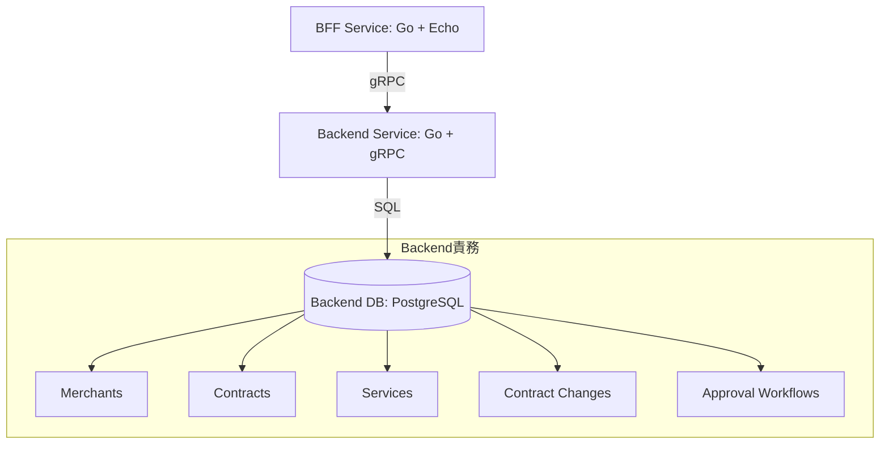
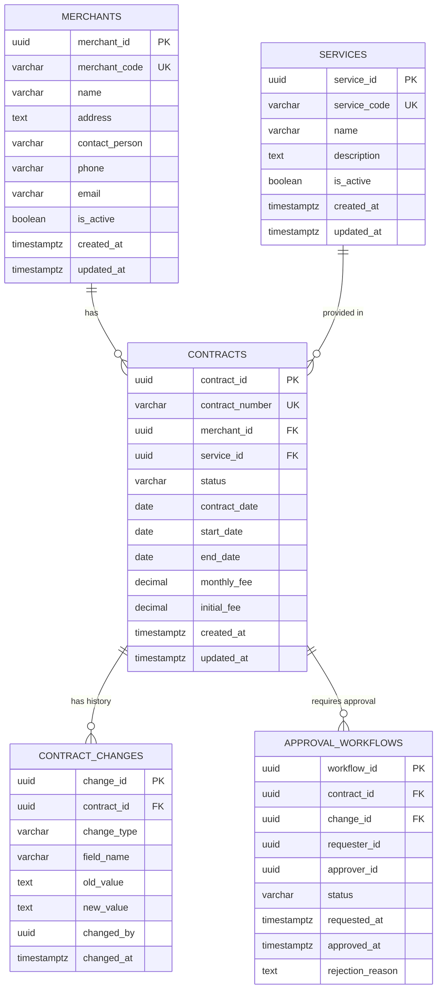
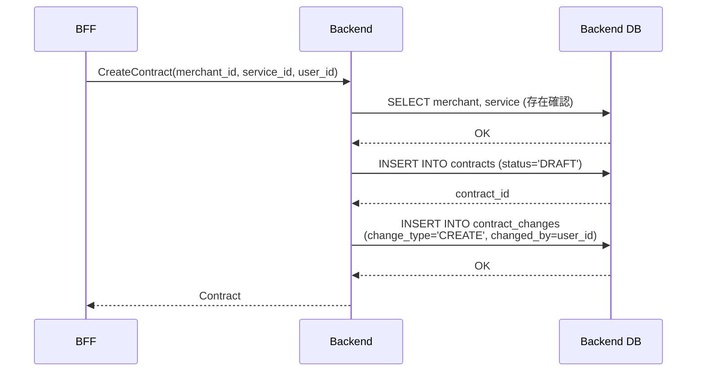
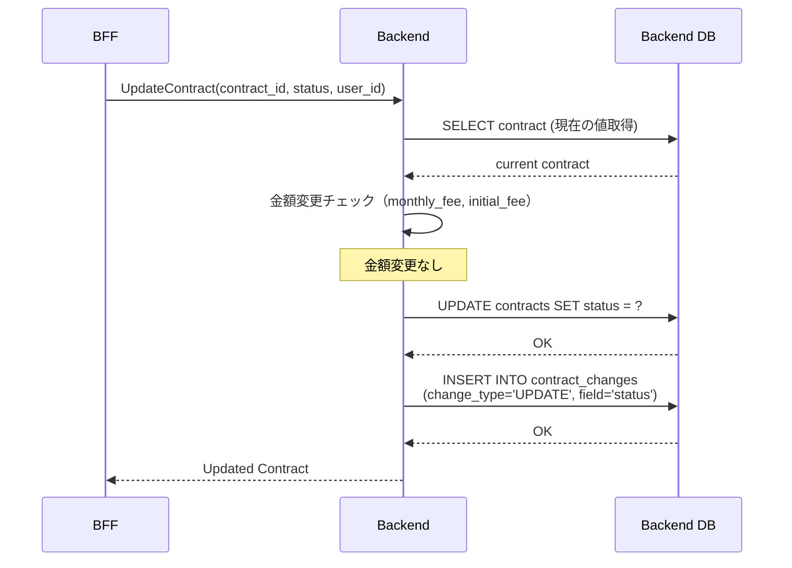
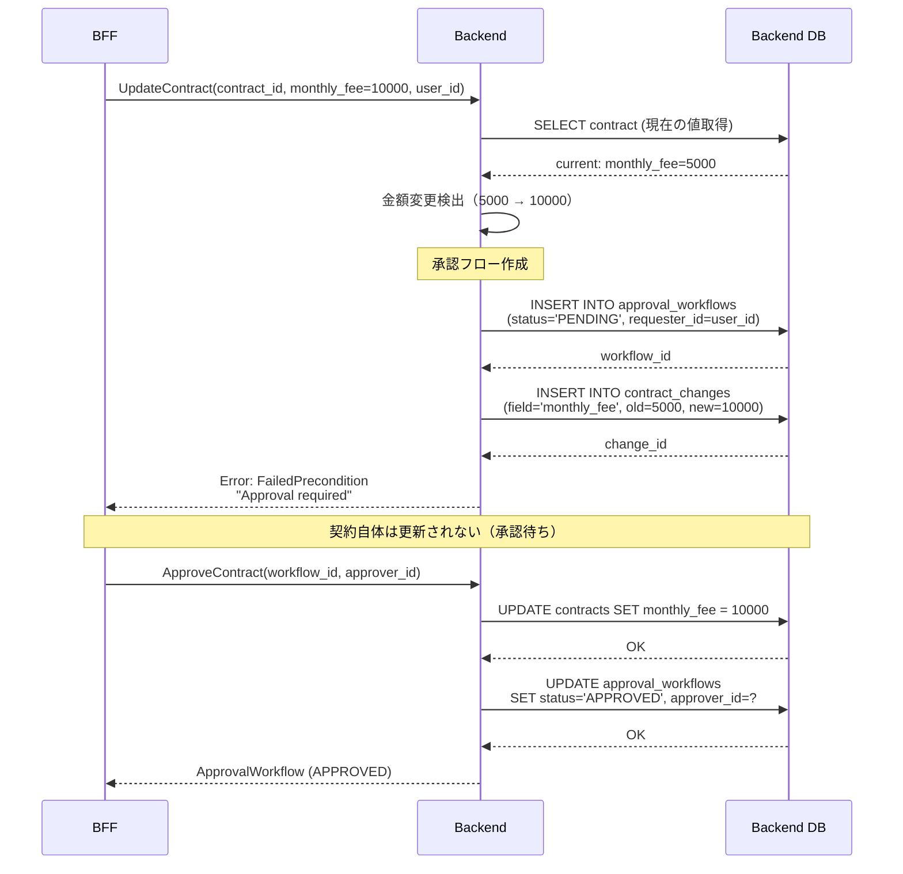

# Backend Service - 機能設計書

## 概要

このドキュメントは **Backend サービス** の機能設計を定義します。

**Backendの責務:**
- ビジネスロジックの実装
- データ管理（加盟店・契約・サービス）
- 承認ワークフローの管理
- gRPCサーバーとしてBFFにAPIを提供
- データ変更監査の記録

---

## システム構成図



---

## データモデル

### Backend Database（backend_db）

Backendサービスは独自のPostgreSQLデータベースを持ち、ビジネスデータを管理します。

#### ER図



### テーブル定義

#### 1. merchants（加盟店）

加盟店の基本情報を管理します。

```sql
CREATE TABLE merchants (
    merchant_id UUID PRIMARY KEY DEFAULT gen_random_uuid(),
    merchant_code VARCHAR(50) UNIQUE NOT NULL,
    name VARCHAR(255) NOT NULL,
    address TEXT,
    contact_person VARCHAR(100),
    phone VARCHAR(20),
    email VARCHAR(255),
    is_active BOOLEAN DEFAULT TRUE,
    created_at TIMESTAMPTZ DEFAULT NOW(),
    updated_at TIMESTAMPTZ DEFAULT NOW()
);

CREATE INDEX idx_merchants_code ON merchants(merchant_code);
CREATE INDEX idx_merchants_name ON merchants(name);
```

**フィールド説明:**
- `merchant_id`: 加盟店ID（UUID）
- `merchant_code`: 加盟店コード（ユニーク制約、例: M-00001）
- `name`: 加盟店名
- `address`: 住所
- `contact_person`: 担当者名
- `phone`: 電話番号
- `email`: メールアドレス
- `is_active`: 有効/無効フラグ

---

#### 2. services（サービス）

当社が提供するビジネスサービスを管理します。

```sql
CREATE TABLE services (
    service_id UUID PRIMARY KEY DEFAULT gen_random_uuid(),
    service_code VARCHAR(50) UNIQUE NOT NULL,
    name VARCHAR(255) NOT NULL,
    description TEXT,
    is_active BOOLEAN DEFAULT TRUE,
    created_at TIMESTAMPTZ DEFAULT NOW(),
    updated_at TIMESTAMPTZ DEFAULT NOW()
);

CREATE INDEX idx_services_code ON services(service_code);
```

**フィールド説明:**
- `service_id`: サービスID（UUID）
- `service_code`: サービスコード（ユニーク制約、例: SV-PAYMENT）
- `name`: サービス名（例: 決済サービス）
- `description`: サービス説明
- `is_active`: 有効/無効フラグ

**初期データ例:**
```sql
INSERT INTO services (service_code, name, description) VALUES
('SV-PAYMENT', '決済サービス', 'クレジットカード決済代行サービス'),
('SV-POINT', 'ポイントサービス', '顧客ポイント管理サービス'),
('SV-PROMOTION', '販促支援サービス', 'クーポン・キャンペーン管理サービス');
```

---

#### 3. contracts（契約）

加盟店とサービスの契約情報を管理します。

```sql
CREATE TABLE contracts (
    contract_id UUID PRIMARY KEY DEFAULT gen_random_uuid(),
    contract_number VARCHAR(50) UNIQUE NOT NULL,
    merchant_id UUID NOT NULL REFERENCES merchants(merchant_id) ON DELETE CASCADE,
    service_id UUID NOT NULL REFERENCES services(service_id),
    status VARCHAR(20) NOT NULL CHECK (status IN ('DRAFT', 'ACTIVE', 'SUSPENDED', 'TERMINATED')),
    contract_date DATE,
    start_date DATE NOT NULL,
    end_date DATE,
    monthly_fee DECIMAL(10, 2),
    initial_fee DECIMAL(10, 2),
    created_at TIMESTAMPTZ DEFAULT NOW(),
    updated_at TIMESTAMPTZ DEFAULT NOW()
);

CREATE INDEX idx_contracts_number ON contracts(contract_number);
CREATE INDEX idx_contracts_merchant_id ON contracts(merchant_id);
CREATE INDEX idx_contracts_service_id ON contracts(service_id);
CREATE INDEX idx_contracts_status ON contracts(status);
```

**フィールド説明:**
- `contract_id`: 契約ID（UUID）
- `contract_number`: 契約番号（ユニーク制約、例: C-2025-00001）
- `merchant_id`: 加盟店ID（外部キー）
- `service_id`: サービスID（外部キー）
- `status`: 契約ステータス
  - `DRAFT`: 仮契約（下書き）
  - `ACTIVE`: 有効契約（稼働中）
  - `SUSPENDED`: 停止中
  - `TERMINATED`: 解約済み
- `contract_date`: 契約日
- `start_date`: 開始日
- `end_date`: 終了日（NULL=無期限）
- `monthly_fee`: 月額料金
- `initial_fee`: 初期費用

---

#### 4. contract_changes（契約変更履歴）

契約のすべての変更を記録します（J-SOX対応）。

```sql
CREATE TABLE contract_changes (
    change_id UUID PRIMARY KEY DEFAULT gen_random_uuid(),
    contract_id UUID NOT NULL REFERENCES contracts(contract_id) ON DELETE CASCADE,
    change_type VARCHAR(20) NOT NULL CHECK (change_type IN ('CREATE', 'UPDATE', 'DELETE')),
    field_name VARCHAR(100),
    old_value TEXT,
    new_value TEXT,
    changed_by UUID NOT NULL,         -- BFFのuser_id
    changed_at TIMESTAMPTZ DEFAULT NOW()
);

CREATE INDEX idx_contract_changes_contract_id ON contract_changes(contract_id);
CREATE INDEX idx_contract_changes_changed_by ON contract_changes(changed_by);
CREATE INDEX idx_contract_changes_changed_at ON contract_changes(changed_at);
```

**フィールド説明:**
- `change_id`: 変更ID（UUID）
- `contract_id`: 契約ID（外部キー）
- `change_type`: 変更種別
  - `CREATE`: 新規作成
  - `UPDATE`: 更新
  - `DELETE`: 削除
- `field_name`: 変更されたフィールド名（例: `monthly_fee`, `status`）
- `old_value`: 変更前の値
- `new_value`: 変更後の値
- `changed_by`: 変更者のuser_id（BFFから渡される）
- `changed_at`: 変更日時

**保持期間:** 7年間（J-SOX要件）

---

#### 5. approval_workflows（承認ワークフロー）

金額変更等の重要な契約変更の承認プロセスを管理します。

```sql
CREATE TABLE approval_workflows (
    workflow_id UUID PRIMARY KEY DEFAULT gen_random_uuid(),
    contract_id UUID NOT NULL REFERENCES contracts(contract_id) ON DELETE CASCADE,
    change_id UUID REFERENCES contract_changes(change_id),
    requester_id UUID NOT NULL,       -- BFFのuser_id（申請者）
    approver_id UUID,                 -- BFFのuser_id（承認者）
    status VARCHAR(20) NOT NULL CHECK (status IN ('PENDING', 'APPROVED', 'REJECTED')),
    requested_at TIMESTAMPTZ DEFAULT NOW(),
    approved_at TIMESTAMPTZ,
    rejection_reason TEXT
);

CREATE INDEX idx_approval_workflows_contract_id ON approval_workflows(contract_id);
CREATE INDEX idx_approval_workflows_status ON approval_workflows(status);
CREATE INDEX idx_approval_workflows_requester_id ON approval_workflows(requester_id);
```

**フィールド説明:**
- `workflow_id`: ワークフローID（UUID）
- `contract_id`: 契約ID（外部キー）
- `change_id`: 変更履歴ID（外部キー）
- `requester_id`: 申請者のuser_id（BFFから渡される）
- `approver_id`: 承認者のuser_id（BFFから渡される）
- `status`: ステータス
  - `PENDING`: 承認待ち
  - `APPROVED`: 承認済み
  - `REJECTED`: 却下
- `requested_at`: 申請日時
- `approved_at`: 承認日時
- `rejection_reason`: 却下理由

---

## gRPC API設計

### サービス一覧

Backendは以下の4つのgRPCサービスを提供します。

#### 1. MerchantService（加盟店管理）

| メソッド | 説明 | リクエスト | レスポンス |
|---------|------|-----------|-----------|
| ListMerchants | 加盟店一覧取得 | ListMerchantsRequest | ListMerchantsResponse |
| GetMerchant | 加盟店詳細取得 | GetMerchantRequest | Merchant |
| CreateMerchant | 加盟店登録 | CreateMerchantRequest | Merchant |
| UpdateMerchant | 加盟店更新 | UpdateMerchantRequest | Merchant |
| DeleteMerchant | 加盟店削除 | DeleteMerchantRequest | Empty |

#### 2. ContractService（契約管理）

| メソッド | 説明 | リクエスト | レスポンス |
|---------|------|-----------|-----------|
| ListContracts | 契約一覧取得 | ListContractsRequest | ListContractsResponse |
| GetContract | 契約詳細取得 | GetContractRequest | Contract |
| CreateContract | 契約登録 | CreateContractRequest | Contract |
| UpdateContract | 契約更新 | UpdateContractRequest | Contract |
| DeleteContract | 契約削除 | DeleteContractRequest | Empty |
| GetContractChanges | 契約変更履歴取得 | GetContractChangesRequest | GetContractChangesResponse |

#### 3. ServiceManagementService（サービス管理）

| メソッド | 説明 | リクエスト | レスポンス |
|---------|------|-----------|-----------|
| ListServices | サービス一覧取得 | ListServicesRequest | ListServicesResponse |
| GetService | サービス詳細取得 | GetServiceRequest | Service |
| CreateService | サービス登録 | CreateServiceRequest | Service |
| UpdateService | サービス更新 | UpdateServiceRequest | Service |

#### 4. ApprovalService（承認ワークフロー）

| メソッド | 説明 | リクエスト | レスポンス |
|---------|------|-----------|-----------|
| ListPendingApprovals | 承認待ち一覧取得 | ListPendingApprovalsRequest | ListPendingApprovalsResponse |
| ApproveContract | 承認実行 | ApproveContractRequest | ApprovalWorkflow |
| RejectContract | 却下実行 | RejectContractRequest | ApprovalWorkflow |

---

## ビジネスロジック

### 1. 契約登録フロー



**処理:**
1. BFFから`CreateContract` gRPC呼び出し（user_idを含む）
2. merchant_id, service_idの存在確認
3. contractsテーブルにINSERT（status='DRAFT'）
4. contract_changesにCREATEレコード追加
5. レスポンス返却

---

### 2. 契約更新フロー（金額変更なし）



**処理:**
1. 金額変更チェック（monthly_fee, initial_feeが変更されているか）
2. 金額変更なし: 即座にUPDATE実行
3. contract_changesにUPDATEレコード追加
4. レスポンス返却

---

### 3. 契約更新フロー（金額変更あり - 承認必須）



**処理（金額変更あり）:**
1. 金額変更を検出（monthly_fee または initial_fee）
2. approval_workflowsにPENDINGレコード作成
3. contract_changesに変更内容を記録
4. **契約自体は更新せず**、FailedPreconditionエラー返却
5. 承認者が`ApproveContract`呼び出し → 契約更新実行
6. approval_workflowsをAPPROVED状態に更新

**職務分掌（Segregation of Duties）:**
- 申請者（requester_id）≠ 承認者（approver_id）を強制
- BFF側で権限チェック（`contracts:approve`権限が必要）

---

### 4. 承認ワークフロー実装例

```go
// internal/service/contract_service.go
func (s *ContractService) UpdateContract(ctx context.Context, req *pb.UpdateContractRequest) (*pb.Contract, error) {
    // 現在の契約取得
    current, err := s.repo.GetContract(ctx, req.ContractId)
    if err != nil {
        return nil, status.Error(codes.NotFound, "Contract not found")
    }

    // 金額変更チェック
    amountChanged := (req.MonthlyFee != nil && *req.MonthlyFee != current.MonthlyFee) ||
                     (req.InitialFee != nil && *req.InitialFee != current.InitialFee)

    if amountChanged {
        // 承認ワークフロー作成
        workflow := &model.ApprovalWorkflow{
            ContractID:   uuid.MustParse(req.ContractId),
            RequesterID:  uuid.MustParse(req.UserId), // BFFから渡される
            Status:       "PENDING",
            RequestedAt:  time.Now(),
        }
        workflowID, err := s.workflowRepo.Create(ctx, workflow)
        if err != nil {
            return nil, status.Error(codes.Internal, "Failed to create approval workflow")
        }

        // 変更内容を記録
        if req.MonthlyFee != nil && *req.MonthlyFee != current.MonthlyFee {
            s.recordChange(ctx, current.ContractID, "monthly_fee",
                fmt.Sprintf("%.2f", current.MonthlyFee),
                fmt.Sprintf("%.2f", *req.MonthlyFee),
                uuid.MustParse(req.UserId))
        }
        if req.InitialFee != nil && *req.InitialFee != current.InitialFee {
            s.recordChange(ctx, current.ContractID, "initial_fee",
                fmt.Sprintf("%.2f", current.InitialFee),
                fmt.Sprintf("%.2f", *req.InitialFee),
                uuid.MustParse(req.UserId))
        }

        return nil, status.Error(codes.FailedPrecondition,
            fmt.Sprintf("Approval required (workflow_id: %s)", workflowID))
    }

    // 金額変更なし: 即座に更新
    updated, err := s.repo.Update(ctx, req)
    if err != nil {
        return nil, status.Error(codes.Internal, "Failed to update contract")
    }

    // 変更履歴記録（金額以外のフィールド）
    if req.Status != nil && *req.Status != current.Status {
        s.recordChange(ctx, current.ContractID, "status", current.Status, *req.Status, uuid.MustParse(req.UserId))
    }

    return updated, nil
}
```

---

## データ変更監査

### contract_changes への記録

すべてのCRUD操作を記録します。

```go
func (s *ContractService) recordChange(
    ctx context.Context,
    contractID uuid.UUID,
    fieldName string,
    oldValue, newValue string,
    changedBy uuid.UUID,
) error {
    change := &model.ContractChange{
        ContractID: contractID,
        ChangeType: "UPDATE",
        FieldName:  fieldName,
        OldValue:   oldValue,
        NewValue:   newValue,
        ChangedBy:  changedBy,
        ChangedAt:  time.Now(),
    }
    return s.changeRepo.Create(ctx, change)
}
```

### 記録内容

| 操作 | change_type | field_name | old_value | new_value |
|------|------------|-----------|-----------|-----------|
| 契約作成 | CREATE | - | - | - |
| ステータス変更 | UPDATE | status | DRAFT | ACTIVE |
| 月額料金変更 | UPDATE | monthly_fee | 5000.00 | 10000.00 |
| 契約削除 | DELETE | - | - | - |

---

## エラーハンドリング

### gRPCステータスコード

```go
import (
    "google.golang.org/grpc/codes"
    "google.golang.org/grpc/status"
)

// リソース未存在
status.Error(codes.NotFound, "Merchant not found")

// バリデーションエラー
status.Errorf(codes.InvalidArgument, "Invalid merchant_code: %s", code)

// 重複エラー
status.Error(codes.AlreadyExists, "Merchant code already exists")

// 承認必須
status.Error(codes.FailedPrecondition, "Approval required for amount change")

// 内部エラー
status.Error(codes.Internal, "Database error")
```

---

## パフォーマンス最適化

### 1. インデックス設計

```sql
-- 加盟店
CREATE INDEX idx_merchants_code ON merchants(merchant_code);
CREATE INDEX idx_merchants_name ON merchants(name);

-- 契約
CREATE INDEX idx_contracts_number ON contracts(contract_number);
CREATE INDEX idx_contracts_merchant_id ON contracts(merchant_id);
CREATE INDEX idx_contracts_service_id ON contracts(service_id);
CREATE INDEX idx_contracts_status ON contracts(status);

-- 契約変更履歴
CREATE INDEX idx_contract_changes_contract_id ON contract_changes(contract_id);
CREATE INDEX idx_contract_changes_changed_at ON contract_changes(changed_at);

-- 承認ワークフロー
CREATE INDEX idx_approval_workflows_status ON approval_workflows(status);
```

### 2. ページネーション実装

```go
type ListMerchantsRequest struct {
    Page  int32
    Limit int32
}

func (s *MerchantService) ListMerchants(ctx context.Context, req *pb.ListMerchantsRequest) (*pb.ListMerchantsResponse, error) {
    page := req.Page
    if page < 1 {
        page = 1
    }
    limit := req.Limit
    if limit < 1 || limit > 100 {
        limit = 20
    }
    offset := (page - 1) * limit

    merchants, err := s.repo.List(ctx, int(offset), int(limit))
    if err != nil {
        return nil, status.Error(codes.Internal, "Failed to list merchants")
    }

    total, _ := s.repo.Count(ctx)

    return &pb.ListMerchantsResponse{
        Merchants: merchants,
        Total:     total,
        Page:      page,
        Limit:     limit,
    }, nil
}
```

---

## 参照ドキュメント

### ルートドキュメント
- [CLAUDE.md](../../CLAUDE.md)
- [docs/glossary.md](../../docs/glossary.md)
- [docs/system-architecture.md](../../docs/system-architecture.md)
- [docs/jsox-compliance.md](../../docs/jsox-compliance.md)
- [docs/security-guidelines.md](../../docs/security-guidelines.md)

### API契約
- [contracts/proto/](../../contracts/proto/)

---

**最終更新日:** 2026-04-07
**作成者:** Claude Code
