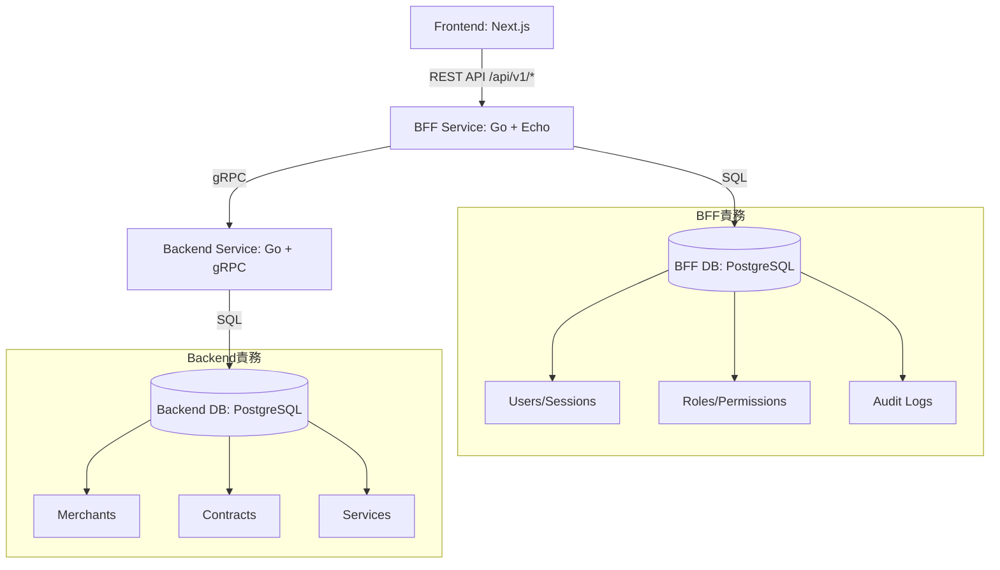
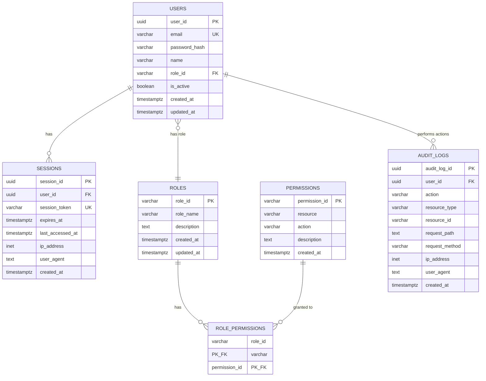
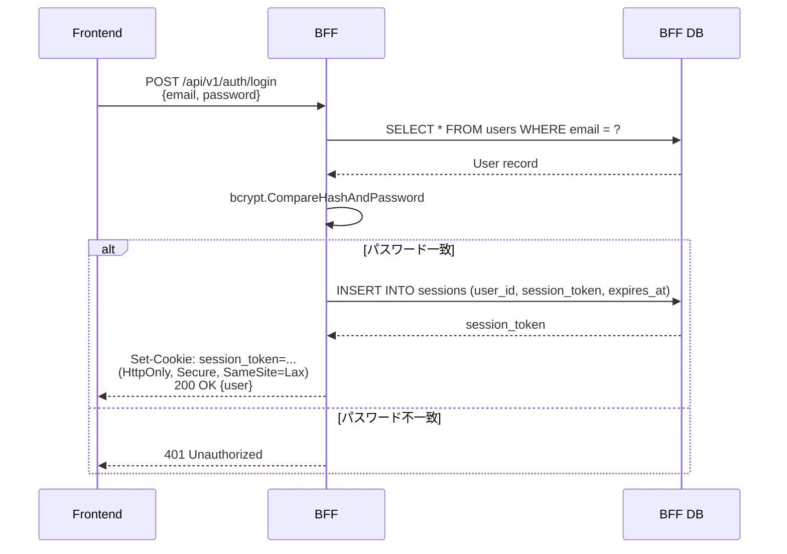
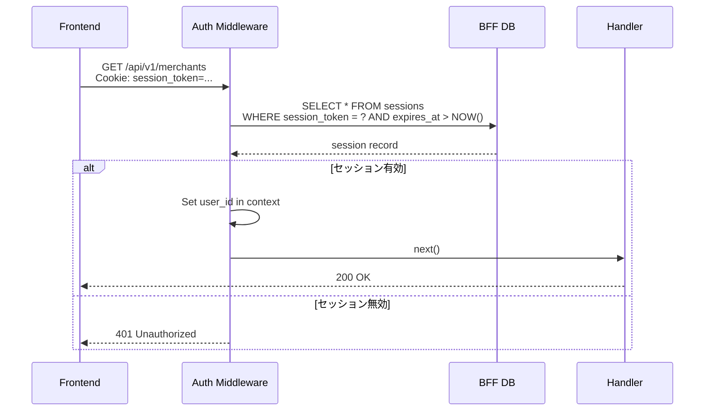
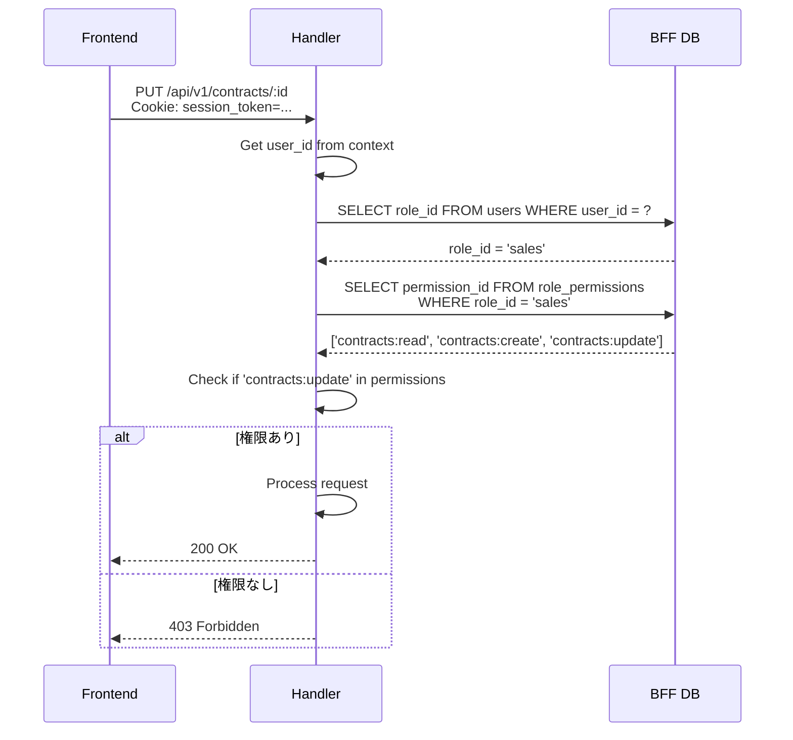
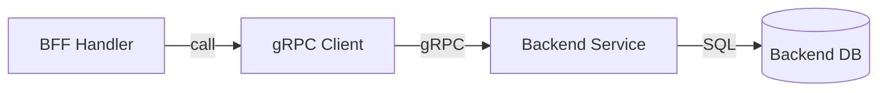

# BFF Service - 機能設計書

## 概要

このドキュメントは **BFF (Backend for Frontend) サービス** の機能設計を定義します。

**BFFの責務:**
- Frontend向けREST APIの提供（`/api/v1/*`）
- 認証・認可・セッション管理
- Backend gRPCサービスの集約
- 監査ログ記録（J-SOX対応）
- ユーザー・ロール・権限管理

---

## システム構成図



---

## データモデル

### BFF Database（bff_db）

BFFサービスは独自のPostgreSQLデータベースを持ち、認証・認可・監査ログを管理します。

#### ER図



### テーブル定義

#### 1. users（ユーザー）

社内従業員のアカウント情報を管理します。

```sql
CREATE TABLE users (
    user_id UUID PRIMARY KEY DEFAULT gen_random_uuid(),
    email VARCHAR(255) UNIQUE NOT NULL,
    password_hash VARCHAR(255) NOT NULL,
    name VARCHAR(100) NOT NULL,
    role_id VARCHAR(50) NOT NULL REFERENCES roles(role_id),
    is_active BOOLEAN DEFAULT TRUE,
    created_at TIMESTAMPTZ DEFAULT NOW(),
    updated_at TIMESTAMPTZ DEFAULT NOW()
);

CREATE INDEX idx_users_email ON users(email);
CREATE INDEX idx_users_role_id ON users(role_id);
```

**フィールド説明:**
- `user_id`: ユーザーID（UUID）
- `email`: メールアドレス（ログインID、ユニーク制約）
- `password_hash`: bcryptハッシュ化パスワード
- `name`: ユーザー名
- `role_id`: ロールID（外部キー）
- `is_active`: 有効/無効フラグ

#### 2. roles（ロール）

ロールベースアクセス制御（RBAC）のロール定義。

```sql
CREATE TABLE roles (
    role_id VARCHAR(50) PRIMARY KEY, -- 'system-admin', 'contract-manager', etc.
    role_name VARCHAR(100) NOT NULL,
    description TEXT,
    created_at TIMESTAMPTZ DEFAULT NOW(),
    updated_at TIMESTAMPTZ DEFAULT NOW()
);
```

**初期ロールデータ:**
```sql
INSERT INTO roles (role_id, role_name, description) VALUES
('system-admin', 'システム管理者', '全機能アクセス可能、ロール・権限管理可能'),
('contract-manager', '契約管理者', '契約の登録・編集・承認可能'),
('sales', '営業担当者', '契約閲覧・新規登録・申請可能'),
('viewer', '閲覧者', '契約の閲覧のみ');
```

**重要:** ロール名はソースコードにハードコードせず、DBから動的に取得すること。

#### 3. permissions（権限）

機能単位のアクセス権限定義。

```sql
CREATE TABLE permissions (
    permission_id VARCHAR(50) PRIMARY KEY, -- 'contracts:approve', 'users:manage', etc.
    resource VARCHAR(50) NOT NULL,         -- 'contracts', 'users', etc.
    action VARCHAR(50) NOT NULL,           -- 'approve', 'manage', etc.
    description TEXT,
    created_at TIMESTAMPTZ DEFAULT NOW()
);

CREATE INDEX idx_permissions_resource ON permissions(resource);
```

**権限の命名規則:** `{resource}:{action}`

**初期権限データ:**
```sql
INSERT INTO permissions (permission_id, resource, action, description) VALUES
-- 加盟店権限
('merchants:read', 'merchants', 'read', '加盟店閲覧'),
('merchants:create', 'merchants', 'create', '加盟店登録'),
('merchants:update', 'merchants', 'update', '加盟店更新'),
('merchants:delete', 'merchants', 'delete', '加盟店削除'),
-- 契約権限
('contracts:read', 'contracts', 'read', '契約閲覧'),
('contracts:create', 'contracts', 'create', '契約登録'),
('contracts:update', 'contracts', 'update', '契約編集申請'),
('contracts:approve', 'contracts', 'approve', '契約承認'),
('contracts:delete', 'contracts', 'delete', '契約削除'),
-- ユーザー管理権限
('users:manage', 'users', 'manage', 'ユーザー管理'),
-- ロール・権限管理
('roles:manage', 'roles', 'manage', 'ロール・権限管理');
```

#### 4. role_permissions（ロール-権限紐付け）

ロールに付与された権限を管理します。

```sql
CREATE TABLE role_permissions (
    role_id VARCHAR(50) REFERENCES roles(role_id) ON DELETE CASCADE,
    permission_id VARCHAR(50) REFERENCES permissions(permission_id) ON DELETE CASCADE,
    PRIMARY KEY (role_id, permission_id)
);
```

**初期データ例（system-admin）:**
```sql
INSERT INTO role_permissions (role_id, permission_id) VALUES
-- system-admin: すべての権限
('system-admin', 'merchants:read'),
('system-admin', 'merchants:create'),
('system-admin', 'merchants:update'),
('system-admin', 'merchants:delete'),
('system-admin', 'contracts:read'),
('system-admin', 'contracts:create'),
('system-admin', 'contracts:update'),
('system-admin', 'contracts:approve'),
('system-admin', 'contracts:delete'),
('system-admin', 'users:manage'),
('system-admin', 'roles:manage');
```

#### 5. sessions（セッション）

ユーザーのログインセッション情報を管理します。

```sql
CREATE TABLE sessions (
    session_id UUID PRIMARY KEY DEFAULT gen_random_uuid(),
    user_id UUID NOT NULL REFERENCES users(user_id) ON DELETE CASCADE,
    session_token VARCHAR(255) UNIQUE NOT NULL,
    expires_at TIMESTAMPTZ NOT NULL,
    last_accessed_at TIMESTAMPTZ DEFAULT NOW(),
    ip_address INET,
    user_agent TEXT,
    created_at TIMESTAMPTZ DEFAULT NOW()
);

CREATE INDEX idx_sessions_user_id ON sessions(user_id);
CREATE INDEX idx_sessions_token ON sessions(session_token);
CREATE INDEX idx_sessions_expires_at ON sessions(expires_at);
```

**フィールド説明:**
- `session_token`: ランダム生成されたトークン（256文字）
- `expires_at`: セッション有効期限（ログインから24時間）
- `last_accessed_at`: 最終アクセス日時
- `ip_address`: ログイン元IPアドレス
- `user_agent`: ブラウザ情報

**セッション有効期限:** 24時間（設定変更可能）

#### 6. audit_logs（監査ログ）

すべてのAPI呼び出しを記録します（J-SOX対応）。

```sql
CREATE TABLE audit_logs (
    audit_log_id UUID PRIMARY KEY DEFAULT gen_random_uuid(),
    user_id UUID REFERENCES users(user_id) ON DELETE SET NULL,
    action VARCHAR(100) NOT NULL,           -- 'CREATE_CONTRACT', 'UPDATE_CONTRACT', etc.
    resource_type VARCHAR(50) NOT NULL,     -- 'contracts', 'merchants', etc.
    resource_id VARCHAR(255),
    request_path TEXT,
    request_method VARCHAR(10),
    ip_address INET,
    user_agent TEXT,
    created_at TIMESTAMPTZ DEFAULT NOW()
);

CREATE INDEX idx_audit_logs_user_id ON audit_logs(user_id);
CREATE INDEX idx_audit_logs_created_at ON audit_logs(created_at);
CREATE INDEX idx_audit_logs_resource ON audit_logs(resource_type, resource_id);
```

**記録内容:**
- 誰が（user_id）
- 何を（action）
- どのリソースに（resource_type, resource_id）
- いつ（created_at）
- どこから（ip_address）
- どの操作で（request_path, request_method）

**保持期間:** 7年間（J-SOX要件）

---

## API設計

### エンドポイント一覧

すべてのエンドポイントは `/api/v1` プレフィックスを持ちます。

#### 認証API（BFF自身のDB）

| メソッド | エンドポイント | 説明 | 認証 | 権限 |
|---------|---------------|------|------|------|
| POST | `/api/v1/auth/login` | ログイン | 不要 | - |
| POST | `/api/v1/auth/logout` | ログアウト | 必要 | - |
| GET | `/api/v1/auth/me` | 現在のユーザー情報取得 | 必要 | - |

#### 加盟店API（Backend gRPC）

| メソッド | エンドポイント | 説明 | 認証 | 権限 |
|---------|---------------|------|------|------|
| GET | `/api/v1/merchants` | 加盟店一覧取得 | 必要 | `merchants:read` |
| GET | `/api/v1/merchants/:id` | 加盟店詳細取得 | 必要 | `merchants:read` |
| POST | `/api/v1/merchants` | 加盟店登録 | 必要 | `merchants:create` |
| PUT | `/api/v1/merchants/:id` | 加盟店更新 | 必要 | `merchants:update` |
| DELETE | `/api/v1/merchants/:id` | 加盟店削除 | 必要 | `merchants:delete` |

#### 契約API（Backend gRPC）

| メソッド | エンドポイント | 説明 | 認証 | 権限 |
|---------|---------------|------|------|------|
| GET | `/api/v1/contracts` | 契約一覧取得 | 必要 | `contracts:read` |
| GET | `/api/v1/contracts/:id` | 契約詳細取得 | 必要 | `contracts:read` |
| POST | `/api/v1/contracts` | 契約登録 | 必要 | `contracts:create` |
| PUT | `/api/v1/contracts/:id` | 契約更新 | 必要 | `contracts:update` |
| DELETE | `/api/v1/contracts/:id` | 契約削除 | 必要 | `contracts:delete` |

#### サービスAPI（Backend gRPC）

| メソッド | エンドポイント | 説明 | 認証 | 権限 |
|---------|---------------|------|------|------|
| GET | `/api/v1/services` | サービス一覧取得 | 必要 | `contracts:read` |
| GET | `/api/v1/services/:id` | サービス詳細取得 | 必要 | `contracts:read` |
| POST | `/api/v1/services` | サービス登録 | 必要 | `roles:manage` |
| PUT | `/api/v1/services/:id` | サービス更新 | 必要 | `roles:manage` |

#### 承認ワークフローAPI（Backend gRPC）

| メソッド | エンドポイント | 説明 | 認証 | 権限 |
|---------|---------------|------|------|------|
| GET | `/api/v1/approvals` | 承認待ち一覧取得 | 必要 | `contracts:approve` |
| POST | `/api/v1/approvals/:id/approve` | 承認実行 | 必要 | `contracts:approve` |
| POST | `/api/v1/approvals/:id/reject` | 却下実行 | 必要 | `contracts:approve` |

#### ユーザー管理API（BFF自身のDB）

| メソッド | エンドポイント | 説明 | 認証 | 権限 |
|---------|---------------|------|------|------|
| GET | `/api/v1/users` | ユーザー一覧取得 | 必要 | `users:manage` |
| GET | `/api/v1/users/:id` | ユーザー詳細取得 | 必要 | `users:manage` |
| POST | `/api/v1/users` | ユーザー登録 | 必要 | `users:manage` |
| PUT | `/api/v1/users/:id` | ユーザー更新 | 必要 | `users:manage` |

#### ロール・権限管理API（BFF自身のDB）

| メソッド | エンドポイント | 説明 | 認証 | 権限 |
|---------|---------------|------|------|------|
| GET | `/api/v1/roles` | ロール一覧取得 | 必要 | `roles:manage` |
| POST | `/api/v1/roles` | ロール作成 | 必要 | `roles:manage` |
| PUT | `/api/v1/roles/:id` | ロール更新 | 必要 | `roles:manage` |
| GET | `/api/v1/permissions` | 権限一覧取得 | 必要 | `roles:manage` |

#### 監査ログAPI（BFF自身のDB）

| メソッド | エンドポイント | 説明 | 認証 | 権限 |
|---------|---------------|------|------|------|
| GET | `/api/v1/audit-logs` | 監査ログ一覧取得 | 必要 | `roles:manage` |

---

## 認証・認可フロー

### 認証フロー（セッションベース）

#### ログイン



#### 認証チェック（ミドルウェア）



### 認可フロー（RBAC）



---

## gRPC通信設計

### Backend呼び出しパターン

BFFはBackendとgRPCで通信します。

#### アーキテクチャ



#### 実装例: 加盟店一覧取得

```go
// internal/handler/merchant_handler.go
func (h *MerchantHandler) ListMerchants(c echo.Context) error {
    // 認証済みユーザー取得
    userID := c.Get("user_id").(uuid.UUID)

    // 権限チェック
    if !h.authService.HasPermission(userID, "merchants:read") {
        return c.JSON(http.StatusForbidden, map[string]string{"error": "Permission denied"})
    }

    // クエリパラメータ取得
    page, _ := strconv.Atoi(c.QueryParam("page"))
    limit, _ := strconv.Atoi(c.QueryParam("limit"))
    if page < 1 {
        page = 1
    }
    if limit < 1 || limit > 100 {
        limit = 20
    }

    // gRPC呼び出し
    ctx, cancel := context.WithTimeout(context.Background(), 5*time.Second)
    defer cancel()

    req := &pb.ListMerchantsRequest{
        Page:  int32(page),
        Limit: int32(limit),
    }
    resp, err := h.backendClient.ListMerchants(ctx, req)
    if err != nil {
        h.logger.Error("Failed to list merchants", zap.Error(err))
        return c.JSON(http.StatusInternalServerError, map[string]string{"error": "Internal server error"})
    }

    // 監査ログ記録
    h.auditService.Log(AuditLog{
        UserID:       userID,
        Action:       "LIST_MERCHANTS",
        ResourceType: "merchants",
        RequestPath:  c.Request().URL.Path,
        IPAddress:    c.RealIP(),
    })

    return c.JSON(http.StatusOK, resp)
}
```

---

## 監査ログ設計

### ログ記録タイミング

- **すべてのAPI呼び出し**を記録（ログインエンドポイント含む）
- ミドルウェアで自動記録
- 処理成功・失敗にかかわらず記録

### ミドルウェア実装

```go
// internal/middleware/audit.go
func AuditLogMiddleware(db *sqlx.DB, logger *zap.Logger) echo.MiddlewareFunc {
    return func(next echo.HandlerFunc) echo.HandlerFunc {
        return func(c echo.Context) error {
            // リクエスト処理
            err := next(c)

            // 監査ログ記録
            userID := c.Get("user_id")
            if userID != nil {
                go logAuditEvent(db, logger, AuditLog{
                    UserID:        userID.(uuid.UUID),
                    Action:        determineAction(c.Request()),
                    ResourceType:  extractResourceType(c.Path()),
                    ResourceID:    extractResourceID(c.Path()),
                    RequestPath:   c.Request().URL.Path,
                    RequestMethod: c.Request().Method,
                    IPAddress:     c.RealIP(),
                    UserAgent:     c.Request().UserAgent(),
                    CreatedAt:     time.Now(),
                })
            }

            return err
        }
    }
}

func determineAction(req *http.Request) string {
    method := req.Method
    path := req.URL.Path

    // 例: POST /api/v1/contracts → CREATE_CONTRACT
    if strings.Contains(path, "/contracts") {
        switch method {
        case "POST":
            return "CREATE_CONTRACT"
        case "PUT":
            return "UPDATE_CONTRACT"
        case "DELETE":
            return "DELETE_CONTRACT"
        case "GET":
            return "READ_CONTRACT"
        }
    }
    // ... 他のリソースも同様
    return method + "_" + strings.ToUpper(path)
}
```

### ログ検索機能

監査ログは以下の条件で検索可能にします。

**検索条件:**
- ユーザーID
- リソース種別（merchants, contracts等）
- リソースID
- アクション（CREATE_CONTRACT等）
- 日時範囲
- IPアドレス

**API例:**
```
GET /api/v1/audit-logs?user_id=xxx&resource_type=contracts&from=2025-01-01&to=2025-12-31
```

---

## セキュリティ実装

### 1. セッション管理

#### セッション生成
```go
import "crypto/rand"
import "encoding/base64"

func generateSessionToken() (string, error) {
    b := make([]byte, 32)
    _, err := rand.Read(b)
    if err != nil {
        return "", err
    }
    return base64.URLEncoding.EncodeToString(b), nil
}
```

#### Cookie設定
```go
cookie := &http.Cookie{
    Name:     "session_token",
    Value:    sessionToken,
    Path:     "/",
    HttpOnly: true,           // JavaScript からアクセス不可
    Secure:   true,           // HTTPS のみ
    SameSite: http.SameSiteLaxMode, // CSRF 対策
    MaxAge:   86400,          // 24時間
}
c.SetCookie(cookie)
```

### 2. CSRF対策（Double Submit Cookie）

```go
// ミドルウェアでCSRFトークン検証
func CSRFMiddleware() echo.MiddlewareFunc {
    return func(next echo.HandlerFunc) echo.HandlerFunc {
        return func(c echo.Context) error {
            if c.Request().Method != "GET" {
                cookieToken := c.Request().Header.Get("X-CSRF-Token")
                headerToken := c.Request().Header.Get("X-CSRF-Token")
                if cookieToken == "" || cookieToken != headerToken {
                    return c.JSON(http.StatusForbidden, map[string]string{"error": "Invalid CSRF token"})
                }
            }
            return next(c)
        }
    }
}
```

### 3. パスワードハッシュ化

```go
import "golang.org/x/crypto/bcrypt"

// ユーザー登録時
func hashPassword(password string) (string, error) {
    bytes, err := bcrypt.GenerateFromPassword([]byte(password), 12) // コスト12
    return string(bytes), err
}

// ログイン時
func checkPasswordHash(password, hash string) bool {
    err := bcrypt.CompareHashAndPassword([]byte(hash), []byte(password))
    return err == nil
}
```

### 4. 入力バリデーション

```go
import "github.com/go-playground/validator/v10"

type LoginRequest struct {
    Email    string `json:"email" validate:"required,email"`
    Password string `json:"password" validate:"required,min=8"`
}

func (h *AuthHandler) Login(c echo.Context) error {
    var req LoginRequest
    if err := c.Bind(&req); err != nil {
        return c.JSON(http.StatusBadRequest, map[string]string{"error": "Invalid request"})
    }

    validate := validator.New()
    if err := validate.Struct(req); err != nil {
        return c.JSON(http.StatusBadRequest, map[string]string{"error": err.Error()})
    }

    // ... 処理続行
}
```

---

## エラーハンドリング

### エラーレスポンス統一

```go
type ErrorResponse struct {
    Error   string `json:"error"`
    Message string `json:"message,omitempty"`
    Code    string `json:"code,omitempty"`
}

// 使用例
return c.JSON(http.StatusForbidden, ErrorResponse{
    Error:   "Permission denied",
    Message: "You don't have permission to perform this action",
    Code:    "PERMISSION_DENIED",
})
```

### HTTPステータスコード

| コード | 用途 |
|-------|------|
| 200 | 成功 |
| 201 | 作成成功 |
| 400 | リクエスト不正 |
| 401 | 未認証 |
| 403 | 権限不足 |
| 404 | リソース未存在 |
| 500 | サーバーエラー |

---

## パフォーマンス最適化

### 1. gRPCコネクションプーリング

```go
var backendConn *grpc.ClientConn

func InitBackendClient() error {
    conn, err := grpc.Dial(
        "backend:50051",
        grpc.WithInsecure(),
        grpc.WithKeepaliveParams(keepalive.ClientParameters{
            Time:                10 * time.Second,
            Timeout:             3 * time.Second,
            PermitWithoutStream: true,
        }),
    )
    if err != nil {
        return err
    }
    backendConn = conn
    return nil
}
```

### 2. データベースコネクションプール

```go
db, err := sqlx.Connect("postgres", dsn)
db.SetMaxOpenConns(25)
db.SetMaxIdleConns(5)
db.SetConnMaxLifetime(5 * time.Minute)
```

### 3. ページネーション

```go
type PaginationParams struct {
    Page  int `query:"page"`
    Limit int `query:"limit"`
}

func (p *PaginationParams) Validate() {
    if p.Page < 1 {
        p.Page = 1
    }
    if p.Limit < 1 || p.Limit > 100 {
        p.Limit = 20
    }
}
```

---

## 参照ドキュメント

### ルートドキュメント
- [CLAUDE.md](../../CLAUDE.md)
- [docs/glossary.md](../../docs/glossary.md)
- [docs/system-architecture.md](../../docs/system-architecture.md)
- [docs/jsox-compliance.md](../../docs/jsox-compliance.md)
- [docs/security-guidelines.md](../../docs/security-guidelines.md)

### API契約
- [contracts/openapi/bff-api.yaml](../../contracts/openapi/bff-api.yaml)
- [contracts/proto/](../../contracts/proto/)

---

**最終更新日:** 2026-04-07
**作成者:** Claude Code
