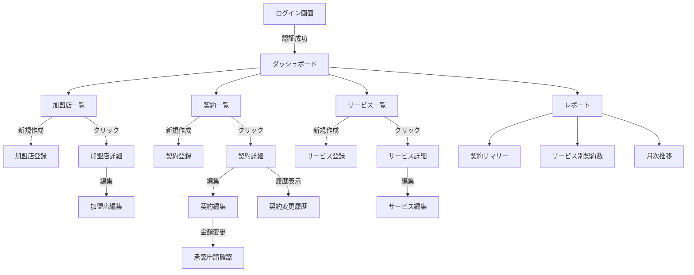

# Frontend機能設計書

## 概要

本ドキュメントは、加盟店契約管理システムのFrontendサービスにおける機能設計を定義します。

**参照ドキュメント:**
- [ルート CLAUDE.md](../../../CLAUDE.md)
- [Frontend CLAUDE.md](../CLAUDE.md)
- [docs/product-requirements.md](../../../docs/product-requirements.md)
- [docs/system-architecture.md](../../../docs/system-architecture.md)
- [docs/glossary.md](../../../docs/glossary.md)

---

## アーキテクチャ概要

### 技術アーキテクチャ

```
┌─────────────────────────────────────────────────────┐
│           Next.js 14 (App Router)                   │
├─────────────────────────────────────────────────────┤
│  Server Components (RSC)  │  Client Components      │
│  - データフェッチング      │  - インタラクティブUI   │
│  - 初期レンダリング        │  - フォーム             │
│  - SEO最適化               │  - 状態管理             │
├─────────────────────────────────────────────────────┤
│              API Client (fetch)                      │
│          ↓ REST API (JSON/HTTPS)                    │
│              BFF (Go/Echo)                           │
└─────────────────────────────────────────────────────┘
```

### ディレクトリ構成（概要）

```
src/
├── app/                         # App Router
│   ├── (auth)/                  # 認証レイアウトグループ
│   │   └── login/
│   ├── (dashboard)/             # ダッシュボードレイアウトグループ
│   │   ├── layout.tsx
│   │   ├── page.tsx
│   │   ├── merchants/
│   │   ├── contracts/
│   │   ├── services/
│   │   └── reports/
│   └── layout.tsx
├── components/
│   ├── ui/                      # shadcn/ui
│   ├── layouts/
│   ├── merchants/
│   ├── contracts/
│   └── common/
├── lib/
│   ├── api/                     # APIクライアント
│   ├── utils.ts
│   └── validations/
├── hooks/
├── stores/                      # Zustand
└── types/
    └── api.ts                   # 自動生成
```

---

## 画面設計

### 画面遷移図



### 画面一覧

#### 1. 認証関連

**1.1 ログイン画面 (`/login`)**

**目的:** ユーザー認証

**レイアウト:**
```
┌─────────────────────────────────────┐
│      契約管理システム                │
│                                     │
│  ┌───────────────────────────────┐  │
│  │ メールアドレス                 │  │
│  │ [                          ]  │  │
│  │                               │  │
│  │ パスワード                     │  │
│  │ [                          ]  │  │
│  │                               │  │
│  │      [ログイン]                │  │
│  └───────────────────────────────┘  │
└─────────────────────────────────────┘
```

**コンポーネント構成:**
- `app/(auth)/login/page.tsx` - Server Component
- `components/auth/LoginForm.tsx` - Client Component

**主要機能:**
- メールアドレス・パスワード入力
- バリデーション（Zod）
- ログイン処理（POST `/api/v1/auth/login`）
- エラー表示

**バリデーションルール:**
```typescript
const loginSchema = z.object({
  email: z.string().email('メールアドレスの形式が正しくありません'),
  password: z.string().min(8, 'パスワードは8文字以上必要です'),
});
```

---

#### 2. ダッシュボード

**2.1 ダッシュボードホーム (`/dashboard`)**

**目的:** システム全体のサマリー表示

**レイアウト:**
```
┌─────────────────────────────────────────────────────────┐
│ [ロゴ]  契約管理システム           [ユーザー名 ▼]      │
├─────────────────────────────────────────────────────────┤
│ サイドバー │  メインコンテンツ                          │
│ ├ ダッシュ │ ┌──────────────────────────────────────┐ │
│ ├ 加盟店   │ │ 契約サマリー                          │ │
│ ├ 契約     │ │  総契約数: 1,234  │  今月の新規: 45   │ │
│ ├ サービス │ │  有効契約: 1,100  │  解約: 12         │ │
│ ├ レポート │ └──────────────────────────────────────┘ │
│            │                                            │
│            │ ┌──────────────────────────────────────┐ │
│            │ │ 最近の契約                            │ │
│            │ │ [契約リスト]                          │ │
│            │ └──────────────────────────────────────┘ │
└─────────────────────────────────────────────────────────┘
```

**コンポーネント構成:**
- `app/(dashboard)/layout.tsx` - ダッシュボードレイアウト
- `app/(dashboard)/page.tsx` - ダッシュボードホーム
- `components/layouts/DashboardLayout.tsx`
- `components/layouts/Sidebar.tsx`
- `components/layouts/Header.tsx`
- `components/dashboard/ContractSummary.tsx`
- `components/dashboard/RecentContracts.tsx`

**主要機能:**
- 契約サマリーカード表示
- 最近の契約一覧（5件）
- サイドバーナビゲーション

---

#### 3. 加盟店管理

**3.1 加盟店一覧画面 (`/dashboard/merchants`)**

**目的:** 加盟店の検索・一覧表示

**レイアウト:**
```
┌─────────────────────────────────────────────────────────┐
│ 加盟店一覧                        [+ 新規登録]          │
├─────────────────────────────────────────────────────────┤
│ [検索: 店舗名・ID]  [🔍]           [絞り込み ▼]        │
├─────────────────────────────────────────────────────────┤
│ 加盟店ID   │ 店舗名     │ 住所        │ 担当者  │ 操作│
│ M-001      │ ABC商店   │ 東京都...   │ 山田    │ 編集│
│ M-002      │ XYZ株式会社│ 大阪府...   │ 田中    │ 編集│
│ ...                                                     │
├─────────────────────────────────────────────────────────┤
│                    [< 前へ]  1 2 3  [次へ >]            │
└─────────────────────────────────────────────────────────┘
```

**コンポーネント構成:**
- `app/(dashboard)/merchants/page.tsx` - Server Component
- `components/merchants/MerchantList.tsx` - Client Component
- `components/merchants/MerchantSearchBar.tsx`
- `components/merchants/MerchantTable.tsx`
- `components/common/Pagination.tsx`

**主要機能:**
- 加盟店一覧表示（ページネーション）
- 検索（店舗名、加盟店ID）
- 並び替え（登録日、店舗名）
- 新規登録ボタン

**APIエンドポイント:**
- `GET /api/v1/merchants?page=1&limit=20&search={query}`

---

**3.2 加盟店詳細画面 (`/dashboard/merchants/[id]`)**

**目的:** 加盟店の詳細情報表示

**レイアウト:**
```
┌─────────────────────────────────────────────────────────┐
│ 加盟店詳細                              [編集] [削除]   │
├─────────────────────────────────────────────────────────┤
│ 加盟店ID: M-001                                         │
│ 店舗名:   ABC商店                                       │
│ 住所:     東京都渋谷区...                               │
│ 担当者:   山田太郎                                      │
│ 電話番号: 03-1234-5678                                  │
│ メール:   contact@abc.com                               │
├─────────────────────────────────────────────────────────┤
│ 契約一覧                                                │
│ ┌───────────────────────────────────────────────────┐ │
│ │ 契約番号 │ サービス │ ステータス │ 月額    │ 操作│ │
│ │ C-001    │ 決済     │ 有効       │ 10,000 │ 詳細│ │
│ └───────────────────────────────────────────────────┘ │
└─────────────────────────────────────────────────────────┘
```

**コンポーネント構成:**
- `app/(dashboard)/merchants/[id]/page.tsx`
- `components/merchants/MerchantDetail.tsx`
- `components/merchants/MerchantInfo.tsx`
- `components/contracts/ContractListByMerchant.tsx`

**主要機能:**
- 加盟店情報表示
- 関連契約一覧表示
- 編集・削除ボタン

**APIエンドポイント:**
- `GET /api/v1/merchants/{id}`
- `GET /api/v1/contracts?merchant_id={id}`

---

**3.3 加盟店登録/編集画面 (`/dashboard/merchants/new`, `/dashboard/merchants/[id]/edit`)**

**目的:** 加盟店の新規登録・編集

**レイアウト:**
```
┌─────────────────────────────────────────────────────────┐
│ 加盟店登録                                              │
├─────────────────────────────────────────────────────────┤
│ 加盟店コード *                                          │
│ [                                                    ]  │
│                                                         │
│ 店舗名 *                                                │
│ [                                                    ]  │
│                                                         │
│ 住所 *                                                  │
│ [                                                    ]  │
│                                                         │
│ 担当者名 *                                              │
│ [                                                    ]  │
│                                                         │
│ 電話番号 *                                              │
│ [                                                    ]  │
│                                                         │
│ メールアドレス *                                        │
│ [                                                    ]  │
│                                                         │
│                    [キャンセル]  [保存]                │
└─────────────────────────────────────────────────────────┘
```

**コンポーネント構成:**
- `app/(dashboard)/merchants/new/page.tsx`
- `app/(dashboard)/merchants/[id]/edit/page.tsx`
- `components/merchants/MerchantForm.tsx`

**主要機能:**
- フォーム入力
- バリデーション（リアルタイム）
- 登録・更新処理
- エラー表示

**バリデーションルール:**
```typescript
const merchantSchema = z.object({
  merchant_code: z.string().min(1, '加盟店コードは必須です'),
  name: z.string().min(1, '店舗名は必須です'),
  address: z.string().min(1, '住所は必須です'),
  contact_person: z.string().min(1, '担当者名は必須です'),
  contact_phone: z.string().regex(/^\d{2,4}-\d{2,4}-\d{4}$/, '電話番号の形式が正しくありません'),
  contact_email: z.string().email('メールアドレスの形式が正しくありません'),
});
```

**APIエンドポイント:**
- `POST /api/v1/merchants` - 新規登録
- `PUT /api/v1/merchants/{id}` - 更新

---

#### 4. 契約管理

**4.1 契約一覧画面 (`/dashboard/contracts`)**

**目的:** 契約の検索・一覧表示

**レイアウト:**
```
┌─────────────────────────────────────────────────────────┐
│ 契約一覧                          [+ 新規登録]          │
├─────────────────────────────────────────────────────────┤
│ [検索]  [加盟店 ▼]  [サービス ▼]  [ステータス ▼]      │
├─────────────────────────────────────────────────────────┤
│ 契約番号│ 加盟店  │ サービス│ ステータス│ 月額  │ 操作│
│ C-001   │ ABC商店│ 決済    │ 有効      │10,000│ 詳細│
│ C-002   │ XYZ社  │ ポイント│ 有効      │5,000 │ 詳細│
│ ...                                                     │
├─────────────────────────────────────────────────────────┤
│                    [< 前へ]  1 2 3  [次へ >]            │
└─────────────────────────────────────────────────────────┘
```

**コンポーネント構成:**
- `app/(dashboard)/contracts/page.tsx`
- `components/contracts/ContractList.tsx`
- `components/contracts/ContractSearchBar.tsx`
- `components/contracts/ContractTable.tsx`
- `components/contracts/ContractFilters.tsx`

**主要機能:**
- 契約一覧表示（ページネーション）
- 検索（契約番号、加盟店名）
- 絞り込み（加盟店、サービス、ステータス）
- 並び替え（契約日、月額）

**APIエンドポイント:**
- `GET /api/v1/contracts?page=1&limit=20&merchant_id={id}&service_id={id}&status={status}`

---

**4.2 契約詳細画面 (`/dashboard/contracts/[id]`)**

**目的:** 契約の詳細情報表示

**レイアウト:**
```
┌─────────────────────────────────────────────────────────┐
│ 契約詳細                         [編集] [解約] [履歴]   │
├─────────────────────────────────────────────────────────┤
│ 契約番号:   C-001                                       │
│ 加盟店:     ABC商店 (M-001)                             │
│ サービス:   決済サービス                                 │
│ ステータス: 有効                                        │
│ 契約日:     2026-01-15                                  │
│ 開始日:     2026-02-01                                  │
│ 終了日:     -                                           │
│ 初期費用:   50,000円                                    │
│ 月額費用:   10,000円                                    │
│ 備考:       -                                           │
├─────────────────────────────────────────────────────────┤
│ 変更履歴                                                │
│ ┌───────────────────────────────────────────────────┐ │
│ │ 2026-03-01 │ 月額変更 │ 8,000円→10,000円 │ 山田 │ │
│ │ 2026-01-15 │ 新規登録 │ -               │ 田中 │ │
│ └───────────────────────────────────────────────────┘ │
└─────────────────────────────────────────────────────────┘
```

**コンポーネント構成:**
- `app/(dashboard)/contracts/[id]/page.tsx`
- `components/contracts/ContractDetail.tsx`
- `components/contracts/ContractInfo.tsx`
- `components/contracts/ContractHistory.tsx`

**主要機能:**
- 契約情報表示
- 変更履歴表示
- 編集・解約ボタン

**APIエンドポイント:**
- `GET /api/v1/contracts/{id}`
- `GET /api/v1/contracts/{id}/history`

---

**4.3 契約登録/編集画面 (`/dashboard/contracts/new`, `/dashboard/contracts/[id]/edit`)**

**目的:** 契約の新規登録・編集

**レイアウト:**
```
┌─────────────────────────────────────────────────────────┐
│ 契約登録                                                │
├─────────────────────────────────────────────────────────┤
│ 加盟店 *                                                │
│ [加盟店を選択 ▼]                                        │
│                                                         │
│ サービス *                                              │
│ [サービスを選択 ▼]                                      │
│                                                         │
│ 開始日 *                                                │
│ [📅 2026-04-01]                                         │
│                                                         │
│ 終了日                                                  │
│ [📅 未設定]                                             │
│                                                         │
│ 初期費用 *                                              │
│ [                              ] 円                     │
│                                                         │
│ 月額費用 *                                              │
│ [                              ] 円                     │
│                                                         │
│ 備考                                                    │
│ [                                                    ]  │
│                                                         │
│                    [キャンセル]  [登録]                │
└─────────────────────────────────────────────────────────┘
```

**コンポーネント構成:**
- `app/(dashboard)/contracts/new/page.tsx`
- `app/(dashboard)/contracts/[id]/edit/page.tsx`
- `components/contracts/ContractForm.tsx`

**主要機能:**
- フォーム入力
- 加盟店・サービス選択（コンボボックス）
- 日付選択（日付ピッカー）
- バリデーション
- 金額変更時の承認フロー警告表示

**バリデーションルール:**
```typescript
const contractSchema = z.object({
  merchant_id: z.string().uuid('加盟店を選択してください'),
  service_id: z.string().uuid('サービスを選択してください'),
  start_date: z.string().regex(/^\d{4}-\d{2}-\d{2}$/, '日付形式が正しくありません'),
  end_date: z.string().regex(/^\d{4}-\d{2}-\d{2}$/).optional().nullable(),
  initial_fee: z.number().min(0, '初期費用は0以上である必要があります'),
  monthly_fee: z.number().min(0, '月額費用は0以上である必要があります'),
  notes: z.string().optional(),
});
```

**特別なロジック（金額変更時）:**
```typescript
// 月額または初期費用が変更された場合
if (isEditing && (initialFeeChanged || monthlyFeeChanged)) {
  // 承認フロー確認ダイアログ表示
  showApprovalConfirmDialog({
    message: '金額が変更されました。承認申請を作成しますか？',
    onConfirm: () => {
      submitContractUpdateRequest();
    },
  });
}
```

**APIエンドポイント:**
- `POST /api/v1/contracts` - 新規登録
- `PUT /api/v1/contracts/{id}` - 更新（金額以外）
- `POST /api/v1/contracts/{id}/request-update` - 金額変更申請

---

**4.4 契約変更履歴画面 (`/dashboard/contracts/[id]/history`)**

**目的:** 契約の変更履歴詳細表示

**レイアウト:**
```
┌─────────────────────────────────────────────────────────┐
│ 契約変更履歴 - C-001                                    │
├─────────────────────────────────────────────────────────┤
│ 日時        │ 変更内容      │ 旧値   │ 新値   │ 変更者│
│ 2026-03-01  │ monthly_fee  │ 8,000 │ 10,000│ 山田  │
│ 10:30       │              │       │       │       │
│             │ 承認者: 佐藤  承認日: 2026-03-02          │
├─────────────────────────────────────────────────────────┤
│ 2026-02-15  │ status       │ DRAFT │ ACTIVE│ 田中  │
│ 14:00       │              │       │       │       │
├─────────────────────────────────────────────────────────┤
│ 2026-01-15  │ 新規登録      │ -     │ -     │ 田中  │
│ 09:00       │              │       │       │       │
└─────────────────────────────────────────────────────────┘
```

**コンポーネント構成:**
- `app/(dashboard)/contracts/[id]/history/page.tsx`
- `components/contracts/ContractHistoryList.tsx`
- `components/contracts/ContractHistoryItem.tsx`

**主要機能:**
- 変更履歴一覧表示（時系列）
- 承認情報表示（金額変更の場合）
- フィルタリング（変更者、期間）

**APIエンドポイント:**
- `GET /api/v1/contracts/{id}/history`

---

#### 5. サービス管理

**5.1 サービス一覧画面 (`/dashboard/services`)**

**目的:** サービスの一覧表示・管理

**レイアウト:**
```
┌─────────────────────────────────────────────────────────┐
│ サービス一覧                      [+ 新規登録]          │
├─────────────────────────────────────────────────────────┤
│ [検索: サービス名・コード]  [🔍]                        │
├─────────────────────────────────────────────────────────┤
│ サービスコード│ サービス名     │ 状態    │ 契約数│操作│
│ SVC-001       │ 決済サービス   │ 有効    │ 523  │編集│
│ SVC-002       │ ポイント       │ 有効    │ 412  │編集│
│ SVC-003       │ クーポン       │ 無効    │ 0    │編集│
│ ...                                                     │
└─────────────────────────────────────────────────────────┘
```

**コンポーネント構成:**
- `app/(dashboard)/services/page.tsx`
- `components/services/ServiceList.tsx`
- `components/services/ServiceTable.tsx`

**主要機能:**
- サービス一覧表示
- 検索（サービス名、コード）
- 新規登録ボタン

**APIエンドポイント:**
- `GET /api/v1/services`

---

**5.2 サービス登録/編集画面 (`/dashboard/services/new`, `/dashboard/services/[id]/edit`)**

**目的:** サービスの新規登録・編集

**レイアウト:**
```
┌─────────────────────────────────────────────────────────┐
│ サービス登録                                            │
├─────────────────────────────────────────────────────────┤
│ サービスコード *                                        │
│ [                                                    ]  │
│                                                         │
│ サービス名 *                                            │
│ [                                                    ]  │
│                                                         │
│ 説明                                                    │
│ [                                                    ]  │
│ [                                                    ]  │
│                                                         │
│ 有効化                                                  │
│ [✓] このサービスを有効にする                            │
│                                                         │
│                    [キャンセル]  [保存]                │
└─────────────────────────────────────────────────────────┘
```

**コンポーネント構成:**
- `app/(dashboard)/services/new/page.tsx`
- `app/(dashboard)/services/[id]/edit/page.tsx`
- `components/services/ServiceForm.tsx`

**主要機能:**
- フォーム入力
- バリデーション
- 有効化/無効化トグル

**APIエンドポイント:**
- `POST /api/v1/services`
- `PUT /api/v1/services/{id}`

---

#### 6. レポート

**6.1 レポートダッシュボード (`/dashboard/reports`)**

**目的:** 各種レポートの表示

**レイアウト:**
```
┌─────────────────────────────────────────────────────────┐
│ レポート                                                │
├─────────────────────────────────────────────────────────┤
│ [期間: 2026年1月 - 2026年4月]   [📥 エクスポート]      │
├─────────────────────────────────────────────────────────┤
│ 契約サマリー                                            │
│ ┌─────────────┬─────────────┬─────────────┐          │
│ │ 総契約数    │ 新規契約    │ 解約        │          │
│ │ 1,234       │ 45          │ 12          │          │
│ └─────────────┴─────────────┴─────────────┘          │
├─────────────────────────────────────────────────────────┤
│ サービス別契約数                                        │
│ ┌─────────────────────────────────────────────────┐  │
│ │ [棒グラフ]                                       │  │
│ │ 決済:    523                                    │  │
│ │ ポイント: 412                                    │  │
│ │ クーポン: 299                                    │  │
│ └─────────────────────────────────────────────────┘  │
├─────────────────────────────────────────────────────────┤
│ 月次契約推移                                            │
│ ┌─────────────────────────────────────────────────┐  │
│ │ [折れ線グラフ]                                   │  │
│ └─────────────────────────────────────────────────┘  │
└─────────────────────────────────────────────────────────┘
```

**コンポーネント構成:**
- `app/(dashboard)/reports/page.tsx`
- `components/reports/ReportDashboard.tsx`
- `components/reports/ContractSummaryCard.tsx`
- `components/reports/ServiceContractChart.tsx`
- `components/reports/MonthlyTrendChart.tsx`

**主要機能:**
- 期間選択
- サマリーカード表示
- グラフ表示（Chart.js / Recharts）
- CSVエクスポート

**APIエンドポイント:**
- `GET /api/v1/reports/summary?from={date}&to={date}`
- `GET /api/v1/reports/by-service?from={date}&to={date}`
- `GET /api/v1/reports/monthly-trend?from={date}&to={date}`

---

## コンポーネント設計

### 共通コンポーネント（shadcn/ui）

以下のshadcn/uiコンポーネントを使用します：

```bash
# 導入するコンポーネント
npx shadcn-ui@latest add button
npx shadcn-ui@latest add card
npx shadcn-ui@latest add form
npx shadcn-ui@latest add input
npx shadcn-ui@latest add label
npx shadcn-ui@latest add select
npx shadcn-ui@latest add table
npx shadcn-ui@latest add dialog
npx shadcn-ui@latest add dropdown-menu
npx shadcn-ui@latest add pagination
npx shadcn-ui@latest add badge
npx shadcn-ui@latest add alert
npx shadcn-ui@latest add toast
npx shadcn-ui@latest add calendar
npx shadcn-ui@latest add popover
```

### カスタムコンポーネント

#### 1. レイアウトコンポーネント

**DashboardLayout:**
```typescript
// components/layouts/DashboardLayout.tsx
interface DashboardLayoutProps {
  children: React.ReactNode;
}

export function DashboardLayout({ children }: DashboardLayoutProps) {
  return (
    <div className="flex h-screen">
      <Sidebar />
      <div className="flex-1 flex flex-col">
        <Header />
        <main className="flex-1 overflow-y-auto p-6">
          {children}
        </main>
      </div>
    </div>
  );
}
```

**Sidebar:**
```typescript
// components/layouts/Sidebar.tsx
export function Sidebar() {
  const pathname = usePathname();

  const navItems = [
    { href: '/dashboard', label: 'ダッシュボード', icon: HomeIcon },
    { href: '/dashboard/merchants', label: '加盟店', icon: StoreIcon },
    { href: '/dashboard/contracts', label: '契約', icon: FileTextIcon },
    { href: '/dashboard/services', label: 'サービス', icon: PackageIcon },
    { href: '/dashboard/reports', label: 'レポート', icon: BarChartIcon },
  ];

  return (
    <aside className="w-64 bg-gray-900 text-white">
      {/* サイドバー内容 */}
    </aside>
  );
}
```

#### 2. データ表示コンポーネント

**DataTable (汎用テーブル):**
```typescript
// components/common/DataTable.tsx
interface Column<T> {
  key: keyof T;
  header: string;
  render?: (value: T[keyof T], row: T) => React.ReactNode;
}

interface DataTableProps<T> {
  columns: Column<T>[];
  data: T[];
  onRowClick?: (row: T) => void;
}

export function DataTable<T>({ columns, data, onRowClick }: DataTableProps<T>) {
  return (
    <Table>
      <TableHeader>
        <TableRow>
          {columns.map((col) => (
            <TableHead key={String(col.key)}>{col.header}</TableHead>
          ))}
        </TableRow>
      </TableHeader>
      <TableBody>
        {data.map((row, idx) => (
          <TableRow key={idx} onClick={() => onRowClick?.(row)}>
            {columns.map((col) => (
              <TableCell key={String(col.key)}>
                {col.render ? col.render(row[col.key], row) : String(row[col.key])}
              </TableCell>
            ))}
          </TableRow>
        ))}
      </TableBody>
    </Table>
  );
}
```

---

## 状態管理

### Zustand Store

**認証ストア:**
```typescript
// stores/auth-store.ts
interface AuthState {
  user: User | null;
  isAuthenticated: boolean;
  setUser: (user: User | null) => void;
  logout: () => void;
}

export const useAuthStore = create<AuthState>((set) => ({
  user: null,
  isAuthenticated: false,
  setUser: (user) => set({ user, isAuthenticated: !!user }),
  logout: () => set({ user: null, isAuthenticated: false }),
}));
```

**使用例:**
```typescript
function Header() {
  const { user, logout } = useAuthStore();

  return (
    <header>
      <span>{user?.name}</span>
      <Button onClick={logout}>ログアウト</Button>
    </header>
  );
}
```

---

## APIクライアント

### 共通APIクライアント

```typescript
// lib/api/client.ts
const API_BASE_URL = process.env.NEXT_PUBLIC_API_BASE_URL || 'http://localhost:4000';

interface ApiError {
  code: string;
  message: string;
  details?: Record<string, string>;
}

class ApiClient {
  private async request<T>(
    endpoint: string,
    options: RequestInit = {}
  ): Promise<T> {
    const url = `${API_BASE_URL}${endpoint}`;

    // CSRF Token取得
    const csrfToken = this.getCsrfToken();

    const response = await fetch(url, {
      ...options,
      headers: {
        'Content-Type': 'application/json',
        'X-CSRF-Token': csrfToken || '',
        ...options.headers,
      },
      credentials: 'include', // Cookie送信
    });

    if (!response.ok) {
      const error: ApiError = await response.json();
      throw new Error(error.message);
    }

    return response.json();
  }

  private getCsrfToken(): string | null {
    if (typeof document === 'undefined') return null;
    const cookie = document.cookie
      .split('; ')
      .find(row => row.startsWith('csrf_token='));
    return cookie?.split('=')[1] || null;
  }

  async get<T>(endpoint: string): Promise<T> {
    return this.request<T>(endpoint, { method: 'GET' });
  }

  async post<T>(endpoint: string, data: unknown): Promise<T> {
    return this.request<T>(endpoint, {
      method: 'POST',
      body: JSON.stringify(data),
    });
  }

  async put<T>(endpoint: string, data: unknown): Promise<T> {
    return this.request<T>(endpoint, {
      method: 'PUT',
      body: JSON.stringify(data),
    });
  }

  async delete<T>(endpoint: string): Promise<T> {
    return this.request<T>(endpoint, { method: 'DELETE' });
  }
}

export const apiClient = new ApiClient();
```

### ドメイン別APIクライアント

**加盟店API:**
```typescript
// lib/api/merchants.ts
import { apiClient } from './client';
import type { paths } from '@/types/api';

type MerchantListResponse = paths['/api/v1/merchants']['get']['responses']['200']['content']['application/json'];
type MerchantResponse = paths['/api/v1/merchants/{id}']['get']['responses']['200']['content']['application/json'];

export const merchantsApi = {
  list: (params?: { page?: number; limit?: number; search?: string }) =>
    apiClient.get<MerchantListResponse>(`/api/v1/merchants?${new URLSearchParams(params as any)}`),

  getById: (id: string) =>
    apiClient.get<MerchantResponse>(`/api/v1/merchants/${id}`),

  create: (data: CreateMerchantRequest) =>
    apiClient.post('/api/v1/merchants', data),

  update: (id: string, data: UpdateMerchantRequest) =>
    apiClient.put(`/api/v1/merchants/${id}`, data),

  delete: (id: string) =>
    apiClient.delete(`/api/v1/merchants/${id}`),
};
```

---

## エラーハンドリング

### エラー境界

```typescript
// components/common/ErrorBoundary.tsx
'use client';

import { Component, ReactNode } from 'react';

interface Props {
  children: ReactNode;
}

interface State {
  hasError: boolean;
  error?: Error;
}

export class ErrorBoundary extends Component<Props, State> {
  constructor(props: Props) {
    super(props);
    this.state = { hasError: false };
  }

  static getDerivedStateFromError(error: Error): State {
    return { hasError: true, error };
  }

  render() {
    if (this.state.hasError) {
      return (
        <div className="flex items-center justify-center h-screen">
          <div className="text-center">
            <h1 className="text-2xl font-bold mb-4">エラーが発生しました</h1>
            <p className="text-gray-600">{this.state.error?.message}</p>
            <Button onClick={() => window.location.reload()}>
              再読み込み
            </Button>
          </div>
        </div>
      );
    }

    return this.props.children;
  }
}
```

### トースト通知

```typescript
// hooks/use-toast.ts (shadcn/ui提供)
import { useToast } from '@/components/ui/use-toast';

// 使用例
function MyComponent() {
  const { toast } = useToast();

  const handleSuccess = () => {
    toast({
      title: '保存しました',
      description: '契約情報が正常に保存されました',
    });
  };

  const handleError = (error: Error) => {
    toast({
      title: 'エラー',
      description: error.message,
      variant: 'destructive',
    });
  };
}
```

---

## テスト戦略

### コンポーネントテスト

```typescript
// tests/components/merchants/MerchantCard.test.tsx
import { render, screen } from '@testing-library/react';
import { MerchantCard } from '@/components/merchants/MerchantCard';

describe('MerchantCard', () => {
  const mockMerchant = {
    id: '1',
    merchant_code: 'M-001',
    name: 'テスト加盟店',
    address: '東京都渋谷区',
    contact_person: '山田太郎',
    contact_email: 'test@example.com',
    contact_phone: '03-1234-5678',
  };

  it('加盟店情報を正しく表示する', () => {
    render(<MerchantCard merchant={mockMerchant} />);

    expect(screen.getByText('テスト加盟店')).toBeInTheDocument();
    expect(screen.getByText('M-001')).toBeInTheDocument();
    expect(screen.getByText('東京都渋谷区')).toBeInTheDocument();
  });

  it('編集ボタンをクリックするとonEditが呼ばれる', async () => {
    const onEdit = vi.fn();
    render(<MerchantCard merchant={mockMerchant} onEdit={onEdit} />);

    const editButton = screen.getByRole('button', { name: /編集/ });
    await userEvent.click(editButton);

    expect(onEdit).toHaveBeenCalledWith('1');
  });
});
```

### E2Eテスト

```typescript
// tests/e2e/merchant-flow.spec.ts
import { test, expect } from '@playwright/test';

test('加盟店登録フロー', async ({ page }) => {
  // ログイン
  await page.goto('/login');
  await page.fill('[name="email"]', 'test@example.com');
  await page.fill('[name="password"]', 'password123');
  await page.click('button[type="submit"]');

  // 加盟店一覧へ
  await expect(page).toHaveURL('/dashboard');
  await page.click('text=加盟店');

  // 新規登録
  await page.click('text=新規登録');
  await page.fill('[name="merchant_code"]', 'M-999');
  await page.fill('[name="name"]', 'テスト加盟店');
  await page.fill('[name="address"]', '東京都渋谷区');
  await page.fill('[name="contact_person"]', '山田太郎');
  await page.fill('[name="contact_phone"]', '03-1234-5678');
  await page.fill('[name="contact_email"]', 'test@example.com');
  await page.click('button:has-text("保存")');

  // 成功メッセージ確認
  await expect(page.locator('text=保存しました')).toBeVisible();

  // 一覧に表示されることを確認
  await expect(page.locator('text=テスト加盟店')).toBeVisible();
});
```

---

## パフォーマンス最適化

### 1. Server Componentsの活用

```typescript
// app/(dashboard)/merchants/page.tsx
async function MerchantsPage() {
  // サーバーで直接データフェッチ
  const merchants = await fetchMerchants();

  return <MerchantList merchants={merchants} />;
}
```

### 2. 画像最適化

```typescript
import Image from 'next/image';

<Image
  src="/merchant-logo.png"
  alt="加盟店ロゴ"
  width={100}
  height={100}
  loading="lazy"
/>
```

### 3. 動的インポート

```typescript
// 重いチャートコンポーネントは遅延ロード
const ReportChart = dynamic(() => import('@/components/reports/ReportChart'), {
  loading: () => <Skeleton className="h-64" />,
  ssr: false,
});
```

### 4. React.memoの活用

```typescript
export const MerchantCard = React.memo(function MerchantCard({ merchant }: Props) {
  return <Card>...</Card>;
});
```

---

## セキュリティ実装

### CSRFトークン管理

```typescript
// middleware.ts (Next.js Middleware)
import { NextResponse } from 'next/server';
import type { NextRequest } from 'next/server';

export function middleware(request: NextRequest) {
  const response = NextResponse.next();

  // CSRF Tokenがない場合は生成
  if (!request.cookies.get('csrf_token')) {
    const csrfToken = generateCsrfToken();
    response.cookies.set('csrf_token', csrfToken, {
      httpOnly: true,
      secure: true,
      sameSite: 'strict',
    });
  }

  return response;
}
```

### 認証チェック

```typescript
// middleware.ts
export function middleware(request: NextRequest) {
  const sessionCookie = request.cookies.get('session_id');

  // ログインページ以外で未認証の場合はリダイレクト
  if (!sessionCookie && !request.nextUrl.pathname.startsWith('/login')) {
    return NextResponse.redirect(new URL('/login', request.url));
  }

  return NextResponse.next();
}

export const config = {
  matcher: ['/dashboard/:path*'],
};
```

---

## アクセシビリティ

### キーボード操作対応

- Tabキーでフォーカス移動
- Enterキーで要素選択
- Escキーでダイアログ閉じる

### ARIA属性

```typescript
<button
  aria-label="加盟店を削除"
  onClick={handleDelete}
>
  <TrashIcon />
</button>
```

### フォームラベル

```typescript
<Label htmlFor="merchant-name">店舗名</Label>
<Input id="merchant-name" name="name" />
```

---

## 関連ドキュメント

- [Frontend CLAUDE.md](../CLAUDE.md) - 開発ルール
- [repository-structure.md](repository-structure.md) - リポジトリ構造詳細
- [development-guidelines.md](development-guidelines.md) - 開発ガイドライン
- [docs/product-requirements.md](../../../docs/product-requirements.md) - プロダクト要求
- [docs/glossary.md](../../../docs/glossary.md) - 用語集
- [contracts/openapi/bff-api.yaml](../../../contracts/openapi/bff-api.yaml) - BFF API仕様

---

**最終更新日:** 2026-04-05
**作成者:** Claude Code
